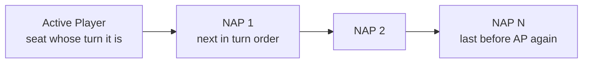
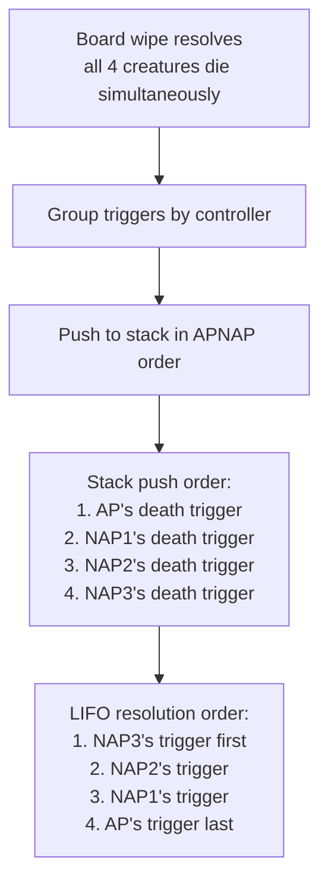

# APNAP

> Source: `internal/gameengine/multiplayer.go` (632 lines), `triggers.go`
> CR refs: §101.4 (APNAP), §603.3b (simultaneous triggers), §800.4 (multiplayer turn order)

**A**ctive **P**layer, **N**on-**A**ctive **P**layer ordering. The single rule that resolves all simultaneous-choice ambiguity in multiplayer Magic. When N players need to make a choice "at the same time" (multiple triggers fire, multiple replacements match, multiple players need to discard), APNAP determines the order.

## The Order

Active player goes first, then non-active players in turn order. Wraps back around — APNAP order in a 4-seat game where seat 2 is active is `[2, 3, 0, 1]`.

## When APNAP Applies

| Situation | HexDek Function | CR |
|---|---|---|
| Multiple triggers fire simultaneously | `OrderTriggersAPNAP` | §603.3b |
| Multiple replacements match same event | `FireEvent` category sort + APNAP tiebreak | §616.1 |
| Each-opponent fan-out effects | `gs.OpponentsOf(seat)` returns dead-inclusive APNAP order | §800.4 |
| Living-only iteration | `gs.LivingOpponents(seat)` | implicit |
| Eliminations | `HandleSeatElimination` advances active seat | §800.4h |
| Defending player order in combat | `DeclareBlockers` iterates in APNAP | §509 |

## Counterintuitive Stack Implication

When triggers from multiple controllers fire at once:

- AP's triggers pushed onto stack **first** → resolve **last** (LIFO)
- Last NAP's triggers pushed **last** → resolve **first**

So in a 4-player game where every player has a death-trigger creature on the field and a board wipe kills everything:

Active player "loses the speed race." The last NAP's triggers resolve first.

This is correct per CR §603.3b and surprises new players consistently.

## Within a Controller

Once grouped by controller, APNAP stops mattering at the dispatch level. The controller picks intra-group order via `Hat.OrderTriggers` / `Hat.OrderReplacements`. See [Hat AI System](Hat%20AI%20System.md).

This matters when one player has multiple triggering creatures and wants to sequence them — e.g. casting a board wipe while controlling Soul Warden + Soul's Attendant + Suture Priest: each gives 1 life on creature ETB, the player picks the order they fire (irrelevant for life gain since result is the same; matters for some odd interactions).

## Eliminations

Per CR §800.4h, when a player is eliminated mid-turn (loses life to 0, decked, etc.), the active seat may need to advance. `HandleSeatElimination` checks:

- If the eliminated seat was active, advance to the next living seat (per APNAP from the eliminated seat's position)
- Re-derive APNAP order from the new active seat
- Drop dead seats from `LivingOpponents` lists

This is what makes elimination not destabilize ongoing trigger chains.

## OpponentsOf vs LivingOpponents

Two helpers, different semantics:

- `gs.OpponentsOf(seat)` — every other seat in APNAP order, including dead/conceded ones. Used for "each opponent" effects when the targeting predates the elimination.
- `gs.LivingOpponents(seat)` — every other seat that's still alive, APNAP order. Used for "each opponent draws a card" type fan-outs where dead opponents shouldn't count.

The distinction matters for Wheels of Fortune effects — *"each player discards their hand and draws seven"* draws each living player; *"each opponent loses 5 life"* skips dead opponents (already lost, can't lose more).

## Implementation Note

`OrderTriggersAPNAP` returns the **PUSH order**. Element [0] gets pushed first → resolves last. This is why the function name is "OrderTriggersAPNAP" not "OrderTriggersResolution" — it's giving you the push sequence, not the resolution sequence.

The naming was deliberately chosen to match CR §603.3b's wording ("put on the stack in APNAP order") rather than the resolution-time consequence.

## Related

- [Stack and Priority](Stack%20and%20Priority.md) — stack push and resolution
- [Trigger Dispatch](Trigger%20Dispatch.md) — primary APNAP consumer
- [Replacement Effects](Replacement%20Effects.md) — APNAP as tiebreak in §616.1
- [State-Based Actions](State-Based%20Actions.md) — APNAP not used here (SBAs are instantaneous)
- [Hat AI System](Hat%20AI%20System.md) — `OrderTriggers` for intra-group ordering
