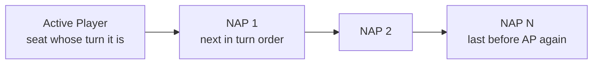

# APNAP

> Last updated: 2026-04-29
> Source: `internal/gameengine/multiplayer.go`, `triggers.go`
> CR refs: §101.4, §603.3b

**A**ctive **P**layer, **N**on-**A**ctive **P**layer ordering. Resolves all simultaneous-choice ambiguity in multiplayer Magic.

## Order

## When It Applies

| Situation | Function |
|---|---|
| Multiple [[Trigger Dispatch\|triggers]] fire simultaneously | `OrderTriggersAPNAP` |
| Multiple [[Replacement Effects\|replacements]] match same event | `FireEvent` category sort + APNAP tiebreak |
| Each-opponent fan-out effects | `gs.OpponentsOf(seat)` returns dead-inclusive APNAP order |
| Living-only iteration | `gs.LivingOpponents(seat)` |
| Eliminations | `HandleSeatElimination` advances active seat per §800.4h |

## Counterintuitive Stack Implication

When triggers from multiple controllers fire at once:
- AP's triggers pushed onto stack FIRST → resolve LAST (LIFO)
- Last NAP's triggers pushed LAST → resolve FIRST

So AP "loses" the speed race when multiple players trigger off the same event.

## Within a Controller

Once grouped by controller, APNAP stops mattering. The controller picks intra-group order via `Hat.OrderTriggers` / `Hat.OrderReplacements`. See [[Hat AI System]].

## Related

- [[Stack and Priority]]
- [[Trigger Dispatch]]
- [[Replacement Effects]]
- [[State-Based Actions]]
