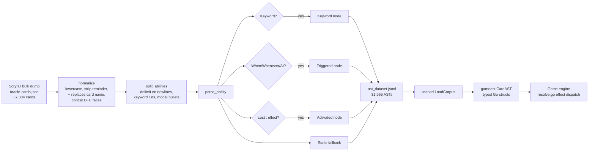

# Card AST and Parser

> Last updated: 2026-04-29
> Source: `scripts/parser.py`, `internal/gameast/`, `internal/astload/`
> CR ref: §113

Oracle text → typed AST. Python parser produces JSONL; Go consumes it via `astload`.

## Pipeline

## Top-Level AST Nodes (§113)

| Node | Shape | Example |
|---|---|---|
| `Static` | `(condition?, modification?, raw)` | "Creatures you control get +1/+1" |
| `Activated` | `(cost, effect, timing?, raw)` | "{T}: Add {G}" |
| `Triggered` | `(trigger, effect, intervening_if?, raw)` | "When ~ ETBs, draw a card" |
| `Keyword` | `(name, args, raw)` | Flying, Flashback {2}{U} |

## Supporting Types

`gameast` package (Go) mirrors the Python AST:
- `ManaSymbol` / `ManaCost` — `{U}`, `{2}`, `{U/B}`, `{X}`, `{S}`, `{U/P}`
- `Filter` — target spec ("target creature you control", "each opponent")
- `Trigger` — event slug + actor/target filter + phase
- `Cost` — composite (mana, tap, untap, sacrifice, discard, life, exile-self, …)
- `Condition` — typed boolean (`you_control`, `life_threshold`, `card_count_zone`, `tribal`)

## Effect Leaves

`gameast/effects.go` defines: Damage, Draw, Discard, Mill, Scry, Surveil, CounterSpell, Destroy, Exile, Bounce, Tutor, Reanimate, GainLife, LoseLife, Sacrifice, CreateToken, CounterMod, Buff, GrantAbility, AddMana, GainControl, CopySpell, ExtraTurn, ExtraCombat, WinGame, LoseGame, Replacement, Prevent, Sequence, Choice, Optional_, Conditional, UnknownEffect.

## Parse Errors → Coverage Doc

Unconsumed fragments recorded in `parse_errors`. `data/rules/parser_coverage.md` lists every gap. This is what made syntactic 100% coverage tractable.

## Coverage Status

- **Syntactic:** 100% on 31,965 cards (every card returns an AST, no parse errors)
- **Engine-executable:** ~24% of the AST is fully typed leaves the runtime can dispatch
- **Stub coverage:** ~76% — `Modification(kind="custom", args=(slug,))` placeholders → handed to [[Per-Card Handlers]]

## Layer Tagging (planned in AST)

Per [[#Architecture decisions|2026-04-15 decision]]: Modifications get `layer: Optional[int]` per §613 to remove engine re-derivation. See [[Layer System]].

## Related

- [[Per-Card Handlers]]
- [[Layer System]]
- [[Engine Architecture]]
