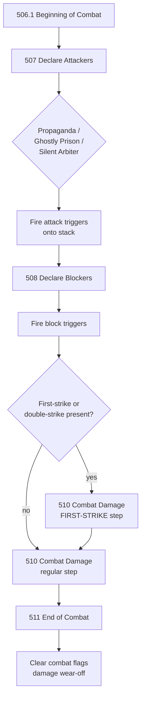
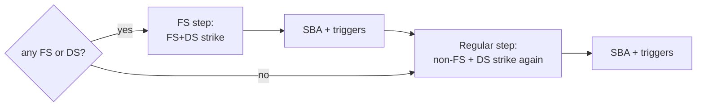

# Combat Phases

> Last updated: 2026-04-29
> Source: `internal/gameengine/combat.go`, `keywords_combat.go`, `combat_restrictions.go`
> CR refs: §506-§511

5-step combat phase, multiplayer attack targeting (§802), full keyword combat math.

## Phase Flow

## Functions

- `CombatPhase(gs)` — top-level 5-step driver
- `DeclareAttackers(gs, seat)` — Hat picks attackers, taps, fires "attacks" triggers
- `DeclareBlockers(gs, attackers, seat)` — defenders pick blocks via Hat
- `DealCombatDamageStep(...)` — handles first-strike step + regular step
- `EndOfCombatStep(gs)` — clears `attacking` / `blocking` / `declared_attacker_this_combat` flags

## Damage Ordering

## Combat Keywords Implemented

Flying, reach, trample, deathtouch, lifelink, menace, vigilance, first/double strike, indestructible, hexproof, ward, prowess, banding, flanking, bushido, provoke, battle cry, myriad, annihilator, intimidate, fear, shadow, horsemanship, skulk, defender, exalted.

## Multiplayer Targeting (§802)

Attacker chooses defending player or planeswalker per attacker (`ChooseAttackTarget`). [[Hat AI System|Hat]] uses 7-dim threat score; Yggdrasil layers grudge/retaliation. See [[YggdrasilHat|YggdrasilHat]].

## Combat Restrictions

`combat_restrictions.go` wires Propaganda-style attack tax + Silent Arbiter max-1-attacker into `DeclareAttackers`. Stax pieces reduce incoming combat.

## Commander Damage

Per-source tracking on `Seat.CommanderDamage[srcID]`. SBA §704.6c kills at 21 from a single commander (partner support included). See [[State-Based Actions]].

## Extra Combats

`gs.Flags["pending_extra_combats"]` drives an outer loop in [[Tournament Runner|TakeTurn]]. Aggravated Assault, World at War, Sphinx of the Second Sun all increment this.

## Related

- [[Stack and Priority]]
- [[State-Based Actions]]
- [[YggdrasilHat]]
