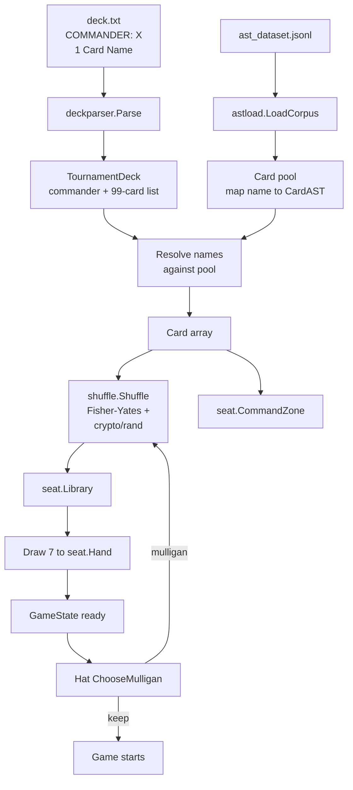

# Decklist to Game Pipeline

> Source: `internal/deckparser/`, `internal/astload/`, `internal/shuffle/`

How a `.txt` deck file becomes a playable [GameState](Engine%20Architecture.md). The pipeline's job is to turn human-readable decklists into the typed runtime structures the engine operates on.

## Pipeline



## deckparser Format

The canonical text format:

```
# Deck Name (comment)
# Source: https://moxfield.com/decks/XXXXX
COMMANDER: Commander Name
1 Card Name
1 Other Card
4 Lightning Bolt
36 Forest
```

Rules:

- Lines starting with `#` are comments (ignored)
- `COMMANDER:` lines are special — define the commander zone contents
- Quantity-prefixed lines are mainboard
- Quantity is replicated by the parser (e.g. `4 Lightning Bolt` produces 4 distinct card pointers)
- Single-line per card; no continuation
- Whitespace tolerant — leading/trailing space stripped

`Partner` commanders use two `COMMANDER:` lines:

```
COMMANDER: Sakashima of a Thousand Faces
COMMANDER: Reyhan, Last of the Abzan
```

The parser handles 2-commander decks by setting `Seat.CommanderNames` to both names.

## AST Pool

`astload.LoadCorpus("data/rules/ast_dataset.jsonl")` returns `map[string]*gameast.CardAST`. Resolution is by exact card name.

When a card name doesn't resolve (typo, misspelling, card not in corpus), the engine logs a warning but continues — the deck stays playable with a stub card (no AST, no abilities) at that slot. This is more permissive than rejecting the deck outright.

## Card Construction

For each `(name, qty)` entry in the parsed deck:

1. Look up `*gameast.CardAST` from the pool
2. For each of `qty` instances, allocate a new `*Card`:
   - Copy the AST reference (shared, immutable)
   - Set `Owner` to the seat index
   - Set runtime fields (`oracleTextReady = false` etc.)
3. Append to the seat's library

Cards are fresh instances per game (no leakage across games), but the AST is shared (the AST is read-only; copying it would waste memory).

## Shuffle (CR §103.1)

`internal/shuffle/fisher_yates.go` implements Fisher-Yates with `crypto/rand` entropy:

```go
func Shuffle(cards []*Card) error {
    n := len(cards)
    for i := n - 1; i > 0; i-- {
        j, err := cryptoRandIntn(i + 1)
        if err != nil {
            return err
        }
        cards[i], cards[j] = cards[j], cards[i]
    }
    return nil
}
```

Returns error only if entropy source fails. Crypto entropy matters because:

- For local tournament runs, deterministic seeding is preferred for reproducibility (use `math/rand` with seed)
- For trustless multiplayer (server-mode), commit-reveal shuffle attestation requires unpredictable entropy
- Crypto entropy is fast enough — shuffle is not a hot path

Tournament mode uses seeded `math/rand` for reproducibility (set seed via `--seed`); server mode uses crypto entropy for trustlessness.

## Mulligan (CR §103.4)

Engine offers `ChooseMulligan` to the [Hat](Hat%20AI%20System.md):

- **GreedyHat** — mulligan if 0 or 1 lands in hand
- **YggdrasilHat** — archetype-tuned thresholds (combo deck tolerates fewer lands, ramp deck demands more)

If the hat decides to mulligan:

1. Cards return to library
2. Library reshuffled
3. New 7-card hand drawn
4. **London mulligan** rules: cards drawn = 7, but on each subsequent mulligan the player must put N cards on the bottom (N = mulligans taken so far)
5. `ChooseBottomCards` is called for the bottom selection

Per CR §103.5, the London mulligan replaced the Vancouver mulligan in 2019. HexDek implements London.

## Commander Setup

Commanders go to the **command zone**, NOT library. Per CR §903:

- Commander identity restricts deck colors (`ColorIdentity` field)
- Commander cast tax = `2 × command_zone_casts` (memory: `Seat.CommanderCastCounts[name]`)
- Commander damage tracked per-source on each opponent
- Commander zone redirect (§903.9b) lets owner intercept zone changes

Cast via `ShouldCastCommander` Hat decision with [tax](Mana%20System.md) applied per §903.8.

## Validation

A few sanity checks before the game starts:

- **Color identity** — each non-basic-land card's color identity must be a subset of the commander's. Decks failing this validation get logged but still play (the engine doesn't enforce format legality at runtime).
- **Card count** — Commander format is 100 cards (commander + 99 mainboard). Parser flags decks with the wrong count.
- **Banned cards** — pre-filtered at parser corpus load (ante cards, removed cards). Decks containing banned cards get logged.

These are advisory — the engine doesn't refuse to play an illegal deck. The decision was: better to play a slightly-illegal deck than to reject good-faith decklists with minor errors.

## Per-Tool Variants

Different tools build the GameState slightly differently:

- **[Tournament Runner](Tournament%20Runner.md)** — full pipeline, parallel pod construction
- **[Tool - Valkyrie](Tool%20-%20Valkyrie.md)** — same pipeline, single-game iteration
- **[Tool - Judge](Tool%20-%20Judge.md)** — REPL-driven hand-construction (no decklist file)
- **[Tool - Server](Tool%20-%20Server.md)** — pipeline + WebSocket session wrapping
- **[Tool - Heimdall](Tool%20-%20Heimdall.md)** — pipeline + event-stream collection

All share the deckparser → astload → shuffle → mulligan flow.

## Related

- [Tool - Import](Tool%20-%20Import.md) — produces `.txt` from URLs
- [Moxfield Import Pipeline](Moxfield%20Import%20Pipeline.md) — bulk corpus pulls
- [Tournament Runner](Tournament%20Runner.md) — primary consumer
- [Card AST and Parser](Card%20AST%20and%20Parser.md) — `ast_dataset.jsonl` source
- [Engine Architecture](Engine%20Architecture.md) — what GameState becomes
