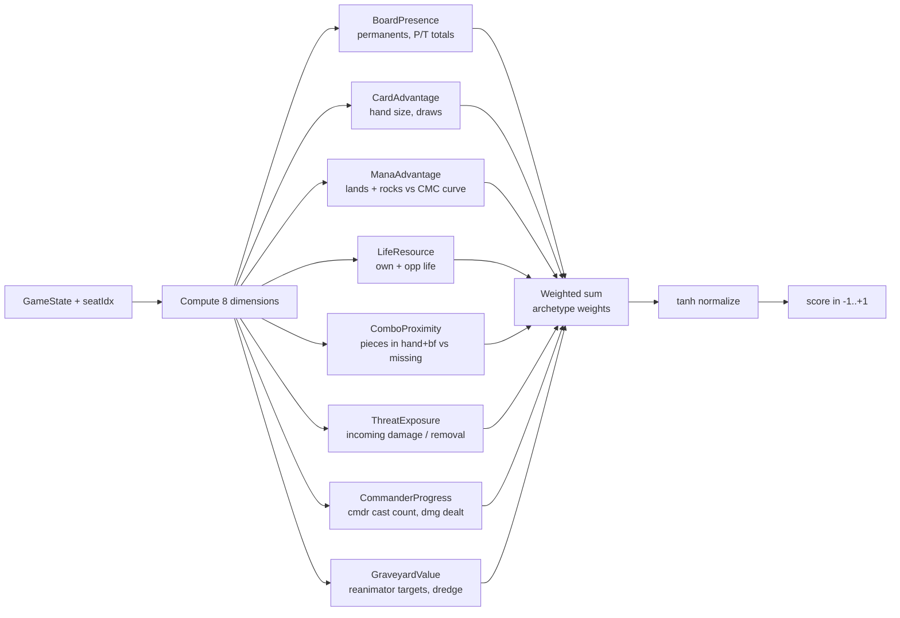

# Eval Weights and Archetypes

> Last updated: 2026-04-29
> Source: `internal/hat/eval_weights.go`, `internal/hat/evaluator.go`

8-dimensional state evaluation, archetype-tuned weights, tanh-normalized to `[-1, +1]`.

## Evaluator Pipeline

## 8 Dimensions

| Name | What it measures |
|---|---|
| BoardPresence | permanents on field, total P/T |
| CardAdvantage | hand size, drawing engines, card velocity |
| ManaAdvantage | mana generation vs deck curve |
| LifeResource | own life relative to threshold + opponent life |
| ComboProximity | known combo pieces present vs missing |
| ThreatExposure | incoming damage, opponent removal in hand |
| CommanderProgress | commander cast count, damage dealt by cmdr |
| GraveyardValue | reanimator/escape/dredge targets |

## Archetype Weights

Defined in `archetypeWeights` map. Sample row (full table in `eval_weights.go`):

| Archetype | Board | Card | Mana | Life | Combo | Threat | Cmdr | Graveyard |
|---|---|---|---|---|---|---|---|---|
| Aggro | 1.5 | 0.4 | 0.3 | 0.8 | 0.1 | 0.6 | 0.9 | 0.2 |
| Combo | 0.4 | 0.8 | 0.7 | 0.3 | **2.0** | 0.5 | 0.6 | 0.5 |
| Control | 0.5 | **1.5** | 0.8 | 0.6 | 0.4 | 1.2 | 0.5 | 0.4 |
| Midrange | 1.0 | 1.0 | 0.8 | 0.7 | 0.5 | 0.8 | 0.7 | 0.5 |
| Ramp | 0.6 | … | high | … | … | … | … | … |

Per [[#Architecture decisions|2026-04-27 expansion]]: also stax, reanimator, spellslinger weights. Tribal/tempo/voltron handled by default case.

## Override via Freya

[[Freya Strategy Analyzer|Freya]] computes deck-specific `EvalWeights` via `ComputeEvalWeights`. Tournament runner attaches them via `StrategyProfile.Weights`. Overrides archetype defaults.

## Combo Urgency Bonus

`comboUrgency()` scans all `ComboPlan` entries against hand+battlefield:
- Last missing piece → `+1.0` heuristic bonus
- Second-to-last missing → `+0.5`

Combo/control decks get a pass UCB boost of `ratio * 0.3` when combo proximity ≥50%.

## Eval Cache

Turn-scoped cache keyed on `(turn, seatIdx)`. Invalidated only on turn change (board state stable across stack pushes). Critical for [[YggdrasilHat]] performance.

## Related

- [[Hat AI System]]
- [[YggdrasilHat]]
- [[MCTS and Yggdrasil]]
- [[Freya Strategy Analyzer]]
