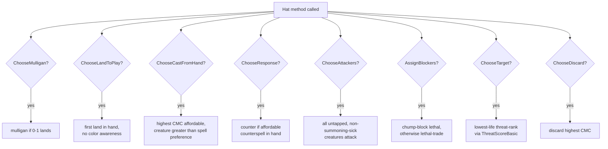

# Greedy Hat

> Source: `internal/hat/greedy.go` (1059 lines)
> Status: **Deprecated**, kept for [Tool - Parity](Tool%20-%20Parity.md) byte-equivalence

Stateless baseline. Byte-equivalent to pre-Phase-10 inline engine heuristics. Two `GreedyHat` instances are interchangeable, so a single `*GreedyHat` is shared across seats with no per-seat state.

## Why Greedy Was the Baseline

Before the [Hat AI System](Hat%20AI%20System.md) was extracted as a pluggable interface, the engine had inline heuristics for each player choice — *"to pick a target, find the lowest-life opponent and target their biggest creature"*, etc. When the interface was extracted, those inline heuristics got moved verbatim into `GreedyHat` so existing tests would still pass byte-equivalently.

GreedyHat is essentially the documented behavior of the engine pre-Phase-10. Its job now is to be the **deterministic baseline** for parity testing.

## Decision Tree



Every method has a simple, deterministic policy:

| Method | Policy |
|---|---|
| `ChooseMulligan` | Mulligan if 0 or 1 lands in hand |
| `ChooseBottomCards` | Bottom highest-CMC cards (post-mulligan) |
| `ChooseLandToPlay` | First land in hand (no color planning) |
| `ChooseCastFromHand` | Highest CMC affordable, prefer creatures |
| `ChooseActivation` | First legal activated ability |
| `ChooseAttackers` | All non-tapped, non-summoning-sick creatures |
| `ChooseAttackTarget` | Lowest-life living opponent |
| `AssignBlockers` | Chump-block if facing lethal, else lethal-trade |
| `ChooseResponse` | Counter if affordable counterspell in hand |
| `ChooseTarget` | Lowest-life threat-rank via `ThreatScoreBasic` |
| `ChooseMode` | First mode in list |
| `ChooseDiscard` | Discard highest-CMC cards first |
| `OrderTriggers` | Source order (no reorder) |
| `OrderReplacements` | Source order (no reorder) |
| `ChooseScry` | Send all to top |
| `ChooseSurveil` | Send all to top |
| `ChoosePutBack` | First N cards |
| `ShouldCastCommander` | Yes if affordable |
| `ShouldRedirectCommanderZone` | Yes (always redirect) |
| `ShouldConcede` | No |
| `ChooseX` | All available mana |
| `ObserveEvent` | No-op (stateless) |

## Why It's Deprecated

Doesn't recognize combos. Doesn't archetype-tune. Doesn't politic. Doesn't see past the next decision. Replaced by [YggdrasilHat](YggdrasilHat.md) for tournament play.

The fundamental limitation is that GreedyHat treats every game choice in isolation. There's no planning, no awareness of opponents' archetypes, no recognition that holding a counterspell for a real threat is better than firing it on a Lightning Bolt.

## Why It's Kept

[Tool - Parity](Tool%20-%20Parity.md) tests diff Go vs Python output. GreedyHat's deterministic behavior is the load-bearing baseline so drift is detectable without mode-driven noise.

If GreedyHat behavior changes (even subtly), parity tests break. That's a feature — it's how we catch unintended behavior changes during refactors. Yggdrasil's RNG-driven behavior wouldn't catch the same class of regression because game-to-game variance is expected.

## Known Gaps

Documented in `data/rules/HAT_CHOICE_GAPS.md` (memory: this file may have moved during the repo independence transition):

- No combo recognition — won't preferentially keep a hand with combo pieces
- No deck-aware tutoring — grabs generic "good stuff" from a tutor instead of the missing combo piece
- No archetype play patterns — aggro, combo, control, stax all play identically
- Generic mulligan rule, not deck-specific
- Rudimentary threat assessment, no political reasoning

These gaps aren't bugs — they're the **intentional baseline** that defines what "no AI thinking" looks like for HexDek. [YggdrasilHat](YggdrasilHat.md) closes each one.

## Usage

```go
// Single instance shared across all seats (stateless)
greedy := &hat.GreedyHat{}
gs.Seats[0].Hat = greedy
gs.Seats[1].Hat = greedy
gs.Seats[2].Hat = greedy
gs.Seats[3].Hat = greedy
```

Or in a tournament:

```bash
mtgsquad-tournament --hat greedy --decks ... --games 100
```

## Related

- [Hat AI System](Hat%20AI%20System.md) — interface contract
- [YggdrasilHat](YggdrasilHat.md) — production replacement
- [Tool - Parity](Tool%20-%20Parity.md) — parity tests rely on this
- [Poker Hat](Poker%20Hat.md) — another deprecated experiment
