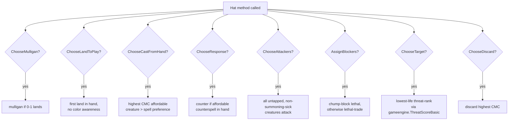

# Greedy Hat

> Last updated: 2026-04-29
> Source: `internal/hat/greedy.go`
> Status: **Deprecated** — kept for Phase 12 parity-test byte-equivalence

Stateless baseline. Byte-equivalent to pre-Phase-10 inline engine heuristics. Two `GreedyHat` instances are interchangeable, so a single `*GreedyHat` is shared across seats.

## Decision Tree

## Why Deprecated

Doesn't recognize combos, doesn't archetype-tune, doesn't politic, doesn't see past the next decision. Replaced by [[YggdrasilHat]] for tournament play.

## Why Kept

Phase 12 parity tests diff Go vs Python output. GreedyHat's deterministic behavior is the load-bearing baseline so drift is detectable without mode-driven noise.

## Known Gaps

Documented in `data/rules/HAT_CHOICE_GAPS.md`:
- No combo recognition
- No deck-aware tutoring (grabs generic "good stuff", not the missing combo piece)
- No archetype play patterns (aggro/combo/control/stax all play identically)
- Generic mulligan not deck-specific
- Rudimentary threat assessment, no political reasoning

## Related

- [[Hat AI System]]
- [[YggdrasilHat]]
