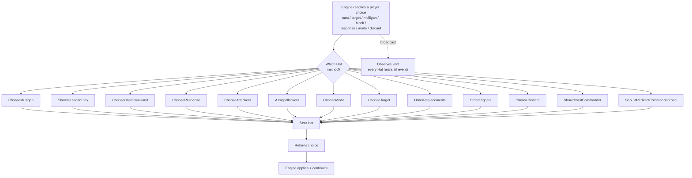
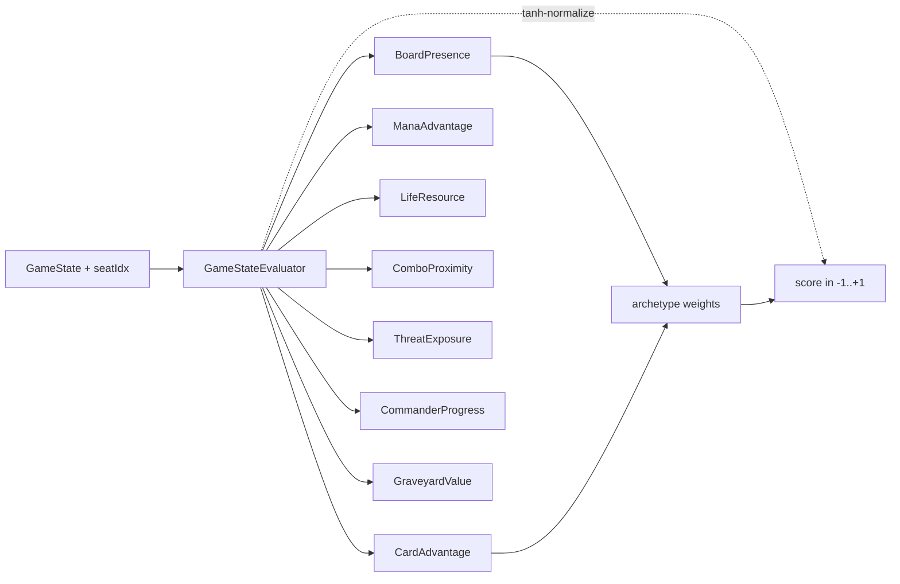

# Hat AI System

> Last updated: 2026-04-29
> Source: `internal/hat/`, `internal/gameengine/hat.go`

A "Hat" is the pluggable player-decision protocol. Every choice the rules leave to a player goes through the Hat interface. Engine NEVER inspects hat type — load-bearing architectural directive from 7174n1c.

## Decision Flow



## Implementations

| Hat | Status | Purpose |
|---|---|---|
| [[YggdrasilHat]] | **CURRENT** | Unified brain, budget dial 0-200+, native multi-seat |
| [[Greedy Hat]] | Deprecated | Baseline heuristic — kept for parity tests |
| [[Poker Hat]] | Deprecated | HOLD/CALL/RAISE adaptive — superseded |
| MCTSHat | Deprecated | Was wrapping inner hat — superseded |
| OctoHat | Test-only | Says yes to everything — engine stress only |

## Why Pluggable

```
gs.Seats[0].Hat = &hat.GreedyHat{}
gs.Seats[1].Hat = hat.NewYggdrasilHat(...)
gs.Seats[2].Hat = hat.NewYggdrasilHat(WithArchetype("combo"))
gs.Seats[3].Hat = hat.NewPokerHat()
```

Mixed pods. Hot-swap mid-game. Engine tests run with deterministic GreedyHat; tournaments use Yggdrasil.

## Interface Lives in Engine

`gameengine.Hat` declared in `gameengine/hat.go` (not `internal/hat/`) so `Seat.Hat` references it without an import cycle. Implementations live in `hat/`.

## Eval Pipeline (Yggdrasil)



See [[Eval Weights and Archetypes]] for weights and [[MCTS and Yggdrasil]] for budget mechanics.

## Strategy Profile

`StrategyProfile` carries deck-specific intelligence from [[Freya Strategy Analyzer]]: archetype, combo pieces, tutor priorities, value-engine keys, card roles, win lines. Loaded by tournament runner via `LoadStrategyFromFreya`.

## Related

- [[YggdrasilHat]]
- [[Eval Weights and Archetypes]]
- [[MCTS and Yggdrasil]]
- [[Greedy Hat]]
- [[Poker Hat]]
- [[Freya Strategy Analyzer]]
