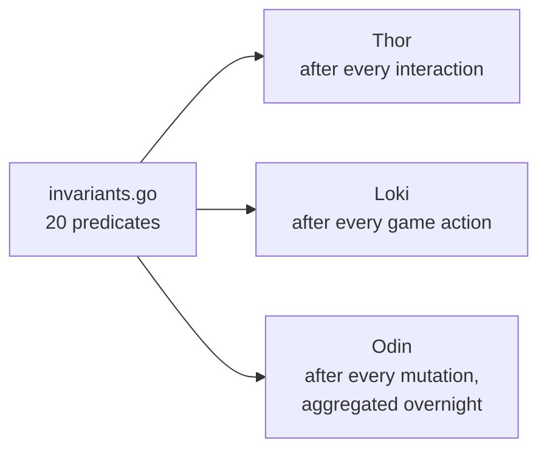

# Invariants (Odin)

> Source: `internal/gameengine/invariants.go`
> Related tools: [Tool - Odin](Tool%20-%20Odin.md), [Tool - Loki](Tool%20-%20Loki.md), [Tool - Thor](Tool%20-%20Thor.md)

20 named predicates checked after every game action. Each returns `nil` on pass, `error` on violation. Lightweight enough to run continuously in tournament-scale tests; informative enough that a violation says exactly what went wrong.

## When Each Class Runs


## Physics Invariants (9)

These are "always true." Cards exist in exactly one zone, life totals can't go negative for living players, the stack is always a valid LIFO sequence, etc. Violations are bugs in the engine, period.

| # | Name | Check |
|---|---|---|
| 1 | ZoneConservation | Total real cards = starting total (tokens excluded) |
| 2 | LifeConsistency | No negative life still playing (unless Angel's Grace flag) |
| 3 | SBACompleteness | No creature with effective toughness ≤ 0 still on battlefield (after SBA pass) |
| 4 | StackIntegrity | Stack empty at phase boundary; stack items have valid IDs |
| 5 | ManaPoolNonNegative | Typed pool ≥ 0 in every color bucket |
| 6 | IndestructibleRespected | No indestructible permanent in graveyard via destroy effect |
| 7 | LayerIdempotency | [Layer System](Layer%20System.md) returns same answer twice |
| 8 | PhaseCheck | Phase/step values are valid enum members |
| 9 | OwnerConsistency | Card owner fields are valid seat indices |

`ZoneConservation` is the most informative when something goes wrong. If the total card count drops, you immediately know a zone-move bug ate a card.

## Gameplay Invariants (11)

These are "true given the current game state's expectations." If a creature died but its death trigger never fired, that's a `TriggerCompleteness` violation — gameplay-level, not physics-level.

| # | Name | Check |
|---|---|---|
| 10 | TriggerCompleteness | Death events with trigger-bearers produce trigger events |
| 11 | CounterAccuracy | No negative counters; +1/+1 and -1/-1 annihilate per §704.5q |
| 12 | CombatLegality | No defending+attacking permanent; no tapped blocker; legal block assignments |
| 13 | TurnStructure | Phase/step values valid; active seat valid |
| 14 | CardIdentity | No card pointer in two zones simultaneously |
| 15 | ReplacementCompleteness | RIP graveyard leak detection (Rest in Peace exists, graveyard non-empty after applicable event) |
| 16 | WinCondition | Winner verifiable from state when game.Ended |
| 17 | Timing | No sorceries on stack during combat; no instants under split-second |
| 18 | ResourceConservation | Mana pool sane; eliminated seats at zero mana |
| 19 | AttachmentConsistency | Aura/equipment on valid targets after §704.5n |
| 20 | StackOrderCorrectness | [APNAP](APNAP.md) order respected on stack push (§101.4) |

`StackOrderCorrectness` is the §101.4 audit. If multiple triggers from different players are on the stack, the relative order has to match APNAP. A push that violates this would surface here.

## Performance

Lightweight predicates. Loki runs all 20 after every action across 10K games + 50K nightmare boards with no measurable slowdown. Most predicates are O(seats) or O(permanents) — fast enough for the inner loop.

The most expensive is `LayerIdempotency` because it actually computes layers twice. It's run periodically rather than on every action, configurable via the test driver.

## Three Consumers



[Thor](Tool%20-%20Thor.md) runs them per-card to verify card-specific behavior. [Loki](Tool%20-%20Loki.md) runs them per-action across random games. [Odin](Tool%20-%20Odin.md) runs them per-mutation in overnight fuzz mode with violation aggregation.

## Adding a New Invariant

The pattern:

```go
// In invariants.go
func InvariantNewCheck(gs *GameState) error {
    for _, seat := range gs.Seats {
        if /* something that should never happen */ {
            return fmt.Errorf("seat %d: ...", seat.Index)
        }
    }
    return nil
}

// In the Invariants() registry
var Invariants = []Invariant{
    {Name: "ZoneConservation", Fn: InvariantZoneConservation},
    ...
    {Name: "NewCheck", Fn: InvariantNewCheck},
}
```

Loki, Odin, and Thor all pick it up automatically via the registry.

## Verification Status

```
Thor:   793,826 tests across 36,083 cards — ZERO violations
Loki:   10,000 games + 50,000 nightmare boards — ZERO violations
Odin:   20 invariants checked after every game action
```

Zero violations across this scale of testing means the engine is structurally correct — the rules apply, state stays consistent, the game doesn't get into illegal shapes. Bugs that remain are gameplay-level (effects firing the wrong way, hat decisions playing badly) not engine-physics-level.

## Related

- [Tool - Odin](Tool%20-%20Odin.md) — overnight fuzzer
- [Tool - Loki](Tool%20-%20Loki.md) — chaos gauntlet
- [Tool - Thor](Tool%20-%20Thor.md) — per-card stress
- [Engine Architecture](Engine%20Architecture.md) — top-level dataflow
- [Layer System](Layer%20System.md) — `LayerIdempotency`
- [Replacement Effects](Replacement%20Effects.md) — `ReplacementCompleteness`
- [APNAP](APNAP.md) — `StackOrderCorrectness`
