# Invariants (Odin)

> Last updated: 2026-04-29
> Source: `internal/gameengine/invariants.go`
> Related tool: [[Tool - Odin]]

20 named predicates checked after every game action by [[Tool - Odin|Odin]] / [[Tool - Loki|Loki]] / [[Tool - Thor|Thor]]. Each returns `nil` on pass, `error` on violation.

## When Each Class Runs

```mermaid
flowchart TD
    Action[Engine action<br/>cast / resolve / SBA /<br/>combat step / trigger] --> Phys[Physics invariants<br/>continuously valid]
    Action --> Game[Gameplay invariants<br/>contextual]
    Phys --> Phys1[ZoneConservation]
    Phys --> Phys2[LifeConsistency]
    Phys --> Phys3[SBACompleteness]
    Phys --> Phys4[StackIntegrity]
    Phys --> Phys5[ManaPoolNonNegative]
    Phys --> Phys6[IndestructibleRespected]
    Phys --> Phys7[LayerIdempotency]
    Phys --> Phys8[PhaseCheck]
    Phys --> Phys9[OwnerConsistency]
    Game --> G10[TriggerCompleteness<br/>after death events]
    Game --> G11[CounterAccuracy<br/>after counter mods]
    Game --> G12[CombatLegality<br/>combat phases only]
    Game --> G13[TurnStructure<br/>phase transitions]
    Game --> G14[CardIdentity<br/>after MoveCard]
    Game --> G15[ReplacementCompleteness<br/>after FireEvent]
    Game --> G16[WinCondition<br/>at game-end]
    Game --> G17[Timing<br/>cast restrictions]
    Game --> G18[ResourceConservation<br/>phase boundaries]
    Game --> G19[AttachmentConsistency<br/>after SBA 5n]
    Game --> G20[StackOrderCorrectness<br/>after trigger push]
```

## Physics (9)

| # | Name | Check |
|---|---|---|
| 1 | ZoneConservation | total real cards = starting total (tokens excluded) |
| 2 | LifeConsistency | no negative life still playing (unless Angel's Grace) |
| 3 | SBACompleteness | no creature ≤0 toughness on battlefield |
| 4 | StackIntegrity | stack empty at phase boundary |
| 5 | ManaPoolNonNegative | typed pool ≥ 0 |
| 6 | IndestructibleRespected | no indestructible in graveyard from destroy |
| 7 | LayerIdempotency | [[Layer System]] returns same answer twice |
| 8 | PhaseCheck | phase/step values valid |
| 9 | OwnerConsistency | card owner fields valid |

## Gameplay (11)

| # | Name | Check |
|---|---|---|
| 10 | TriggerCompleteness | death events with trigger-bearers produce events |
| 11 | CounterAccuracy | no negatives; +1/+1 and -1/-1 annihilate (§704.5q) |
| 12 | CombatLegality | no defending+attacking; no tapped blocker |
| 13 | TurnStructure | phase/step values valid; active seat valid |
| 14 | CardIdentity | no card pointer in two zones |
| 15 | ReplacementCompleteness | RIP grave leak detection |
| 16 | WinCondition | winner verifiable from state |
| 17 | Timing | no sorceries on stack during combat; no instants under split-second |
| 18 | ResourceConservation | mana pool sane; eliminated seats at zero |
| 19 | AttachmentConsistency | aura/equipment on valid targets |
| 20 | StackOrderCorrectness | [[APNAP]] order on stack (§101.4) |

## Performance Note

Lightweight predicates — Loki runs all 20 after every action across 10K games + 50K nightmare boards with no measurable slowdown.

## Related

- [[Tool - Odin]]
- [[Tool - Loki]]
- [[Tool - Thor]]
- [[Engine Architecture]]
