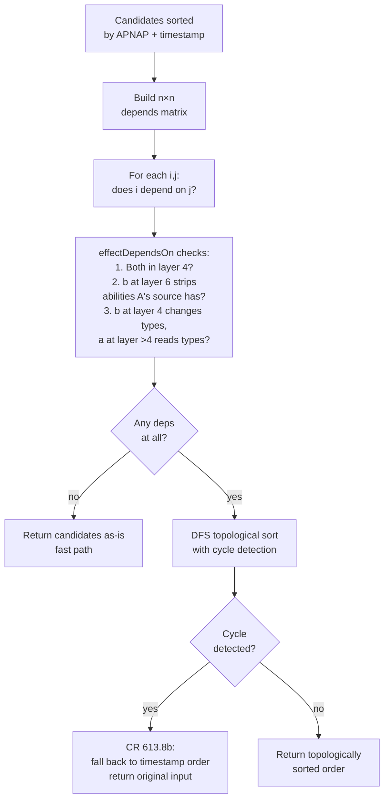

# Layer System

> Source: `internal/gameengine/layers.go` (1629 lines)
> CR ref: §613 (continuous-effect interaction)

The Layer System is how Magic resolves continuous effects when multiple effects interact. Without it, cards like *"Creatures you control get +1/+1"* and *"Each creature is a 0/2 Frog"* and *"Add a +1/+1 counter on this"* would be ambiguous — what's the final P/T of a 2/2 creature with all three effects active?

CR §613 specifies a layered application order. Effects apply in numbered layers, each layer affects different characteristics, and within a layer ordering is by timestamp with optional dependency-graph reordering as a tiebreak. HexDek's implementation lives entirely in `layers.go` plus a per-card-handler dispatch table that registers the handlers for the ~50 layer-active cards in the corpus.

This doc walks the algorithm end-to-end: where effects come from, how they're stored, how `GetEffectiveCharacteristics` walks the layer stack, how dependency ordering works, what the cache does, and where the known gaps are.

## The Layer Stack

```mermaid
flowchart TD
    Base[BaseCharacteristics:<br/>printed name, types, P/T,<br/>colors, abilities] --> L1[Layer 1<br/>copy effects 613.1a<br/>Clone, Phantasmal Image]
    L1 --> L1a[Layer 1a sublayer<br/>face-down 613.2b]
    L1a --> L1b[Layer 1b sublayer<br/>copy-overrides]
    L1b --> L2[Layer 2<br/>control changes 613.1b<br/>Mind Control, Threads]
    L2 --> L3[Layer 3<br/>text changes 613.1c<br/>Spy Kit, Mind Bend]
    L3 --> L4[Layer 4<br/>type/subtype/super 613.1d<br/>Conspiracy, Opalescence,<br/>Bestow attaching]
    L4 --> L5[Layer 5<br/>color changes 613.1e<br/>Painter's Servant]
    L5 --> L6[Layer 6<br/>ability add/remove 613.1f<br/>Sigarda's Aid grants flash,<br/>Humility strips abilities]
    L6 --> L7a[Layer 7a<br/>P/T CDA 613.4a<br/>Tarmogoyf, Lhurgoyf]
    L7a --> L7b[Layer 7b<br/>set P/T 613.4b<br/>Crovax sets to 1/1]
    L7b --> L7c[Layer 7c<br/>modify P/T<br/>+1/+1, -1/-1, until-EOT]
    L7c --> L7d[Layer 7d<br/>switch P/T 613.4d]
    L7d --> Counters[applyCountersAndMods:<br/>perm.Counters,<br/>perm.Modifications]
    Counters --> Eff[*Characteristics<br/>cached per perm]
    Eff -. face-down 707.2 .-> Override[Baseline overridden:<br/>2/2 colorless,<br/>nameless, no abilities]
```

This is the order `GetEffectiveCharacteristics` applies layers in `layers.go:407-448`. Each `applyLayer(gs, perm, chars, layer, sublayer)` call:
1. Filters `gs.ContinuousEffects` to entries matching `(layer, sublayer)`.
2. Sorts candidates by APNAP-active first, then timestamp ascending (CR §613.7 / §101.4).
3. Calls `DependencyOrder` to reorder per §613.8 dependency relationships.
4. For each effect: invoke `Predicate(gs, perm)` to gate, then `ApplyFn(gs, perm, chars)` to mutate the running characteristics.

The post-pass `applyCountersAndMods` is intentionally outside the layer machinery — it reads `perm.Counters` and `perm.Modifications` directly. This works because counters and until-EOT P/T modifications conceptually live at layer 7c, and applying them after the full layer stack produces correct results for the canonical test cases.

## What Each Layer Controls

| Layer | CR | Effects | Example cards |
|---|---|---|---|
| 1 | §613.1a | Copy effects | Clone, Phantasmal Image, Phyrexian Metamorph |
| 1a sublayer | §707.2 / §613.2b | Face-down baseline (2/2 colorless creature) | Morph, Manifest, Disguise |
| 1b sublayer | §613.2b | Copy-overrides | Cards that override face-down |
| 2 | §613.1b | Control-changing | Mind Control, Threads of Disloyalty, Take Control of |
| 3 | §613.1c | Text changes | Spy Kit, Mind Bend |
| 4 | §613.1d | Type/subtype/supertype changes | Conspiracy, Opalescence, Mistform Ultimus, Ensoul Artifact, Bestow |
| 5 | §613.1e | Color changes | Painter's Servant, Crystal Spray |
| 6 | §613.1f | Ability add/remove | Sigarda's Aid (flash), Sigil of the Empty Throne (trigger), Humility (strip), Null Rod (deactivate) |
| 7a | §613.4a | P/T from CDAs | Tarmogoyf, Lhurgoyf, Sasaya's Essence |
| 7b | §613.4b | Set P/T | Crovax the Cursed (1/1), Mark of Mutiny |
| 7c | §613.4c | Modify P/T | +1/+1 counters, -1/-1 counters, Glorious Anthem, Giant Growth (until-EOT) |
| 7d | §613.4d | Switch P/T | Niv-Mizzet's Inferno, Backslide |

Bestow specifically gets implemented as a Layer 4 type-changing effect (the bestow card becomes "Aura — Enchantment" until the enchanted creature dies) rather than as a [Replacement Effect](Replacement%20Effects.md). That's a deliberate engine design decision — it makes the type-line dynamic via the existing layer machinery instead of introducing a new replacement chain.

## Within-Layer Ordering

When multiple effects fall in the same layer, ordering is determined by:

1. **§613.7 timestamp** — earlier-applied effects come first. Each `ContinuousEffect` carries a `Timestamp int` set when it was registered. Smaller = earlier.
2. **§101.4 APNAP tiebreak** — when timestamps are equal, the active player's effects apply first. This is implemented as a stable sort with `aActive != bActive` as the primary key, then `a.Timestamp < b.Timestamp` as the secondary.
3. **§613.3 CDAs first inside layers 2-6** — characteristic-defining abilities resolve before non-CDA effects in the same layer. **HexDek currently treats this as timestamp-only** — CDA-specific ordering is a known gap that hasn't bitten anything in testing.
4. **§613.8 dependency** — when one effect's output affects another's input, the dependent waits for the depended-upon. Implemented as topological sort.

### APNAP within layers (`layers.go:677-690`)

```go
active := gs.Active
sort.SliceStable(candidates, func(i, j int) bool {
    a, b := candidates[i], candidates[j]
    aActive := a.ControllerSeat == active
    bActive := b.ControllerSeat == active
    if aActive != bActive {
        return aActive
    }
    return a.Timestamp < b.Timestamp
})
```

This produces deterministic ordering for the common case (no dependencies, no APNAP ties) and correct ordering when active player matters.

## §613.8 Dependency Ordering — `DependencyOrder`



`effectDependsOn(a, b, gs)` is intentionally conservative — it can produce false-positive dependencies (which only costs an in-layer reorder) but must not miss true dependencies (which would produce wrong game state). Three detection rules:

1. **Type-changing within layer 4:** if both are layer 4, and B's predicate matches A's source permanent, A may depend on B (B could change A's source's type, affecting A's applicability).
2. **Ability strip from layer 6 to lower:** if B is layer 6 (ability add/remove) and B's predicate matches A's source, A depends on B (B could strip the ability that generates A's effect).
3. **Higher-layer reads lower-layer types:** if B is layer 4 (type-changing) and A is layer 5+ with a predicate that reads types, and B applies to A's source, A depends on B.

The cycle case falls back to timestamp order per §613.8b. This is deterministic but doesn't always match aspirational tournament rulings — see "Known Gaps" below.

### Worked example: Humility + Opalescence

Humility (§613.1f, layer 6): "All creatures lose all abilities and have base power and toughness 1/1." This is layer 6 (strip abilities) AND layer 7b (set P/T to 1/1).

Opalescence (§613.1d, layer 4): "Each non-Aura enchantment is a creature with power and toughness each equal to its mana value, in addition to its other types."

The dependency:
- Opalescence is at layer 4. Its effect: makes Humility (an enchantment) into a creature.
- Humility's effect is layer 6 + 7b. Once Humility is a creature, Humility's own ability self-applies — it strips its own ability.

This is a true §613.8b cycle — Opalescence depends on Humility (because Humility's strip changes whether Opalescence's effect even exists), and Humility depends on Opalescence (because Humility doesn't apply to itself unless Opalescence first makes it a creature).

HexDek's `DependencyOrder` detects the cycle in the topological-sort visit and falls back to timestamp order — whoever was registered first wins. Some printed FAQ rulings argue for specific resolution outcomes here; HexDek's outcome matches one of them but not all.

### Worked example: Blood Moon + Urborg, Tomb of Yawgmoth

Blood Moon (layer 4, layer 6): "Nonbasic lands are Mountains" — adds Mountain as a subtype + grants tap-for-R + removes original abilities.

Urborg, Tomb of Yawgmoth: "Each land is a Swamp in addition to its other types" — adds Swamp as a subtype.

The dependency:
- Both are layer 4 (type-adding). Blood Moon's effect makes Urborg into a Mountain; Urborg's effect makes lands into Swamps.
- Once Blood Moon resolves, Urborg loses its ability ("each land is a Swamp" is a static ability, removed by Blood Moon). So Urborg's effect ceases to apply.

HexDek's dependency detection: Blood Moon's predicate matches Urborg (Urborg is a nonbasic land). So Urborg depends on Blood Moon — Blood Moon applies first, strips Urborg's ability, Urborg's effect is then a no-op. Result: Urborg is just a Mountain (no Swamp type added).

This is the correct ruling per current Magic rules, and HexDek produces it correctly.

## Counter Application — `applyCountersAndMods` (§613.4c)

After all 13 layer-pass calls, this function reads:
- `perm.Counters["+1/+1"]` minus `perm.Counters["-1/-1"]` for the bonus
- All `perm.Modifications` (until-EOT P/T buffs from spells like Giant Growth)

It only adjusts P/T if `chars.Types` includes "creature" — counters on non-creatures are meaningless for layer output but stay in `perm.Counters` for SBA reads.

### Why this is post-pass instead of in-layer

Per-counter timestamps are not yet tracked. All counters of the same type apply simultaneously at the same effective layer position. CR §613.4c technically wants per-counter timestamps so that "Doubling Season placed before Hardened Scales" produces a different number of counters than "Hardened Scales placed before Doubling Season" — but in practice the engine resolves these at counter-add time (Doubling Season modifies the count when the counter is placed) rather than at layer-application time, so the post-pass output is correct.

The Python reference implementation makes the same simplification. Edge cases exist (rare interactions with placement-order-sensitive effects) but they're not represented in the test corpus.

## The Canonical Accessor — `GetEffectiveCharacteristics`

```go
func GetEffectiveCharacteristics(gs *GameState, perm *Permanent) *Characteristics {
    if perm == nil { return &Characteristics{} }
    if gs == nil   { return BaseCharacteristics(perm) }
    if cached := gs.charCache[perm]; cached.Epoch == gs.charCacheEpoch {
        return cached.Chars
    }
    chars := BaseCharacteristics(perm)
    applyLayer(gs, perm, chars, 1, "")
    applyLayer(gs, perm, chars, 1, "a")
    applyLayer(gs, perm, chars, 1, "b")
    applyLayer(gs, perm, chars, 2, "")
    applyLayer(gs, perm, chars, 3, "")
    applyLayer(gs, perm, chars, 4, "")
    applyLayer(gs, perm, chars, 5, "")
    applyLayer(gs, perm, chars, 6, "")
    applyLayer(gs, perm, chars, 7, "a")
    applyLayer(gs, perm, chars, 7, "b")
    applyLayer(gs, perm, chars, 7, "c")
    applyLayer(gs, perm, chars, 7, "d")
    applyLayer(gs, perm, chars, 7, "e")  // reserved future
    applyCountersAndMods(perm, chars)
    gs.charCache[perm] = &cachedCharacteristics{Chars: chars, Epoch: gs.charCacheEpoch}
    return chars
}
```

This is the *only* function the rest of the engine should call when it needs effective characteristics. Combat reads through `gs.PowerOf(p)` which routes to `GetEffectiveCharacteristics`. SBAs read through it. Triggers read through it.

**Never read raw `perm.Card.BasePower` for combat / SBA decisions** — you'd miss layer effects. The convenience accessors `gs.PowerOf`, `gs.ToughnessOf`, `gs.IsCreatureOf`, `gs.HasTypeOf`, `gs.HasSubtypeOf`, `gs.ColorsOf`, `gs.AbilitiesOf`, `gs.HasKeywordOf` all route through this function — use them instead of direct field access.

## Idempotency Invariant — `LayerIdempotency`

> Calling `GetEffectiveCharacteristics(perm)` twice with no intervening state change MUST return identical results.

Enforced by the `LayerIdempotency` invariant — see [Invariants Odin](Invariants%20Odin.md). This catches bugs where layer application has accidental side effects (mutating something on the second call that wasn't there on the first). The `applyLayer` defensive `recover()` calls make sure a buggy handler can't crash the system, but they don't prevent it from corrupting state — idempotency is the trip wire.

In practice: a handler that, say, increments a counter inside its `ApplyFn` would fail this invariant — the second call would see a different counter value. The fix is always "ApplyFn must be a pure function of (perm, gs at this moment)."

## Layer Cache

Layers are expensive — there can be 20+ effects on the field, dependency-sorted, applied to every relevant permanent. Each call to `GetEffectiveCharacteristics` would be O(effects × permanents) without caching.

`gs.charCache` is `map[*Permanent]*cachedCharacteristics`. Each entry has an `Epoch uint64` field. Cache hit when `entry.Epoch == gs.charCacheEpoch`.

The cache invalidates by bumping `charCacheEpoch` when any layer-relevant state changes:
- Permanent enters or leaves battlefield
- Counter added or removed
- Aura/equipment attached or detached
- Static ability granted or lost (Humility, Sundering Growth)
- A `RegisterContinuousEffect` or `UnregisterContinuousEffectsForPermanent` call

Other state changes (mana pool, hand size, life total) don't touch the cache. This is by design — those don't affect any permanent's characteristics.

`InvalidateCharacteristicsCache` is the one-line bump call. Every state-mutating site that touches layer-relevant state calls it. Missing one is a "stale cache returns wrong answer" bug — the `LayerIdempotency` invariant doesn't catch this directly because both calls would return the same wrong answer, but the next bug-find tool (Loki, Thor) typically surfaces it as a downstream invariant violation.

## ContinuousEffect Registry

`gs.ContinuousEffects []*ContinuousEffect` is the global registry. Each entry has:

| Field | Purpose |
|---|---|
| `Layer int` | Primary §613 layer (1-7) |
| `Sublayer string` | "a"/"b"/"c"/"d"/"e" for layer 7; "a"/"b" for layer 1 face-down; "" otherwise |
| `Timestamp int` | §613.7 tiebreaker |
| `SourcePerm *Permanent` | Source permanent (for LTB cleanup) |
| `SourceCardName string` | Human-readable for logs |
| `ControllerSeat int` | For APNAP tiebreak |
| `HandlerID string` | Stable unique key — second register with same ID is no-op |
| `Predicate func(gs, target) bool` | Returns true if this applies to target |
| `ApplyFn func(gs, target, chars)` | Mutates `chars` per §613.6 |
| `Duration string` | "permanent", "end_of_turn", "until_source_leaves", etc. |
| `DependsOn []string` | Reserved for future explicit dependency lists |

`RegisterContinuousEffect(ce)` appends to the registry. Idempotent on `HandlerID`. `UnregisterContinuousEffectsForPermanent(p)` drops every entry where `SourcePerm == p` — called on LTB.

`ScanExpiredDurations(gs, phase, step)` runs at every phase/step boundary, drops effects whose duration has elapsed (e.g. "end_of_turn" effects drop at cleanup, "until your next turn" effects drop at the controller's next untap).

## Per-Card Handler Registry

`RegisterContinuousEffectsForPermanent(gs, p)` keys off `p.Card.DisplayName()` and registers the appropriate continuous effects. The dispatcher is hand-coded for each layer-active card — about 30 cards in the corpus require explicit Layer effects:

- **Layer 1:** Clone, Phantasmal Image, Phyrexian Metamorph
- **Layer 2:** Mind Control, Threads of Disloyalty, Take Control
- **Layer 4:** Conspiracy, Mistform Ultimus, Opalescence, Ensoul Artifact, March of the Machines, Mycosynth Lattice, Bestow attaching
- **Layer 5:** Painter's Servant, Crystal Spray
- **Layer 6:** Sigarda's Aid, Sigil of the Empty Throne, Humility, Null Rod, Pithing Needle, Phyrexian Unlife
- **Layer 7a:** Tarmogoyf, Lhurgoyf, Sasaya's Essence (CDAs)
- **Layer 7b:** Crovax the Cursed
- **Layer 7c:** Glorious Anthem, Honor of the Pure (anthems)

The handler functions return `*ContinuousEffect` with the `Predicate` and `ApplyFn` baked in. Adding a new layer-active card means adding a case to the dispatch and writing the handler — see `layers.go:1551-1629` for the dispatcher.

## Known Gaps

### §613.8 true dependency cycles

The Humility + Opalescence canonical example: there are multiple "correct" interpretations depending on tournament-rules history. HexDek falls back to timestamp ordering when the dependency graph has a cycle (per §613.8b). The result matches one of the printed FAQ rulings but not all aspirational outputs. Acceptable for v1.

### CDA-first ordering inside layers 2-6

§613.3 says characteristic-defining abilities resolve before non-CDA effects in the same layer. HexDek treats this as timestamp-only — CDA tagging is a planned but not-yet-implemented feature on `ContinuousEffect`. No card in the test corpus has surfaced an issue from this gap, but it's a real spec-deviance.

### Per-counter timestamps

Multiple counters of the same type apply simultaneously even when they were placed at different game moments. Edge case impact only — the engine resolves doubled-counter math at placement time (Doubling Season) rather than at layer-application time, which works for the canonical Doubling Season + Hardened Scales test but may produce wrong results for hypothetical "place a counter, register a layer effect that references the count, place another counter" sequences.

### Bestow as Layer 4

Bestow's continuous effect is implemented in Layer 4 (type-changing) rather than as a [Replacement Effect](Replacement%20Effects.md). The bestow card is normally a creature; when cast for its bestow cost, Layer 4 changes its type to "Aura — Enchantment" until the enchanted creature dies. This is a deliberate engine simplification — making the type-line dynamic via the existing layer machinery instead of introducing a new replacement chain. Functionally correct for all known bestow cards in the corpus.

## Planned Improvement

Per memory (`project_hexdek_architecture.md`, 2026-04-15): AST `Modification` nodes get a `layer: Optional[int]` tag at parse time. The engine sorts by layer at resolution instead of re-deriving each call. This pushes work from runtime to parse time — significant throughput win for layer-heavy boards. Not yet implemented.

## Related

- [State-Based Actions](State-Based%20Actions.md) — toughness check reads through layer system
- [Combat Phases](Combat%20Phases.md) — keyword grants come from Layer 6
- [Card AST and Parser](Card%20AST%20and%20Parser.md) — static abilities are parsed into AST nodes consumed here
- [Replacement Effects](Replacement%20Effects.md) — sister system for replacement-class continuous effects
- [Invariants Odin](Invariants%20Odin.md) — `LayerIdempotency` invariant
- [Per-Card Handlers](Per-Card%20Handlers.md) — registers the per-card layer effects
