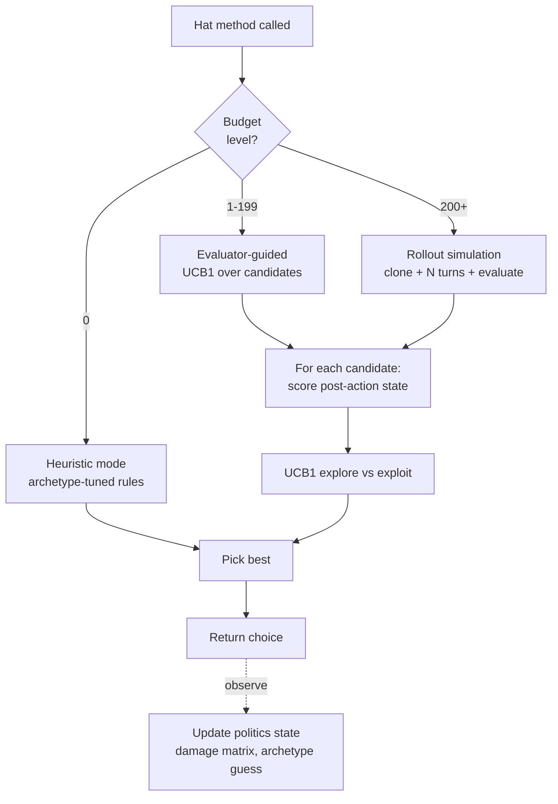
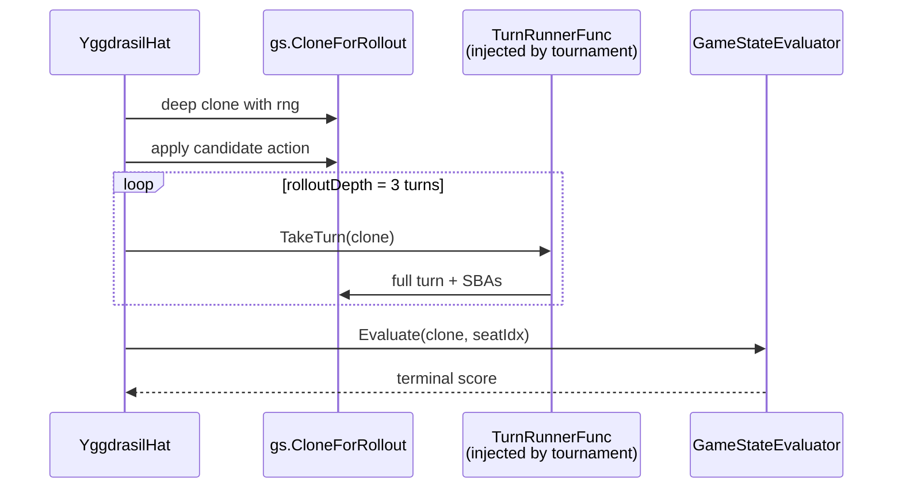

# MCTS and Yggdrasil

> Last updated: 2026-04-29
> Source: `internal/hat/yggdrasil.go`, `mcts.go`, `rollout.go`
> Status: Yggdrasil current; MCTSHat deprecated

## YggdrasilHat

Unified player-decision engine. One brain, tunable personality. Replaces the Greedy → Poker → MCTS delegation chain. Named by 7174n1c after the Norse World Tree.

## Budget Dial

| Budget | Behavior |
|---|---|
| 0 | Heuristic (GreedyHat-equivalent baseline) |
| 1-199 | Evaluator-guided best-of-candidates |
| 200+ | MCTS-style rollout (clone + 3 turns + eval) |

## UCB1 Tracking

`actionStats` map keyed by turn-scoped action key. Reset at `game_start`. Standard UCB1 formula balances exploration of untried candidates vs exploitation of known-good ones.

## Rollout Simulation

`TurnRunnerFunc` injected by `internal/tournament/turn.go::TurnRunnerForRollout` — breaks the hat→tournament import cycle.

## Politics Layer

Native multi-seat awareness:
- `damageDealtTo[seat]` — track our aggression
- `damageReceivedFrom[seat]` — retaliation candidate
- `spellsCastBy[seat]` — activity meter
- `perceivedArchetype[seat]` — guess from observed plays
- `assessAllThreats()` — score every opponent each decision

Behaviors: retaliation risk, grudge factor, spread-damage-when-behind, finish-low-life priority.

## Per-Turn Eval Budget

`YggdrasilHat.TurnBudget` — eval points per turn. Each evaluator-path decision costs 1; each rollout costs 10. When exhausted → heuristic mode for remaining decisions that turn. `--turn-budget 100` recommended.

## Adaptive Budget

`effectiveBudget → 0` when battlefield ≥ 60. Pathological boards skip evaluation entirely.

## Round Notation (2026-04-27)

All hat decision logs use `R{round}.{seat}` format. Round tracked via `gs.Flags["round"]`, increments on seat rotation wrap.

## Related

- [[Hat AI System]]
- [[Eval Weights and Archetypes]]
- [[Freya Strategy Analyzer]]
- [[Tournament Runner]]
