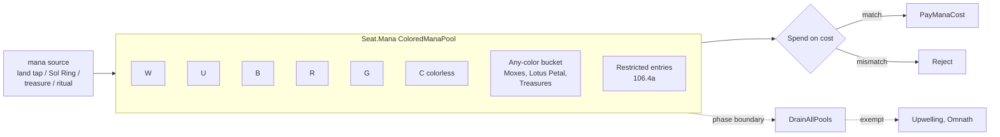

# Mana System

> Last updated: 2026-04-29
> Source: `internal/gameengine/mana.go`, `mana_artifacts.go`, `costs.go`, `cost_modifiers.go`
> CR refs: §106, §202, §601.2f

Typed colored mana pool with restricted-mana support. Backwards-compatible with legacy `Seat.ManaPool int`.

## Pool Structure

## Restricted Mana (§106.4a)

`RestrictedMana` carries a spend-time predicate:
- Food Chain — creature spells only
- Powerstone — noncreature activations only
- Cabal Coffers / Crypt Ghast variants

## API

| Function | Purpose |
|---|---|
| `EnsureTypedPool(seat)` | lazy init `*ColoredManaPool` |
| `AddMana(seat, color, n)` | typed add |
| `PayManaCost(seat, cost)` | spends with restriction matching |
| `DrainManaPool(seat)` | end-of-step §106.4 |
| `ManaExemption(seat)` | Upwelling/Omnath skip drain |

## Legacy Mirror

`Seat.ManaPool int` mirrored from typed total for read-only call sites. Direct writes invalidate the typed pool (next read rebuilds from zero).

## Mana Artifacts

`mana_artifacts.go` registers handlers for Sol Ring, Mana Crypt, the Moxes (original + Mox Amber/Diamond/Opal), Chrome Mox, Mana Vault, Basalt Monolith, Grim Monolith, Worn Powerstone, Thran Dynamo, Gilded Lotus, etc. ~30 specific rocks.

## Cost Modifiers

`cost_modifiers.go` + `ScanCostModifiers` apply spell-cost reductions/taxes:
- Reductions: Foundry Inspector, Goblin Electromancer, Helm of Awakening
- Taxes: Trinisphere, Defense Grid (off-turn instants), Thalia Guardian
- Cost-zero: Rooftop Storm (zombies), Training Grounds variants

## Commander Tax (§903.8)

`Seat.CommanderCasts[id]` counter; tax = `2 * casts_from_command_zone`.

## Drain at Phase Boundaries

[[Tournament Runner|turn.go]] calls `DrainAllPools(gs)` at every step transition. Exempt cards (Upwelling) checked via `ManaExemption`.

## No-Mana-Cost Exploit Fix

CMC=0 instants/sorceries without `cost:N` tag blocked from hand casting (§202.1a). Profane Tutor (suspend-only) was being cast for free until 2026-04-27. Zero-CMC permanents (Ornithopter, Mox Amber) excluded from filter.

## Related

- [[Stack and Priority]]
- [[Per-Card Handlers]]
