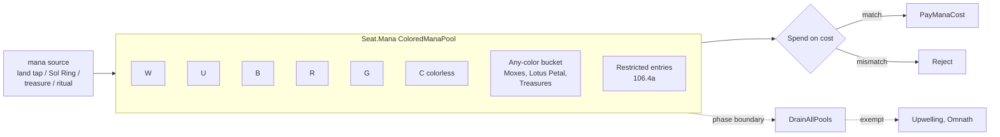

# Mana System

> Source: `internal/gameengine/mana.go` (710 lines), `mana_artifacts.go`, `costs.go`, `cost_modifiers.go`
> CR refs: §106 (mana), §202 (mana cost), §601.2f (cost payment)

Magic's resource economy. Cards have mana costs in colors (W/U/B/R/G), generic ({2}, {3}), and various special variants (X-costs, hybrid {U/B}, snow {S}, Phyrexian {U/P}). The mana system tracks a per-seat pool, applies cost reductions and taxes, and validates that a spell can actually be paid for.

## Pool Structure

## API

| Function | Purpose |
|---|---|
| `EnsureTypedPool(seat)` | Lazy init `*ColoredManaPool` |
| `AddMana(seat, color, n)` | Typed add |
| `PayManaCost(seat, cost)` | Spend with restriction matching |
| `DrainManaPool(seat)` | End-of-step §106.4 drain |
| `ManaExemption(seat)` | Upwelling / Omnath skip drain |
| `AvailableManaEstimate(gs, seat)` | Quick sum of typed pool + untapped sources |

## Restricted Mana (CR §106.4a)

Some mana sources produce mana that can only be spent on certain things. `RestrictedMana` carries a spend-time predicate:

| Card | Restriction |
|---|---|
| Food Chain | Creature spells only |
| Powerstone tokens | Noncreature activations only |
| Cabal Coffers / Crypt Ghast variants | Black mana with specific spend rules |

When the pool has restricted entries, `PayManaCost` validates each mana payment against the restriction. A creature spell can spend Food Chain mana; a sorcery cannot.

## Mana Artifacts

`mana_artifacts.go` registers handlers for ~30 specific rocks:

- Sol Ring, Mana Crypt, Mana Vault, Basalt Monolith, Grim Monolith
- Original Moxes (Pearl, Sapphire, Jet, Ruby, Emerald)
- Mox Amber, Mox Diamond, Mox Opal, Mox Tantalite
- Chrome Mox, Mox Lotus, Lotus Petal
- Worn Powerstone, Thran Dynamo, Gilded Lotus
- Treasure tokens, food tokens (when sacrificed for mana)

Each handler implements the card's specific mana production rules. Sol Ring adds {2} colorless. Mana Crypt adds {2} colorless and triggers an upkeep coin flip. Mox Diamond costs a discard. Etc.

## Cost Modifiers

`cost_modifiers.go` and `ScanCostModifiers` apply spell-cost reductions and taxes:

| Card | Effect |
|---|---|
| Foundry Inspector | Artifacts cost {1} less |
| Goblin Electromancer | Instants and sorceries cost {1} less |
| Helm of Awakening | All spells cost {1} less |
| Trinisphere | All spells cost at least {3} |
| Defense Grid | Off-turn instants cost {3} more |
| Thalia, Guardian of Thraben | Noncreature spells cost {1} more |
| Rooftop Storm | Zombie creatures cost 0 |
| Training Grounds variants | Activated abilities cost {2} less |
| Undead Warchief | Zombies cost {1} less |
| Nightscape Familiar | Black spells cost {U/B} less |

`ScanCostModifiers` walks the battlefield and accumulates additive modifiers, applies them in §601.2e order (additions first, then reductions).

## Commander Tax (CR §903.8)

`Seat.CommanderCasts[id]` counts how many times each commander has been cast from the command zone. Tax = `2 × casts_from_command_zone`.

A commander cast for the first time is its base mana cost. Cast a second time after returning to command zone, it's base + {2}. Third time, base + {4}. Etc. The tax accumulates across the game and never resets (unlike Statecraft's once-per-turn tax variants which Magic doesn't currently use).

## Drain at Phase Boundaries (§106.4)

> *"At the end of each phase and step, all unspent mana empties from each player's mana pool."*

`DrainAllPools(gs)` is called at every step transition by the turn loop. Pools empty before the next step starts.

**Exempt cards** check via `ManaExemption(seat)`:

- **Upwelling** — mana doesn't drain
- **Omnath, Locus of Mana** — green mana stays
- **Cabal Coffers** variants — keep specific bucket types

## Legacy Mirror

`Seat.ManaPool int` is a legacy total maintained for read-only call sites. The typed pool (`Seat.Mana *ColoredManaPool`) is authoritative; the int mirror is computed from it on demand.

Direct writes to `ManaPool int` invalidate the typed pool — the next read rebuilds from zero. This is a transitional compatibility shim from the pre-typed-pool era; eventually the int will be removed and all paths will use the typed pool directly.

## No-Mana-Cost Exploit Fix

Memory note (2026-04-27): CMC=0 instants and sorceries without an explicit `cost:N` AST tag are blocked from hand casting per §202.1a (a card with no mana cost can't be cast normally). Profane Tutor (suspend-only) was being cast for free every turn until this fix.

Zero-CMC permanents (Ornithopter, Mox Amber, Memnite) are correctly excluded from the filter — they have implicit mana costs of {0} and *can* be cast normally.

## Related

- [Stack and Priority](Stack%20and%20Priority.md) — §601.2 cast pipeline including cost payment
- [Per-Card Handlers](Per-Card%20Handlers.md) — mana-rock specific handlers
- [Card AST and Parser](Card%20AST%20and%20Parser.md) — `ManaCost` AST type
