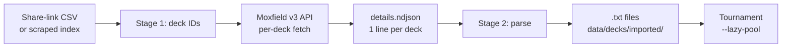

# Moxfield Import Pipeline

> Source: `internal/moxfield/`, `cmd/mtgsquad-import/`

Bulk decklist ingestion path for the 5K+-deck pool tournaments. Two-stage pipeline: share-link CSV → deck details NDJSON → engine-ingestion `.txt` files.

## Two-Stage Flow



## Why Two Stages

Moxfield's API has reliability quirks:

- **Per-deck fetch** (URL → JSON) works fine with no published rate limits
- **Search endpoints** return 403 — bulk discovery via API is blocked

So bulk discovery requires either:

- **Share-link CSV** (manual export from a curated Moxfield list)
- **HTML scraping** (more brittle but covers public listings)

Per-deck fetch is reliable; only the discovery side is tricky. Splitting into two stages lets the discovery side change (CSV today, scraper tomorrow) without affecting the per-deck fetch logic.

## Stage 1: Deck IDs

Input is a list of deck IDs or full URLs. CSV scraper or share-link export populates this. Output is the canonical ID list — typically a few hundred to a few thousand IDs.

The CSV format from Moxfield's share-link export:

```csv
deck_id,name,format,colors,last_updated
abc123,"Sin, Special Agent",commander,BUG,2026-04-15
def456,"Yuriko Storm",commander,UB,2026-04-18
...
```

Stage 1 normalizes this to a flat list of deck IDs, deduplicating and filtering by format (commander only).

## Stage 2: Per-Deck Fetch

For each deck ID:

1. `moxfield.FetchDeck(url)` calls `api.moxfield.com/v3/decks/all/{id}`
2. JSON parsed via `apiResponse` struct (name, format, mainboard, commanders, sideboard, companions)
3. Oracle text resolved via Scryfall lookup (delayed — only needed when the deck is loaded by a tool, see [Card AST and Parser](Card%20AST%20and%20Parser.md))
4. Written as canonical `.txt` deck — see [Decklist to Game Pipeline](Decklist%20to%20Game%20Pipeline.md) format

## Recent Run

Per memory (`project_hexdek_parser.md`): a recent corpus pull produced **1481 unique decks**. Used in steel-man pool tournaments, surfaces commanders / cards never seen in the curated 32-deck portfolio.

The 50K-game tournament on DARKSTAR covered **654 / 654 unique commanders** in the imported corpus — every commander the deck pool contained played at least one game. Verifies the import worked end-to-end.

## Caching

`details.ndjson` keeps each fetched deck so re-runs don't hit the API again:

```json
{"deck_id":"abc123","name":"Sin Special Agent","commander":"Sin, Special Agent","mainboard":[{"name":"Sol Ring","qty":1},...],"fetched_at":"2026-04-29T..."}
{"deck_id":"def456",...}
```

NDJSON-line format: each line is one deck's complete fetch result. Streaming-readable; resumable on partial runs.

## Rate Limiting

Moxfield API has no published rate limits. Be polite — sleep between requests, cap to single-digit RPS. No production issues observed at conservative pacing (~3-5 req/sec).

If you push higher, you risk:

- Temporary 429s (back off, retry with exponential delay)
- Permanent IP block (avoid by staying conservative)

The pipeline includes a simple `time.Sleep(time.Millisecond * 200)` between fetches by default.

## Error Handling

When a deck fetch fails (deleted deck, private deck, network error):

- Log the failure with deck ID and reason
- Continue with the next deck (don't abort the whole batch)
- The failure is recorded in `failures.txt` for later retry

## Output Location

Imported decks are written to `data/decks/imported/{deck_id}.txt`. Tournament runners can `--decks data/decks/imported/` to load the entire imported pool.

For tournaments that mix curated + imported decks, point at the parent directory:

```bash
mtgsquad-tournament --decks data/decks/ --lazy-pool --games 50000
```

## When You'd Use This

- **Pre-tournament corpus refresh** — pull the latest cEDH meta from Moxfield
- **Research dataset construction** — build a diverse pool for archetype analysis
- **Yearly meta snapshot** — preserve a point-in-time view of the format

## Related

- [Tool - Import](Tool%20-%20Import.md) — single-deck import (uses same `moxfield` package)
- [Decklist to Game Pipeline](Decklist%20to%20Game%20Pipeline.md) — what the .txt format means
- [Tournament Runner](Tournament%20Runner.md) — primary consumer
- [Tool - Server](Tool%20-%20Server.md) — also uses `moxfield` package for live deck import
