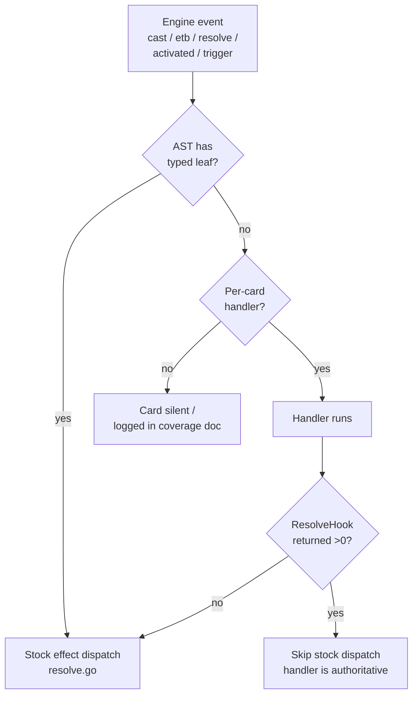

# Per-Card Handlers

> Last updated: 2026-04-29
> Source: `internal/gameengine/per_card/` (~96 .go files), `per_card_hooks.go`
> Count: 1079+ snowflake handlers

When [[Card AST and Parser|AST]] can't express a card cleanly, hand-rolled handler. Avoids cyclic import via `per_card_hooks.go` seam.

## Dispatch Decision Tree

## Hook Surfaces

| Hook | Fires When | Examples |
|---|---|---|
| `ETBHook` | After stock ETB triggers in `resolvePermanentSpellETB` | Doubling Season, Panharmonicon |
| `CastHook` | After stack push, before priority opens | (reserved, batch 1 unused) |
| `ResolveHook` | Inside `ResolveStackTop`, before stock dispatch | Doomsday, Demonic Consultation, Tainted Pact |
| `ActivatedHook` | When activated ability resolves | Aetherflux Reservoir, Walking Ballista |
| `TriggerHook` | Engine emits named game event | Rhystic Study, Mystic Remora, Cloudstone Curio, Hullbreaker Horror |

## Batch Organization

| Batch | Theme | Sample cards |
|---|---|---|
| 1-8 | cEDH staples | Thoracle, Doomsday, Food Chain, Rhystic Study, Necropotence |
| 9 | Test-deck commanders | 28 commander handlers for active deck pool |
| 10 | Combo pieces | Treasure Nabber, Ragost combo, Vecna trilogy |
| 11 | Aristocrats | Blood Artist, Zulaport, Syr Konrad |
| 12 | Discard infra | Hymn to Tourach, Mind Twist, Tergrid payoffs |
| 13 | Discard payoffs | Waste Not, Liliana's Caress, Megrim, Tinybones |
| 14 | Stax lock | Defense Grid, Notion Thief, Trinisphere |
| 15 | Obeka support | Braid of Fire, Sphinx of the Second Sun, Dragonmaster Outcast |
| 16 | Tribal lords | Death Baron, Undead Warchief, Rooftop Storm, Endless Ranks |
| 17 | Combat restrictions + 32-card sweep | Propaganda, Howling Mine, Black Market, Maralen, Lich's Mastery |

## Trigger Guards

`per_card/registry.go:fireTrigger` enforces depth 8 / total 2000 caps. See [[Trigger Dispatch]].

## Trigger Dispatch Audit (2026-04)

Audit found 8 dead per-card triggers due to event-name mismatches. Fixed via [[Trigger Dispatch|event_aliases.go]] normalization layer. `upkeep_controller` event was missing entirely — fix in `turn.go` added `FireCardTrigger(gs, "upkeep_controller", ...)` after `FirePhaseTriggers`. Affected cards: Mana Crypt, Eye of Vecna, The One Ring, Mystic Remora, Oloro, Necrogen Mists, Bottomless Pit.

## Authoritative Mode

When `ResolveHook` returns nonzero, stock dispatch is SKIPPED. Used by Doomsday (custom 5-pile UI) and Demonic Consultation / Tainted Pact (oracle-text effect not expressible in [[Card AST and Parser|AST]]).

## Discard Pipeline

`gameengine.DiscardN()` exported as the canonical discard API for handlers. Ensures `card_discarded` trigger fires (Tergrid, Waste Not, Liliana's Caress).

## Related

- [[Card AST and Parser]]
- [[Trigger Dispatch]]
- [[Engine Architecture]]
