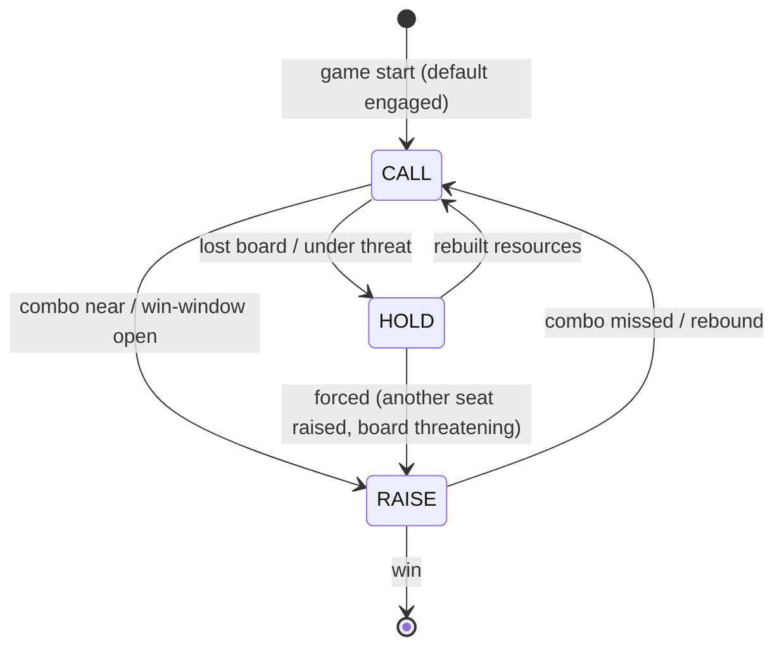

# Poker Hat

> Source: `internal/hat/poker.go` (1956 lines)
> Status: **Deprecated**, superseded by [YggdrasilHat](YggdrasilHat.md)

HOLD/CALL/RAISE adaptive hat. The mode is internal — engine doesn't know it exists. Mirrors Python `scripts/extensions/policies/poker.py` v2.

## What PokerHat Was Trying to Do

Real EDH play has a clear pattern: early game you're rebuilding resources (HOLD), mid-game you're engaged with the table (CALL), end-game someone is racing to win (RAISE). PokerHat's hypothesis was that an AI that explicitly tracked which mode it was in would play more humanly than [GreedyHat](Greedy%20Hat.md) (always greedy) or pure-MCTS (no mode awareness).

The mode was internal, hidden from the engine, surfaced via `ObserveEvent("player_mode_change")` events for other Poker hats to observe.

## Mode Transitions



## Mode Semantics

- **HOLD** — rebuild. Prioritize tutors, draw, recursion, ramp. Targeted removal only if a threat merits. Cheap threats. Skip haymakers.
- **CALL** — engaged. Greedy-like play with open-target attack preference + 7-dim threat ranker.
- **RAISE** — press to win. All-in attacks, save mana for combo pieces, only counter game-ending threats.

## RAISE Cascade

`ObserveEvent` catches `player_mode_change` from OTHER seats. If another seat raises and we have:

- 2+ combo pieces, OR
- Big board, OR
- Imminent loss

we also raise. Reproduces the all-seats-RAISE closing exchanges in paper EDH where everyone reads "someone is about to win" and shifts gears simultaneously.

## 7-Dimensional Threat Score

Widens GreedyHat's "stomp the best board" to include:

1. Board power (creatures + total P/T)
2. Hand size
3. Graveyard value (reanimator potential)
4. Command zone progress (commander cast count)
5. Ramp pressure (lands + rocks)
6. Library count (mill threat)
7. Archetype telegraph (oracle text scan for win-condition signatures)

Each dimension contributes a weighted score; the sum is the seat's "threat" when picking attack targets or removal targets. Yggdrasil inherited a refined version of this dimensioning.

## What Worked

The mode system did capture something real about EDH play. Games with PokerHat seats had observably different rhythms than GreedyHat games — seats that lost their board would *actually back off* and rebuild instead of attacking with empty boards.

The 7-dimensional threat score was a meaningful improvement over `ThreatScoreBasic`. Yggdrasil's politics layer is built on the same dimensions.

## Why Deprecated

Three problems that became unfixable in PokerHat's architecture:

1. **Wrapped delegation chain.** Greedy → Poker → MCTS was brittle. Adding a method meant updating three implementations and tracing which override fired.
2. **No native multi-seat awareness.** Mode tracking was per-seat (own mode) but didn't extend to "what mode is each opponent in, and how should that change my play?"
3. **Mode boundaries were fragile.** State transitions were rule-based heuristics that misfired in long games (HOLD→CALL when threat disappeared, but didn't always RAISE when win-line assembled).

[YggdrasilHat](YggdrasilHat.md) integrates the same threat dimensions plus combo urgency, politics, eval cache, and turn budget into a single brain. The implicit mode-equivalent (heuristic / evaluator / rollout) is exposed as the budget dial instead of internal state.

## What We Kept

The 7-dimensional threat score lives on in [YggdrasilHat](YggdrasilHat.md)'s `assessAllThreats()`. The conviction-concession idea (when far behind for several turns, give up) lives on in `convictionScores` sliding window.

The mode-state machine itself was discarded. Yggdrasil's adaptive budget (heuristic when board is too complex) and turn budget (cap eval points per turn) replace it with cleaner mechanics.

## Usage (Historical)

```go
// Direct construction
poker := hat.NewPokerHat()
gs.Seats[0].Hat = poker

// Or via tournament runner
// mtgsquad-tournament --hat poker
```

The CLI flag still works — Poker is buildable and runnable, just not recommended. Use Yggdrasil instead.

## Related

- [Hat AI System](Hat%20AI%20System.md) — interface contract
- [YggdrasilHat](YggdrasilHat.md) — production replacement
- [Eval Weights and Archetypes](Eval%20Weights%20and%20Archetypes.md) — Yggdrasil's threat scoring
- [Greedy Hat](Greedy%20Hat.md) — the simpler baseline
