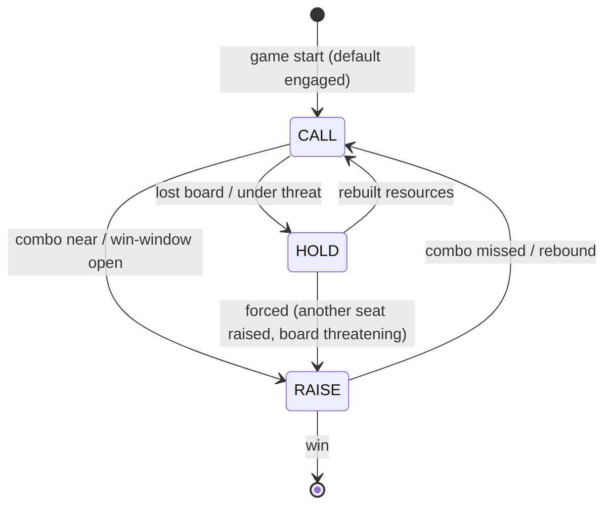

# Poker Hat

> Last updated: 2026-04-29
> Source: `internal/hat/poker.go`
> Status: **Deprecated** — superseded by [[YggdrasilHat]]

HOLD/CALL/RAISE adaptive hat. The MODE is INTERNAL — engine doesn't know it exists. Mirrors Python `scripts/extensions/policies/poker.py` v2.

## Mode Transitions

## Mode Semantics

- **HOLD** — rebuild. Prioritize tutors, draw, recursion, ramp. Targeted removal only if a threat merits. Cheap threats. Skip haymakers.
- **CALL** — engaged. Greedy-like play with open-target attack preference + 7-dim threat ranker.
- **RAISE** — press to win. All-in attacks, save mana for combo pieces, only counter game-ending threats.

## RAISE Cascade

`ObserveEvent` catches `player_mode_change` from OTHER seats. If another seat raises and we have:
- 2+ combo pieces, OR
- Big board, OR
- Imminent loss

we also raise. Reproduces the all-seats-RAISE closing exchanges in paper EDH.

## 7-Dimensional Threat Score

Widens GreedyHat's "stomp the best board" to include:
1. Board power
2. Hand size
3. Graveyard value (reanimator)
4. Command zone progress
5. Ramp pressure
6. Library count (mill)
7. Archetype telegraph

## Why Deprecated

Wrapped delegation chain (Greedy → Poker → MCTS) was brittle. Native multi-seat awareness wasn't there. [[YggdrasilHat]] integrates the same threat dimensions plus combo urgency, politics, eval cache, and turn budget into a single brain.

## Related

- [[Hat AI System]]
- [[YggdrasilHat]]
- [[Eval Weights and Archetypes]]
