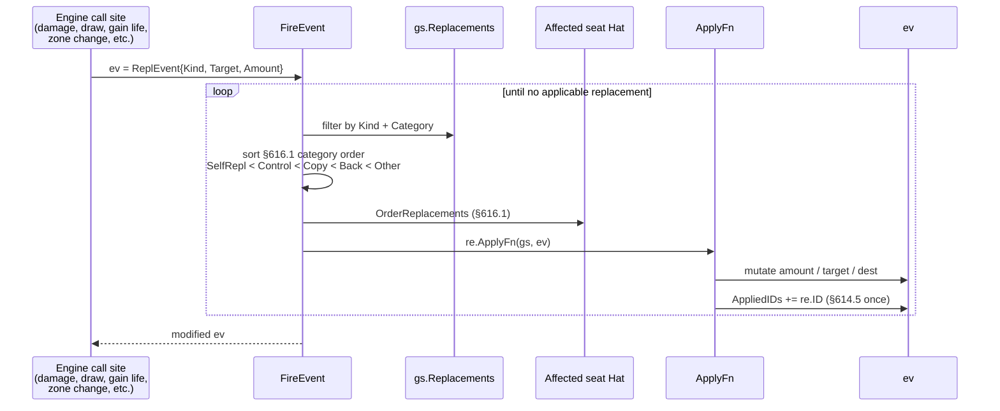

# Replacement Effects

> Last updated: 2026-04-29
> Source: `internal/gameengine/replacement.go`
> CR refs: §614, §616, §101.4

`FireEvent` is the universal dispatcher for "if X would happen, Y happens instead" effects. Modifies the event in place; no recursion.

## Event Modification Sequence

## Category Order (§616.1)

1. Self-replacement (a permanent's own static replacement on itself)
2. Control-changing
3. Copy
4. "Back" replacements (zone-of-origin)
5. Other

## Wired Call Sites

- `resolve.go` Damage → `would_be_dealt_damage` (Boon Reflection, Rhox Faithmender, prevention)
- `resolve.go` Draw → `would_draw` per-card (Lab Maniac, Notion Thief, Dredge)
- `resolve.go` GainLife → `would_gain_life` (Alhammarret's Archive, Boon Reflection)
- `resolve.go` LoseLife → `would_lose_life` (Platinum Angel)
- `resolve.go` CounterMod → `would_put_counter` (Doubling Season, Hardened Scales)
- `resolve.go` CreateToken → `would_create_token` (Doubling Season, Anointed Procession)
- `sba.go` destroyPermSBA → `would_die` + `would_be_put_into_graveyard` (Rest in Peace, Leyline of the Void, Anafenza)
- `sba.go` 5a → `would_lose_game` (Platinum Angel)
- `combat.go` ETB trigger fires → `would_fire_etb_trigger` (Panharmonicon, Yarok)

## Canonical Handlers (12+)

Rest in Peace, Leyline of the Void, Anafenza, Doubling Season, Hardened Scales, Panharmonicon, Yarok, Laboratory Maniac, Jace Wielder of Mysteries, Alhammarret's Archive, Boon Reflection, Platinum Angel. Notion Thief added 2026-04-27.

## Special Mechanics

- **Dredge** (§702.52) — registers as a `would_draw` replacement on the dredger
- **Bestow** (§702.103) — applied via Layer 4 in [[Layer System]], not here
- **Shield counter** (§122.1b) — checked inline in `DestroyPermanent` before firing replacements
- **Commander redirect** (§903.9a/b) — applied inside [[Zone Changes|FireZoneChange]] post-replacement

## Tiebreak

§101.4 APNAP: when same-controller affected, MVP uses deterministic timestamp within category. Multi-affected-player ordering is the affected player's choice via [[Hat AI System|Hat]].

## Iteration Cap

Inner loop capped at 64 iterations (§616.1f says iterate-until-no-applicable; cap is safety net).

## Related

- [[Zone Changes]]
- [[State-Based Actions]]
- [[Trigger Dispatch]]
