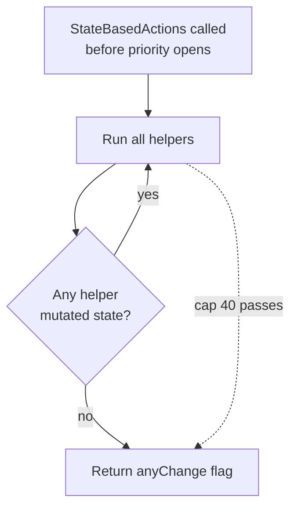
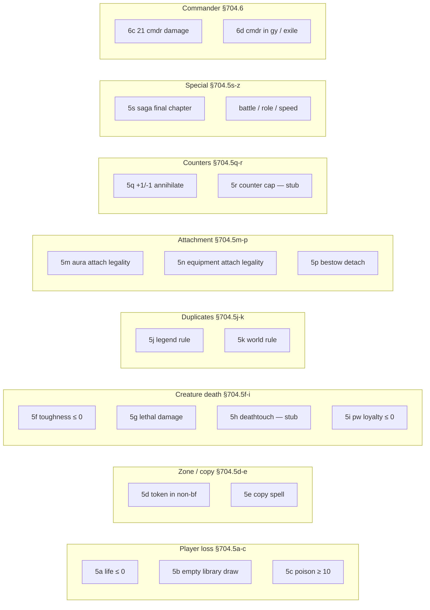

# State-Based Actions

> Last updated: 2026-04-29
> Source: `internal/gameengine/sba.go`
> CR refs: §704

§704.3 says: whenever a player would get priority, perform all applicable SBAs simultaneously, then repeat until none fire. Engine implements this as a fixed-point loop, capped at 40 passes.

## SBA Loop

## Helpers (per CR §704.5 / §704.6)

## Wired Helpers

Implemented mutating: 5a, 5b, 5c, 5d, 5f, 5g, 5i, 5j, 5k, 5m, 5n, 5p, 5q, 5s, 6c. Stubs: 5e, 5h (deathtouch tracked elsewhere via [[Combat Phases]]), 5r.

## Interaction with Other Systems

- Calls [[Replacement Effects|FireEvent]] for `would_die`, `would_be_put_into_graveyard`, `would_lose_game` — Platinum Angel, Rest in Peace, Anafenza all hook here.
- Death triggers fan out via [[Trigger Dispatch]] after destroy event resolves.
- [[Layer System]] is re-applied each pass so toughness math stays current (§704.5f).
- Loop invocations logged to [[Tool - Stack Trace]] as `sba_check`.

## Cap Rationale

40 passes matches the Python reference. Pathological loops (e.g. mutual indestructible legend rule weirdness) are caught here rather than spinning forever. None observed in 50K production games.

## Related

- [[Stack and Priority]]
- [[Invariants Odin]]
- [[Replacement Effects]]
