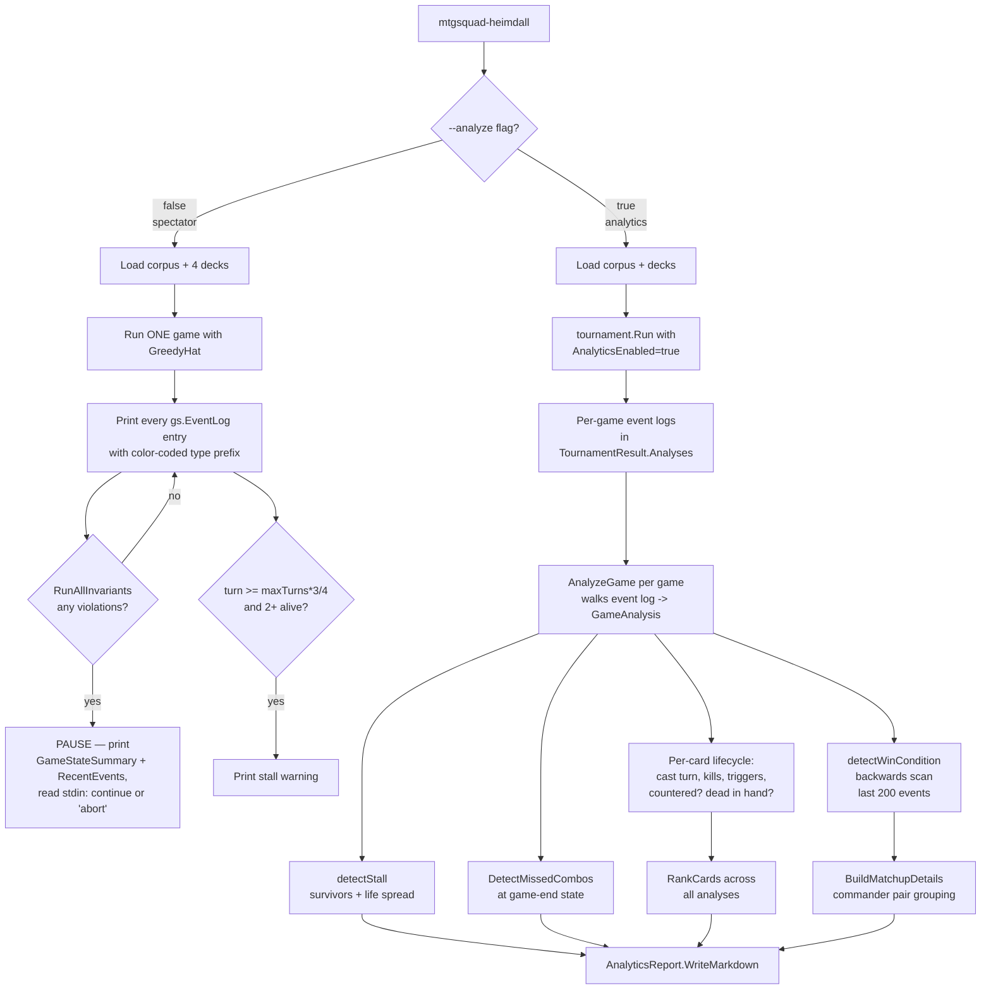
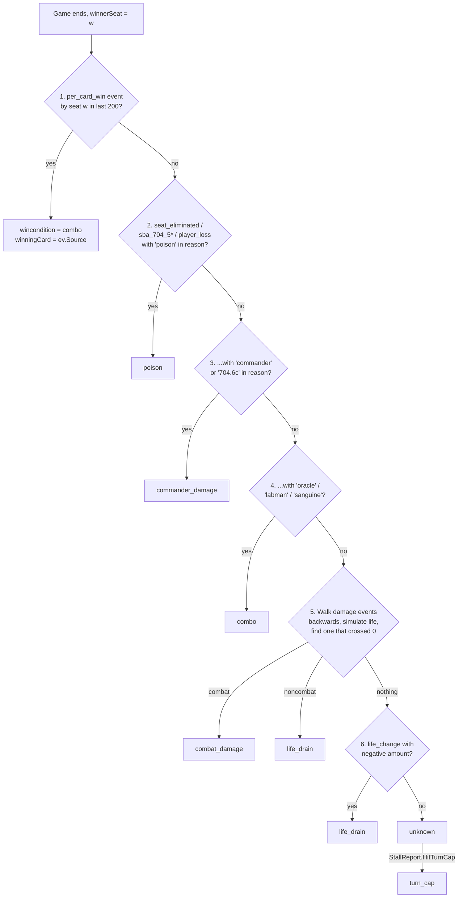
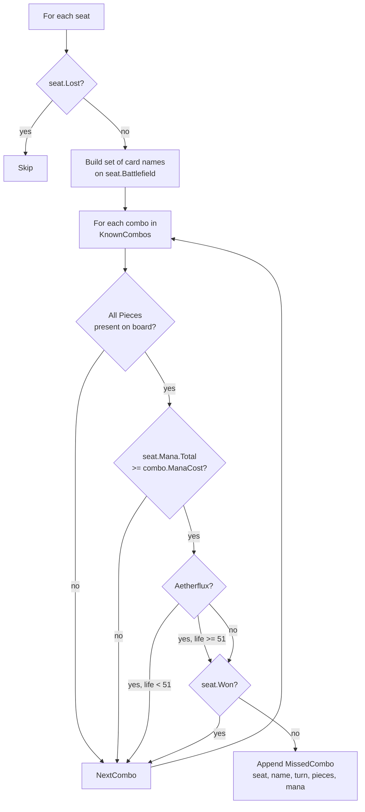

# Tool - Heimdall

> Source: `cmd/mtgsquad-heimdall/main.go` (819 lines), `internal/analytics/` (~2,100 lines: `analyzer.go`, `analytics.go`, `card_rankings.go`, `combos.go`, `matchup_detail.go`, `report.go`, `weakness.go`)

Heimdall is HexDek's analytics engine — the post-game forensic that answers "why did this deck win?" After every tournament, Heimdall walks the structured event logs from each game and produces three classes of artifact: per-card performance stats, per-matchup win-rate matrices, and the missed-combo report that flags every game where a hat had a winning line on the table and didn't take it.

The tool runs in two modes from a single binary. **Spectator mode** is the live single-game streamer — every event prints to stdout with full context, and an invariant violation pauses the world for inspection. **Analytics mode** runs N games, collects their event logs, and produces a markdown report. The two modes share zero code paths beyond corpus loading; they're distinct programs glued behind a single `--analyze` flag.

## Two Modes



The structural split is deliberate — spectator's job is to make a game observable for a human; analytics' job is to compress 1,000 games into a few tables. They use the same event log because that's the engine's universal output, but the consumers don't share state.

## Spectator Mode (the original Eye of Sauron)

`runSpectator` builds a 4-seat game with the requested decks, runs it turn-by-turn, and after every step calls two things: `streamEvents` (which prints anything new in `gs.EventLog`) and `runInvariantsWithPause` (which runs all 20 [Odin invariants](Invariants%20Odin.md) and halts if any return an error).

The event filter in non-verbose mode keeps roughly 25 event kinds — the ones a human can interpret without an engine reference open. Stack pushes/resolutions, casts, combat damage, deaths, destroys, sacrifices, SBA fires, ETB and zone changes, infinite-loop draws, SBA-cap hits. Verbose mode shows everything (typically 200-2000 events per game).

Color coding is hardcoded in `printEvent`: red for damage/destroy/loss, green for ETB and resolves, blue for stack pushes, purple for casts, yellow for SBAs and triggers, cyan for tokens. The `[idx]` prefix is the event log index — useful when an invariant fires and you need to point Judge at "the cast at index 247."

When invariant violation triggers a pause, Heimdall prints `GameStateSummary` (battlefield contents, hand sizes, life totals, mana pools, current phase) plus `RecentEvents(gs, 30)` and waits on stdin. Any input is "continue" except literal `abort`, which sets the global `aborted` flag so the turn loop exits cleanly.

The stall warning is a separate signal: at 75% of `maxTurns` with two or more living players, Heimdall prints a yellow warning showing turn number, survivor count, and life spread. This is borrowed from aircraft stall horns — a flag that the game has lost forward momentum but isn't yet dead.

### Showmatch hook

`TakeTurnWithHook` (in `internal/tournament/turn.go`) gives any spectator a per-phase callback. The Discord showmatch loop uses this to snapshot the game at every phase boundary, format the snapshot as a Discord message, post it, and sleep so humans can keep up. Heimdall's spectator doesn't currently use the hook — it streams unfiltered to stdout — but the plumbing is shared.

## Analytics Mode

`runAnalytics` runs `tournament.Run` with `AnalyticsEnabled: true`, which causes `runOneGame` to retain `gs.EventLog` and pass it through to `analytics.AnalyzeGame`. The result is a slice of `*GameAnalysis`, one per game.

`AnalyzeGame` is a single-pass walk over the event log. It maintains running state — current turn, current board size per seat, current life per seat, creatures-destroyed-this-turn — and on each event updates the corresponding `PlayerAnalysis` and per-card `CardPerformance` entries.

The event-kind switch handles 19 event types:

| Event kind | What Heimdall extracts |
|---|---|
| `cast` | `SpellsCast++`, set `CardPerformance.TurnCast` if first time |
| `play_land` | `LandsPlayed++`, mark card as `IsLand` so it doesn't appear in dead-card lists |
| `damage` | Attribute to `DamageDealt` (source seat) and `DamageTaken` (target seat); first damage to a player sets `FirstBlood` |
| `life_change` | Update running life; track `PeakLife` |
| `creature_dies` | Increment per-turn destroy counter; first death sets `FirstDeath`; 3+ in same turn sets `FirstWipe` |
| `destroy` | `RemovalCast++` for the source seat; mark the target card as `KillsAttributed++` against the destroying card; mark the target card's `TurnDestroyed` |
| `sacrifice` | `CreaturesLost++`, mark `TurnDestroyed` |
| `counter_spell` | `CountersCast++` for source, `SpellsCountered++` for target, mark target card `WasCountered = true` |
| `create_token` | Add to `tokenNames` set so token cards don't appear in dead-card analysis |
| `pool_drain` | `ManaWasted += amount` (mana that emptied at phase boundary unused) |
| `pay_mana` | `ManaSpent += amount` |
| `enter_battlefield` / `leave_battlefield` | Maintain running `currentBoardSize[seat]` for `PeakBoardSize` |
| `player_loss` | Set `TurnOfDeath` |
| `delayed_trigger_fires` / `triggered_ability` | Increment `TriggersFired` per player and `TriggeredCount` per card |
| `per_card_win` | Record `ComboAssembled = currentTurn` (alternate-wincon trigger) |

After the walk, `detectWinCondition` and `detectStall` produce game-level metadata; `DetectMissedCombos` examines end-of-game state for hat intelligence gaps; weakness signals get derived if there are enough games for the commander.

## Win Condition Detection — `detectWinCondition`

Telling "Yuriko won" from "Yuriko won how" is what makes the analytics report useful. Heimdall does this by scanning backwards through the last ~200 events of the game in priority order:



The lethal-damage tracker (step 5) is the most subtle. When multiple players have hit a target with damage, finding "the kill" means simulating life backwards from the elimination event. Starting at `runningLife = 0` (the moment of elimination), walk events backwards: each `damage` to the target adds to running life (un-doing the damage), each `life_change` to the target subtracts (un-doing the heal). The first damage event whose pre-application life would have been > 0 is the lethal source — that's the damage that crossed the threshold.

This produces correct attribution for cases like "Yuriko's commander damage was 19, then Bolt for 1 finishes." Without backwards life simulation, the last damage event (Bolt) would always get credit. With it, you correctly attribute the kill to Yuriko if her commander damage put life at 1 and the Bolt was redundant overflow… actually wait — backwards simulation gives credit to the Bolt because the Bolt is what crossed 0 from positive territory. The point is the attribution is *physically* correct: whichever damage source took the player from above-zero to at-or-below-zero is the killing blow. That's the rule the game uses; Heimdall mirrors it.

### Win-condition string vocabulary

The output is a small fixed set: `combo`, `poison`, `commander_damage`, `decking`, `combat_damage`, `life_drain`, `turn_cap`, `timeout`, `draw`, `unknown`. The `printWinConditions` function in main.go prints percentages across these.

## Missed Combo Detection — the crown jewel

`DetectMissedCombos` examines end-of-game state and asks: did any seat finish the game with a known combo on board, enough mana to fire it, and no win? Each hit is a hat intelligence gap.



The detection is **end-state-only**, not turn-by-turn. Heimdall does not currently snapshot board state mid-game and check at every turn boundary — it checks once, when the game ends. This is a deliberate simplification: turn-by-turn snapshots would multiply storage by ~50× and most "missed" combos at intermediate turns are actually fine ("don't go off yet, board me out next turn instead"). The gameplay-relevant question is "did you have the win when the game ended and not take it?"

### The KnownCombos table

`internal/analytics/combos.go::KnownCombos` is hand-curated. Heuristic combo recognition (scanning AST for "infinite mana" patterns) was tried and discarded — too noisy. Hand-curated 10 combos catch the ones that matter:

| Combo | Pieces required on battlefield | ManaCost | WinType |
|---|---|---|---|
| Thoracle Win | Thassa's Oracle | 2 (UU for Oracle) | win_game |
| Ragost Strongbull Loop | Penregon Strongbull, Crime Novelist, Nuka-Cola Vending Machine | 1 | infinite_damage |
| Sanguine + Exquisite | Sanguine Bond, Exquisite Blood | 0 | infinite_damage |
| Basalt + Kinnan | Basalt Monolith, Kinnan, Bonder Prodigy | 3 | infinite_mana |
| Isochron + Reversal | Isochron Scepter | 2 | infinite_mana |
| Ballista + Heliod | Walking Ballista, Heliod, Sun-Crowned | 4 | infinite_damage |
| Aetherflux Storm | Aetherflux Reservoir | 0 (life >= 51 special case) | infinite_damage |
| Dockside + Sabertooth | Dockside Extortionist, Temur Sabertooth | 3 | infinite_mana |
| Food Chain | Food Chain | 0 | infinite_mana |
| Phyrexian Altar + Gravecrawler | Phyrexian Altar, Gravecrawler | 1 | infinite_mana |

A few are deliberately partial. Thoracle requires the second piece (Demonic Consultation or Tainted Pact) to be in hand or graveyard, but Heimdall only checks "Thassa's Oracle on board with UU available" — that's enough mana to cast Consultation if it's in hand. False positives are possible (Oracle on board with Consultation already cast and graveyard already exiled?) but rare. Isochron Scepter likewise requires Dramatic Reversal to be the imprinted card; checking battlefield-presence is a reasonable proxy.

### Worked example: Thoracle miss

Pretend the engine logged this game tail:

```
[1432] cast: Thassa's Oracle (seat 2)
[1433] enter_battlefield: Thassa's Oracle (seat 2)
[1434] triggered_ability: Thassa's Oracle ETB (seat 2)
... (Oracle ETB fires, but seat 2's Yggdrasil chooses not to follow up
     with Demonic Consultation — perhaps the eval saw a higher-value line)
[1450] turn_start: turn 12 (seat 3)
... (game continues, eventually seat 3 wins via combat)
[1670] sba_704_5a: seat 0 loses
[1671] sba_704_5a: seat 2 loses
[1672] game_end: winner = seat 3
```

`DetectMissedCombos` looks at `gs.Seats[2]`:
- Battlefield contains Thassa's Oracle? Yes.
- Lost? Yes (seat 2 lost on turn 14 after the win window).

Wait — `seat.Lost` is the gate at the top; the function skips lost seats. So this game **wouldn't** flag as missed. The missed-combo detector specifically catches "you survived and had the line and still lost the game" — i.e., the *winner* isn't you, but you lived to the end. If seat 2 lost early, the question is moot. The narrower question Heimdall answers is: *given the end-state where some seat won, were any non-winners sitting on a complete combo board?* That's the actionable hat-failure signal.

In practice the most common hit is a stalled game where two seats had combos available and neither fired — both flagged, both told you the eval scored "wait" higher than "win," which is the bug.

### `DetectMissedCombosWithStrategy`

This variant takes Freya-derived per-deck combo lists in addition to the hardcoded `KnownCombos`. Each Freya strategy file specifies a `ComboPieces` list — pairs of card names the deck author has identified as combo lines. Heimdall checks those too. See [Freya Strategy Analyzer](Freya%20Strategy%20Analyzer.md) for how those lists are produced.

### `DetectMissedFinishers`

A weaker signal than missed combos: did a seat have a Freya-classified *finisher* on the battlefield (e.g., Craterhoof Behemoth, Triumph of the Hordes) with adequate board power and an opponent at low life — and still didn't win? This catches "didn't swing for lethal when lethal was on the board" rather than "didn't fire combo when combo was assembled." Output is the seat, finisher name, turn, board power, and lowest opponent life.

## Lethal-Threshold Kill Shot Tracking

`RankCards.KillShotRate` is the fraction of wins where this card was the `WinningCard` returned by `detectWinCondition`. So if Yuriko delivered the killing blow in 23 of 30 wins, `KillShotRate = 0.77`.

Multiple cards can contribute damage; only one gets `KillShotRate` credit per game. The attribution rule is whichever damage source crossed the elimination threshold (per the backwards-simulation algorithm above), or the `per_card_win` source for combo wins, or the empty string for unknown wins.

This is why the report's "kill shot cards" column tells you where games are decided. A deck whose `KillShotRate` is 90% on its commander is a commander-damage deck. A deck where kill shots are scattered across 15 different cards is a wide-board aggro deck.

## Card Rankings — `RankCards`

Per-card aggregation across all games:

| Field | Computed as |
|---|---|
| `GamesPlayed` | Number of games this card appeared in any deck |
| `TimesCast` | Sum of `TurnCast > 0` across all games |
| `GamesWon` | Games where this card's controller won |
| `WinContribution` | `winContribSum / gamesWon` (fraction of wins where `ContributedToWin` was true) |
| `AvgTurnCast` | Mean of TurnCast across games where it was cast |
| `AvgDamageDealt` | Mean of `CardPerformance.DamageDealt` across all games |
| `AvgKills` | Mean of `KillsAttributed` across all games |
| `DeadInHandRate` | Fraction of games where it was never cast (excluding lands and tokens) |
| `CounteredRate` | Fraction of cast attempts that resolved as countered |
| `KillShotRate` | Fraction of wins where this was `WinningCard` |

Sort is stable: `GamesWon` desc, then `TimesCast` desc, then `AvgDamageDealt` desc. The dead-card filter excludes lands (`IsLand`), tokens (`IsToken`), and any name containing "token" (heuristic catch for engine-generated token names like "creature token colorless spirit Token").

## Matchup Matrices — `BuildMatchupDetails`

For each pair of commanders that appeared in a game together, accumulate:

- Total games played together
- Wins by deck1 (alphabetically first)
- Wins by deck2
- Wins by win-condition type per side (e.g., "deck1 won 8 by combat_damage, 3 by combo, 1 by commander_damage")
- Top 5 cards that appeared in deck1's wins (by frequency)
- Top 5 cards that appeared in deck2's wins
- Average turns to win per side

The output is the matchup matrix that drives deck-tuning decisions. *"Sin wins 62% against Yuriko, mostly via combat_damage with these 5 cards"* tells you what to tune. *"Sin's overall winrate is 28%"* doesn't.

The pairing key is alphabetical: `min(a,b) + "|" + max(a,b)` ensures `Sin vs Yuriko` and `Yuriko vs Sin` go in the same bucket.

## Stall Detection — `detectStall`

A "stall" is a game that hit the turn cap with multiple players still alive. `detectStall` returns a `*StallReport` only if the game stalled (else nil):

| Field | Meaning |
|---|---|
| `HitTurnCap` | Turns reached `defaultMaxTurns` (typically 55-80) |
| `SurvivorsAtEnd` | Players still alive when game ended |
| `TurnsSinceLastKill` | Turns between last elimination and game end |
| `LifeLeader` / `LifeLeaderTotal` | Seat with highest life and that life total |
| `LifeSpread` | Highest life minus lowest among survivors |
| `Cause` | One of: `pillow_fort` (life > 60), `board_parity` (spread < 10 with 3+ alive), `low_aggression` (most turns went by without a kill), `unknown` |

When `WinCondition` came back `unknown` and `HitTurnCap` is true, Heimdall upgrades the wincondition to `turn_cap` so the report distinguishes "weird unknown" from "everyone ran out the clock."

## Weakness Signals — `DeriveWeakness`

Per-commander vulnerability fingerprint, requires 10+ games and 5+ losses for the commander:

| Signal | Threshold |
|---|---|
| `VulnerableToWipes` | Lost within 3 turns of `FirstWipe` |
| `VulnerableToCounter` | Had 2+ spells countered in the loss |
| `SlowToClose` | Loss came in a stalled game |
| `ManaScrew` | Played ≤ 3 lands and died by turn 8 |
| `OverExtends` | Peak board size ≥ 6 with hand size ≤ 1 |

Each is a fraction of losses showing the pattern. *"Krenko has VulnerableToWipes = 0.6"* means 60% of Krenko's losses came in board-wipe games. Actionable input for deck construction.

## Output Format and Consumers

Spectator: stdout (color-coded). The console *is* the report.

Analytics: `AnalyticsReport.WriteMarkdown` generates a structured markdown file:

1. Top-line summary (games, duration, win conditions)
2. Per-commander win rates and stat averages
3. MVP cards (by `GamesWon`)
4. Dead cards (by `DeadInHandRate` over 0.10, requires 10%+ game appearances)
5. Kill-shot cards (sorted by `KillShotRate`)
6. Matchup matrix (top 20 most-played pairs, full breakdown)
7. Missed combos (per-game list with seat, combo name, turn, pieces, mana available)
8. Stalled-game appendix (every game with a stall report)

Consumers of the markdown: deck authors reading `MVP CARDS`, hat developers reading `MISSED COMBOS` and `STALLED GAMES`, and the long-term metric trackers comparing report-to-report deltas.

## Known Gaps

1. **Combo-piece detection only checks battlefield.** A combo like "Hulk pile in graveyard" with the win condition being a graveyard activation doesn't fire detection. Hardcoded `KnownCombos` doesn't model graveyard-resident wincons — only battlefield ones.

2. **Targeted spell wincons aren't combos.** A game where seat 2 cast and resolved Walking Ballista's removal trigger to ping each opponent for 20 doesn't get flagged as Heliod combo unless both pieces stayed on board through end-of-game. If Heliod was countered after damage was already dealt, the game's already over but the combo board state isn't visible at end-state. Acceptable miss for v1.

3. **No turn-by-turn missed-combo timeline.** Only end-state matters. A combo that went live on turn 12, fizzled, then came back on turn 20 and missed wouldn't show two hits — only the end-state hit (or nothing if it ended differently).

4. **Token-name detection is fragile.** `isTokenByName` looks for substring "token" — works for engine-generated names but would mis-flag a card actually named "Token of Faith" if such a card existed.

5. **Commander damage attribution.** When commander deals damage, the `damage` event's `Source` is the commander's name. Both `KillsAttributed` and `KillShotRate` work correctly, but the *commander damage threshold* (21 cumulative) isn't tracked separately from total damage — `wincondition = "commander_damage"` comes from the SBA event reason, not Heimdall's own count.

6. **First-blood timing is approximate.** Set on the first `damage` event with `target_kind = "player"` and `amount > 0`. Damage triggers from cards being cast (Lightning Bolt) and creature combat damage compete to set this — order is event-log order, which matches the engine's resolution order and is correct.

## Usage

```bash
# Spectator: live single-game stream
go run ./cmd/mtgsquad-heimdall \
  --decks data/decks/cage_match \
  --seed 42 --pause-on-anomaly

# Spectator with full event verbosity
go run ./cmd/mtgsquad-heimdall \
  --decks data/decks/cage_match \
  --seed 42 --verbose

# Analytics: 50-game report
go run ./cmd/mtgsquad-heimdall \
  --analyze --games 50 \
  --decks data/decks/cage_match \
  --hat poker \
  --report data/rules/HEIMDALL_ANALYSIS.md \
  --top-cards 20

# Analytics with Yggdrasil + 1000 games
go run ./cmd/mtgsquad-heimdall \
  --analyze --games 1000 \
  --decks data/decks/all \
  --hat octo \
  --workers 16 --report /tmp/heimdall.md
```

The `--hat` flag selects greedy / poker / octo (octo is YggdrasilHat under the codename). Spectator uses GreedyHat by default — the spectator is for engine debugging, where deterministic baseline behavior is more useful than smart-hat play.

## When You'd Use Heimdall

- **After a tournament run** — read MVP and dead-cards tables to identify trim candidates
- **After deploying a hat change** — diff missed-combo counts against previous run; if missed combos went up, hat regressed
- **Showmatch broadcasting** — spectator mode produces narratable output for a Discord channel
- **Bug triage** — `--pause-on-anomaly` halts on first weird thing for inspection
- **Matchup analysis** — read the matchup matrix to identify problem pairings ("Sin can't beat Yuriko, why")

## Related

- [Tool - Tournament](Tool%20-%20Tournament.md) — produces the event logs Heimdall consumes
- [Freya Strategy Analyzer](Freya%20Strategy%20Analyzer.md) — supplies per-deck `ComboPieces` and finisher sets
- [Engine Architecture](Engine%20Architecture.md) — event log spec
- [Tournament Runner](Tournament%20Runner.md) — analytics-enabled mode
- [Invariants Odin](Invariants%20Odin.md) — what spectator's pause-on-anomaly checks
