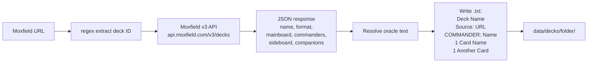

# Tool - Import

> Source: `cmd/mtgsquad-import/`, `internal/moxfield/`

Single-deck importer for Moxfield and Archidekt URLs. Writes a `.txt` deck in canonical [deckparser format](Decklist%20to%20Game%20Pipeline.md).

For bulk corpus pulls (5K+ decks), see [Moxfield Import Pipeline](Moxfield%20Import%20Pipeline.md).

## Flow



## Format Output

```
# Deck Name
# Source: https://moxfield.com/decks/XXXXX
COMMANDER: Commander Name
1 Card Name
1 Another Card
1 Sol Ring
36 Forest
```

This is the canonical format consumed by [deckparser](Decklist%20to%20Game%20Pipeline.md) in every other tool. Lines starting with `#` are comments. `COMMANDER:` is special. Quantity-prefixed cards are mainboard.

## Usage

```bash
# Single Moxfield deck
mtgsquad-import --moxfield https://moxfield.com/decks/XXXXX

# Single Archidekt deck
mtgsquad-import --archidekt https://archidekt.com/decks/12345/name

# Custom output folder
mtgsquad-import --moxfield URL --output data/decks/josh
```

## Source Platforms

### Moxfield

The primary source. v3 API endpoint at `api.moxfield.com/v3/decks/all/{id}`. JSON response contains:

- Deck name, format, last updated
- Mainboard (card name + quantity)
- Commanders (1 or 2 for partner pairs)
- Sideboard (ignored for Commander)
- Companions (recorded, not currently used)

The API returns 403 on search endpoints, but per-deck fetch works fine.

### Archidekt

Secondary source. Different API shape but same conceptual flow. Less commonly used.

## Card Resolution

The importer doesn't fully resolve oracle text — it just records card names. Oracle text is fetched separately when the deck is loaded by a tool, via the AST corpus (see [Card AST and Parser](Card%20AST%20and%20Parser.md)).

This separation is intentional: the deck file is just a list of names, so it's small and human-readable. The expensive AST data lives once in `ast_dataset.jsonl` and gets shared across all decks.

## Bulk Import

For mass corpus pulls (5K+ decks for coevolution research, etc.), see [Moxfield Import Pipeline](Moxfield%20Import%20Pipeline.md). The pipeline handles share-link CSV inputs, NDJSON caching, and rate limiting.

## Known Limit

Moxfield API returns 403 on search endpoints. Bulk discovery requires either:

- The share-link CSV pathway (manual export from Moxfield)
- HTML scraping (more brittle but covers public listings)

Direct deck-fetch (URL → JSON) works fine — only the discovery side is tricky.

## Related

- [Decklist to Game Pipeline](Decklist%20to%20Game%20Pipeline.md) — what the .txt format means
- [Moxfield Import Pipeline](Moxfield%20Import%20Pipeline.md) — bulk corpus pulls
- [Tool - Tournament](Tool%20-%20Tournament.md) — primary consumer of imported decks
