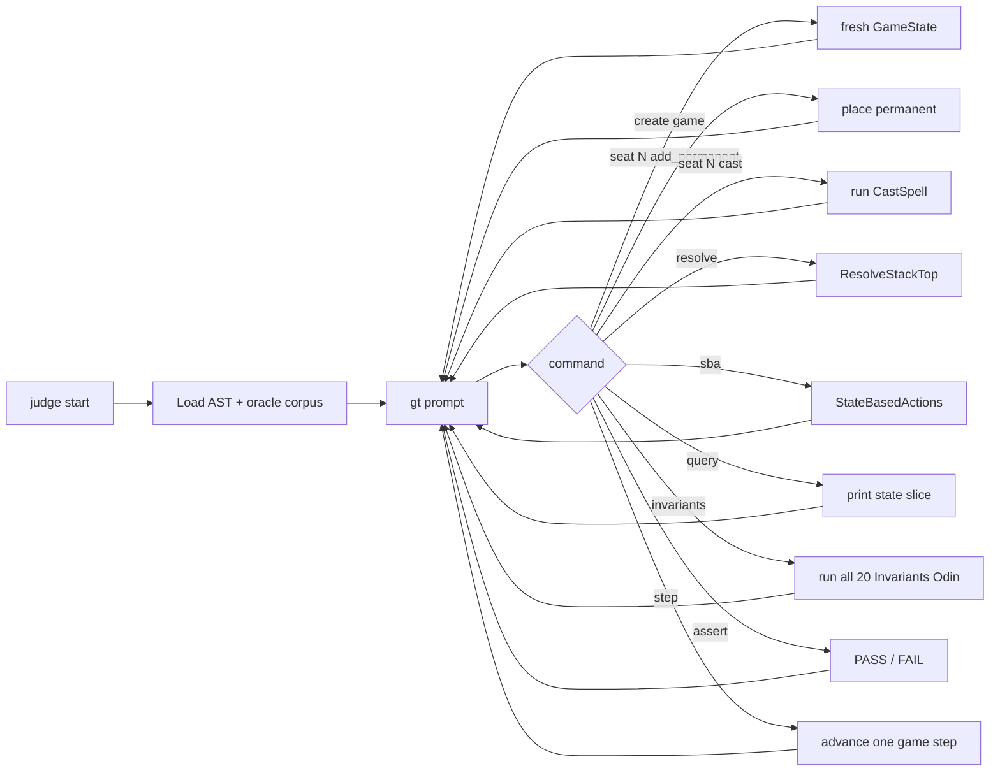

# Tool - Judge

> Source: `cmd/mtgsquad-judge/`

Interactive REPL for adversarial rules-engine testing. Construct board states by hand, fire actions, query state, run invariants. Designed for the rules-lawyer flow: *"I claim X. Engine, prove me wrong."*

The full card corpus is loaded so permanents have real AST data + [layer calculations](Layer%20System.md). Useful for reproducing bugs that other tools surfaced.

## REPL Loop



## Commands

| Command | Purpose |
|---|---|
| `create game --seats N` | Fresh `GameState` with N seats |
| `seat N add_permanent "Card"` | Place permanent on battlefield |
| `seat N add_to_hand "Card"` | Put card in hand |
| `seat N add_to_library "Card"` | Add to library (for shuffle/draw tests) |
| `seat N add_to_graveyard "Card"` | Put card in graveyard (for reanimator tests) |
| `seat N set_life N` | Set life total |
| `seat N cast "Card" [targeting ...]` | Cast a spell |
| `resolve` | Resolve top of stack |
| `sba` | Run state-based actions |
| `query seat N permanent "Name"` | Characteristics of a permanent |
| `query layers` | Show all continuous effects in layer order |
| `query stack` | Print current stack contents |
| `assert <condition>` | PASS / FAIL on engine state |
| `step` | Advance one game step |
| `events` | Show recent event log |
| `invariants` | Run all 20 |
| `state` | Dump full game state (verbose) |

## Use Case Example

Reproducing a Loki-found bug:

```
> create game --seats 4
> seat 0 add_permanent "Doubling Season"
> seat 0 add_permanent "Hardened Scales"
> seat 0 add_permanent "Walking Ballista" --counters "+1/+1=2"
> seat 0 cast "Walking Ballista" --x 0  # already cast, just for context

> seat 0 activate "Walking Ballista" --remove-counter "+1/+1"
# Activates "remove a +1/+1 counter, deal 1 damage"
# Walking Ballista now has 1 counter, dealing 1 damage

> resolve
> sba
> query seat 0 permanent "Walking Ballista"
# Should show 1 +1/+1 counter remaining

> assert "Walking Ballista has 1 counters"
# PASS
```

If the assertion fails, you've reproduced the bug deterministically and can attach a debugger.

## Why It Exists

When [Thor](Tool%20-%20Thor.md) or [Loki](Tool%20-%20Loki.md) finds a bug, Judge is where you reproduce it. Hand-build the exact prerequisite board, fire the action, watch what happens. The REPL flow is designed for the rules-lawyer who wants to interrogate the engine: "this should work, prove me wrong."

Compared to writing a Go test:

- Faster iteration on the exact state you want to test
- No compile-edit-run cycle
- Persistent state across commands
- Easy to dump full state when something looks wrong

## Usage

```bash
go run ./cmd/mtgsquad-judge \
  --ast data/rules/ast_dataset.jsonl \
  --oracle data/rules/oracle-cards.json
```

REPL prompt opens. Commands auto-complete on tab.

## Related

- [Tool - Thor](Tool%20-%20Thor.md) — finds bugs Judge reproduces
- [Tool - Loki](Tool%20-%20Loki.md) — finds bugs Judge reproduces
- [Invariants Odin](Invariants%20Odin.md) — what `invariants` runs
- [Layer System](Layer%20System.md) — what `query layers` shows
