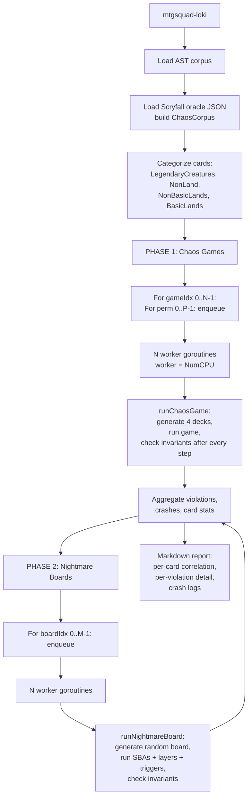
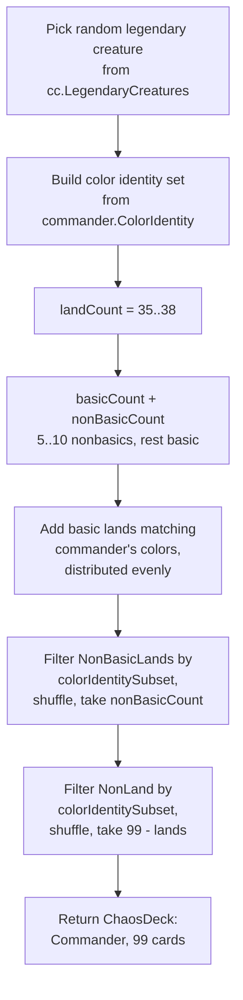
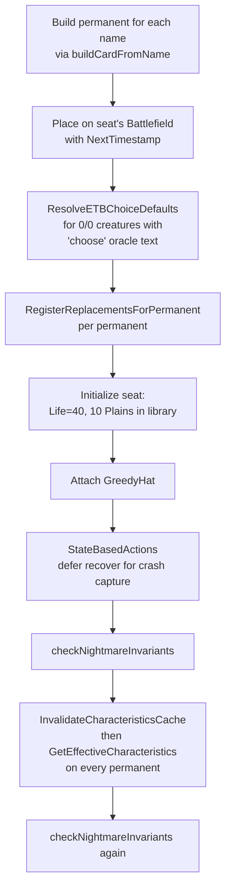
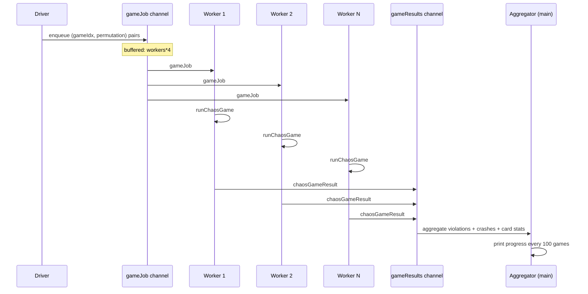

# Tool - Loki

> Source: `cmd/mtgsquad-loki/main.go` (1374 lines), `internal/gameengine/chaos.go` (~600 lines)
> Status: Production. 10K games + 50K nightmare boards = ZERO violations on the v10d release.

Loki is the chaos gauntlet. It picks 4 random commanders from the full ~36K oracle corpus, builds 99-card decks matching their color identity, runs 4-seat games with [GreedyHat](Greedy%20Hat.md), and checks all 20 [Odin invariants](Invariants%20Odin.md) after every action. The point is to surface engine bugs caused by *card combinations nobody designed test cases for* — bugs only visible when specific real cards interact.

The complementary mode is nightmare boards: skip the game and just build pathological battlefield states. Random permanents per seat, run SBAs, run layer recalculation, run invariants. Tests the static-effect machinery against combinations no human would intentionally construct.

## Why Random Decks

[Thor](Tool%20-%20Thor.md) is exhaustive but isolated. Each card gets every interaction in synthetic isolation. That misses bugs caused by *combinations* of cards. Real Magic decks are 99 cards drawn from 30K+ candidates — far too many possible combinations to enumerate. Loki samples instead: random pods, real games, real interactions.

The trick is using the **full corpus**, not a curated set. A pod of "Sliver Queen + Goblin Sharpshooter + Najeela + The Locust God" is something no human would design — but if random sampling produces it, the engine has to handle it gracefully. Every card combination Loki generates is a test the engine has never seen before.

## Run Architecture



The two-phase split is deliberate. Chaos games test "during a real game, do interactions work?" — turn-by-turn play with hat decisions. Nightmare boards test "given an arbitrary legal board state, do continuous effects + layers + SBAs reach a stable point?" Both consume the same `ChaosCorpus` but probe different bug classes.

## Chaos Games — `runChaosGame`

Each game is identified by a `(gameIdx, permutation)` pair. The seeds are deterministic:

```
deckSeed    = masterSeed + gameIdx*10000 + 1
shuffleSeed = deckSeed + permutation*100 + 7
```

`deckSeed` controls deck generation; `shuffleSeed` controls library shuffling and active-player selection. Same gameIdx with different permutations = same decks, different shuffles. Same gameIdx + permutation = exact same game (reproducibility).

### Deck generation — `GenerateChaosDeck`



Singleton enforcement is honored except for basic lands (per Commander rules). For colorless commanders the basic-land split is redirected to nonbasics (no Wastes in the basic-land map).

The color-identity filter is a strict subset check. A commander with `{R, G}` color identity can only run cards whose color identity is contained in `{R, G}` — no white cards, no white-bordered hybrid pips, no white indicator on the card frame. This matches the actual Commander rule (CR §903.5b).

### Engine setup

`buildCardFromName` resolves each chaos card name to a `gameengine.Card`. If the AST corpus has it, attach the AST. If not, build a bare-bones card with just the type and P/T from the Scryfall oracle data. Cards with 0/0 base P/T that have ETB-choice oracle text get a 3/3 default applied via `HasETBChoicePatternExported` so SBA 704.5f doesn't immediately destroy them.

The 4 commanders go to seats 0-3 with their generated 99-card libraries. Each seat gets a fresh `&hat.GreedyHat{}` (stateless — same instance could be shared, but per-game isolation is preferred). Opening hands of 7 are drawn (no London mulligan in chaos mode — keeps things minimal). Active player is `gameRng.Intn(nSeats)` — random.

### The turn loop with invariants

```go
for turn := 1; turn <= maxTurns; turn++ {
    gs.Turn = turn
    func() {
        defer func() {
            if r := recover(); r != nil {
                // Capture crash with stack trace
                crash := chaosCrash{...}
                crash.CardInFlight = extractCardFromStack(stack)
                result.Crashes = append(result.Crashes, crash)
            }
        }()
        tournament.TakeTurn(gs)
    }()
    checkChaosInvariants(gs, ...)  // RunAllInvariants

    func() { defer recover(); gameengine.StateBasedActions(gs) }()
    checkChaosInvariants(gs, ...)

    if gs.CheckEnd() { break }
    gs.Active = nextLivingSeat(gs)
    if len(result.Crashes) > 10 { break }  // safety bail
}
```

Each turn is wrapped in a recover() so a single crashing turn doesn't kill the whole game — the game continues with the next turn, accumulating crashes. After 10 crashes the safety bail kicks in to stop. Invariant violations after `TakeTurn` AND after `StateBasedActions` are both checked because some violations only surface after SBA cleanup.

`extractCardFromStack` parses the Go panic stack trace to find which card name was being processed. Stack traces from `gameengine` typically include the per-card handler in the trace — Loki regexes for the card name and attaches it to the crash record. This is how the report's "card most associated with crashes" column works.

Default config:
- 1000 games × 1 permutation = 1000 game instances
- 4 seats per game
- 60-turn cap
- workers = NumCPU

## Nightmare Boards — `runNightmareBoard`

Skip the game. Just generate a random battlefield state and check that the engine handles it.

### Board generation — `GenerateNightmareBoard`

For each seat, place `permsPerSeat` (default 5) random permanents:
- Pick a random card from the full corpus
- Reject if it's already in use elsewhere on the board (singleton across the entire board, not per seat)
- Reject if it's an instant or sorcery (not a permanent)
- Up to 100 attempts per slot; otherwise that slot is empty

The output is `boards [][]string` — card names per seat. Loki then builds permanents from these names and places them on each seat's battlefield.

### Engine processing



The two-pass invariant check is intentional: first pass catches "SBA produced an illegal state from this random board"; second pass catches "layer recalculation produced an illegal state."

The board is more pathological than a real game state because:
1. Random non-singleton selection means duplicate replacement effects (Rest in Peace + Rest in Peace can register the same effect twice).
2. The 5-perm-per-seat density is unusually high for turn 1 board state.
3. Static abilities are getting registered across cards that no deck would actually run together.

Default: 10000 nightmare boards, 4 seats × 5 perms = 20 random permanents per board.

## Permutations Flag

`--permutations N` runs N games per random deck set with different shuffles. Catches "this card *combination* breaks things" (consistent across permutations) vs. "this *shuffle* breaks things" (one-off seed bug).

A combination bug surfaces consistently — every shuffle of those 4 decks reproduces the violation. A shuffle-specific issue (genuinely RNG-induced) shows up once and never again. The split is informative for triage.

## Statistical Card Correlation

Every game tracks the union of all card names across the 4 decks (`AllCards`). After the run, Loki accumulates two maps:

- `cardInViolationGames[name]` — count of violation-having games where this card was present
- `cardInCleanGames[name]` — count of clean games where this card was present

Score = `violations / (violations + clean)`. Cards with high scores are correlated with violations. This is a signal, not proof — a card that's in 80% of violation games might just be a popular legendary creature that gets sampled often. But a *narrow* card that appears in 5% of games yet 50% of violations is a strong suspect.

The report includes the top 20 cards by violation correlation, plus the top crash-card list (cards present in the stack trace when a panic happened).

## Crash Capture

`chaosCrash` records:

```go
type chaosCrash struct {
    GameIdx       int
    GameSeed      int64
    Permutation   int
    PanicValue    string  // r from recover()
    StackTrace    string  // string(debug.Stack())
    Commanders    []string
    CardInFlight  string  // extracted from stack trace
}
```

Reproducibility: a crash record's `(masterSeed, gameIdx, Permutation)` triple uniquely identifies the game. Re-run Loki with `--seed=<masterSeed> --games=<gameIdx+1> --permutations=<Permutation+1>` (and skip ahead to the right game) and the same crash reproduces.

In practice the workflow is: Loki finds a crash → grab the card-in-flight → feed that card to [Judge](Tool%20-%20Judge.md) for deterministic reproduction with a curated minimal deck → fix the bug.

## Worker Pool Architecture



`workers = runtime.NumCPU()` by default. Each worker reads from the job channel, runs `runChaosGame`, writes the result to the outcome channel. The aggregator goroutine reads outcomes and updates atomic counters. After all workers finish, the result map is rendered to a markdown report.

Phase 2 (nightmare boards) uses the same pattern with a separate worker pool.

## Why 10K Games + 50K Nightmare Boards

The numbers come from coverage statistics. With 10K games × 4 seats × ~25 turns × ~10 decisions per turn, you're hitting ~10M individual game actions. With 50K boards × 4 seats × 5 perms × 2 invariant passes, you're hitting ~2M static board states.

At those volumes, every game-relevant card from the corpus gets exercised many times. The legendary-creature pool has ~3K cards; sampling 40K commanders (4 per game × 10K games) means each commander is sampled ~13 times on average, with a long tail of rare commanders sampled 1-3 times.

If you wanted true uniform coverage of every commander, that'd take ~25K games per commander × ~3K commanders = 75M games. Loki's volume is calibrated to "good probability of finding the bug" rather than "exhaustive proof." Thor handles the exhaustive side.

## Sunset Plan

Per memory (`project_hexdek_parser.md`), [Tournament Runner --pool mode](Tournament%20Runner.md) is replacing Loki as the primary chaos source. The tournament runner already does random-deck pod assignment from a pool, with the bonus of using [YggdrasilHat](YggdrasilHat.md) instead of GreedyHat — which surfaces realistic interactions that GreedyHat's simpler play style would miss.

Loki stays useful for:
- Nightmare-board mode (no equivalent in tournament runner)
- Pure full-corpus randomization without curated deck files
- Reproducible per-game seeds for crash hunting

For chaos games specifically, the tournament runner is now preferred.

## Usage

```bash
# Standard chaos run (default 1000 games, 10K nightmare boards)
go run ./cmd/mtgsquad-loki --workers 8

# Big run (10K games, 50K nightmare boards)
go run ./cmd/mtgsquad-loki \
  --games 10000 --nightmare-boards 50000 --workers 32

# Reproducible debug
go run ./cmd/mtgsquad-loki \
  --games 1 --seed 42 --permutations 1 --workers 1

# Permutation analysis (5 shuffles per deck set)
go run ./cmd/mtgsquad-loki \
  --games 1000 --permutations 5 --workers 16

# Skip nightmare boards
go run ./cmd/mtgsquad-loki --nightmare-boards 0

# Skip chaos games
go run ./cmd/mtgsquad-loki --games 0 --nightmare-boards 50000
```

## When You'd Use Loki

- **Continuous integration** — overnight runs catch regressions across the full corpus
- **After a major engine change** — verify the change doesn't break exotic interactions
- **As a bug-source for [Judge](Tool%20-%20Judge.md)** — Loki finds the bug, Judge reproduces it deterministically
- **When [Thor](Tool%20-%20Thor.md) passes but you suspect interaction bugs** — Loki surfaces what isolated testing misses

## Related

- [Tool - Thor](Tool%20-%20Thor.md) — exhaustive per-card counterpart
- [Tool - Odin](Tool%20-%20Odin.md) — overnight fuzzer with violation aggregation
- [Tool - Tournament](Tool%20-%20Tournament.md) — replacing Loki for chaos play
- [Invariants Odin](Invariants%20Odin.md) — the 20 predicates Loki checks
- [Layer System](Layer%20System.md) — exercised by nightmare boards
- [State-Based Actions](State-Based%20Actions.md) — exercised by nightmare boards
