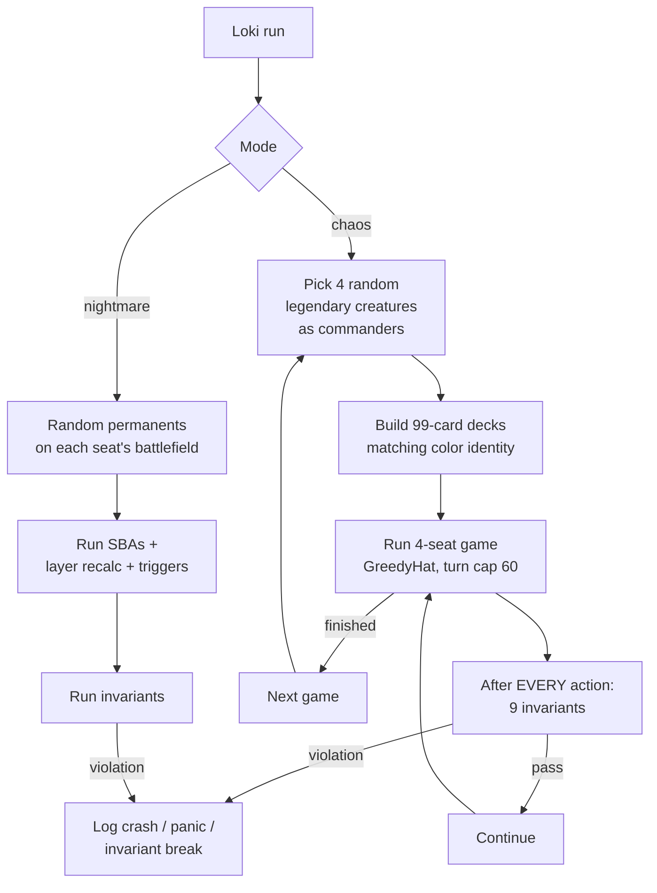

# Tool - Loki

> Last updated: 2026-04-29
> Source: `cmd/mtgsquad-loki/`
> Stats: 10K games + 50K nightmare boards = ZERO violations

Chaos gauntlet. Random Commander decks from full 36K corpus, full invariant checking. Catches "card combinations nobody designed test cases for."

## Run Loop



## Modes

- **Chaos Games** — full game simulation with random decks
- **Nightmare Boards** — static random board state, run SBAs + layer + triggers. Tests [[Layer System]] + [[State-Based Actions]] against combinations no test designed for.

## Permutations Flag

`--permutations N` runs N games per random deck set with different shuffles. Catches "this card COMBINATION breaks things" not just "this shuffle breaks things."

## Usage

```bash
go run ./cmd/mtgsquad-loki --games 10000 --workers 8
go run ./cmd/mtgsquad-loki --games 5000 --nightmare-boards 50000
go run ./cmd/mtgsquad-loki --games 1000 --seed 42 --permutations 5
```

## Sunset Plan

Per memory, [[Tournament Runner|tournament runner --pool mode]] is replacing Loki as the primary chaos source. The tournament runner already does random-deck pod assignment from a pool, with the bonus of using [[YggdrasilHat]] instead of GreedyHat — surfaces realistic interactions, not just legal ones.

## Related

- [[Tool - Thor]]
- [[Tool - Odin]]
- [[Invariants Odin]]
- [[Tool - Tournament]]
