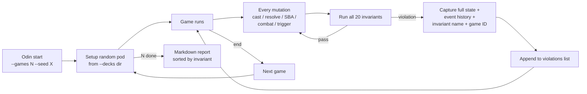

# Tool - Odin

> Last updated: 2026-04-29
> Source: `cmd/mtgsquad-odin/` (binary), `internal/gameengine/invariants.go` (predicates)

Property-based fuzzer. Wraps every GameState mutation with [[Invariants Odin|the 20 invariants]]. Designed to run overnight on DARKSTAR.

## Fuzz Loop



## Why It's a Separate Binary

[[Tool - Loki|Loki]] runs invariants too, but Odin's specialty is overnight fuzz runs — its violation aggregator collects per-game and writes a clean markdown report at the end, designed for the next-morning triage workflow.

## Usage

```bash
go run ./cmd/mtgsquad-odin \
  --games 10000 \
  --seed 42 \
  --decks data/decks/cage_match/ \
  --report data/rules/FUZZ_REPORT.md
```

## Predicate Source

The 20 predicates live in `internal/gameengine/invariants.go` and are documented in [[Invariants Odin]]. Both Odin and [[Tool - Loki|Loki]] import the same predicate set — single source of truth.

## Related

- [[Invariants Odin]]
- [[Tool - Loki]]
- [[Tool - Thor]]
