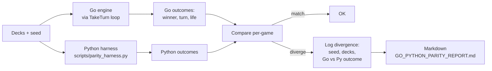

# Tool - Parity

> Last updated: 2026-04-29
> Source: `cmd/mtgsquad-parity/`

Go ↔ Python engine parity verifier. Runs N games in the Go engine, optionally re-runs them in the Python reference, diffs outcomes.

## Diff Flow



## Why Parity Matters

The Python reference (`scripts/playloop.py`) is the spec. Go is the production engine. Any divergence is either:
- Go bug (most cases — Go gets the production load)
- Python bug surfaced by Go's stricter validation
- Spec ambiguity (rules text both engines interpret differently)

Parity tests baseline-pin [[Greedy Hat]] for byte-equivalence, so drift is detectable.

## Skip Mode

If `--python-harness` is omitted, the tool runs but skips diffing. Records Go outcomes only and surfaces `python_available: false` in report — no one mistakes a skip for a pass.

## Usage

```bash
mtgsquad-parity \
  --decks deck1.txt,deck2.txt,deck3.txt,deck4.txt \
  --games 10 \
  --seed 42 \
  --python-harness scripts/parity_harness.py \
  --report data/rules/GO_PYTHON_PARITY_REPORT.md
```

## Sunset Status

Python reference is being archived as Go reaches feature parity. Parity tool stays useful as a regression backstop for the hat byte-equivalence check.

## Related

- [[Greedy Hat]]
- [[Tool - Tournament]]
- [[Card AST and Parser]]
