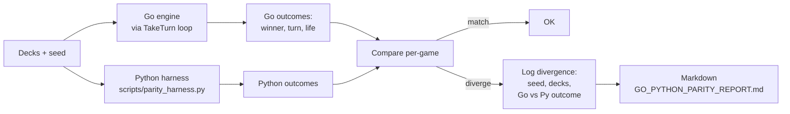

# Tool - Parity

> Source: `cmd/mtgsquad-parity/`

Go ↔ Python engine parity verifier. Runs N games in the Go engine, optionally re-runs them in the Python reference, diffs outcomes.

## Diff Flow



## Why Parity Matters

The Python reference (`scripts/playloop.py`) was the original spec. Go is the production engine. Any divergence is one of:

- **Go bug** (most cases — Go gets the production load and exposes new edge cases)
- **Python bug** surfaced by Go's stricter validation
- **Spec ambiguity** (rules text both engines interpret differently — neither is wrong, the spec is)

Parity tests baseline-pin [GreedyHat](Greedy%20Hat.md) for byte-equivalence, so drift is detectable without mode-driven noise. Yggdrasil and Poker hats vary game-to-game by design (rollout RNG, noise injection); GreedyHat's deterministic output is what makes parity testable.

## Skip Mode

If `--python-harness` is omitted, the tool runs but skips diffing. Records Go outcomes only and surfaces `python_available: false` in the report — no one mistakes a skip for a pass.

## Usage

```bash
# Standard parity run
mtgsquad-parity \
  --decks deck1.txt,deck2.txt,deck3.txt,deck4.txt \
  --games 10 \
  --seed 42 \
  --python-harness scripts/parity_harness.py \
  --report data/rules/GO_PYTHON_PARITY_REPORT.md

# Go-only run (Python skipped)
mtgsquad-parity \
  --decks deck1.txt,deck2.txt,deck3.txt,deck4.txt \
  --games 10 \
  --seed 42
```

## Report Format

Per-game line items:

```
Game 1 (seed 42-1): MATCH (winner=seat-2, turn=14, life=[35,0,40,28])
Game 2 (seed 42-2): DIVERGE
  Go: winner=seat-0, turn=18
  Py: winner=seat-2, turn=14
  Reason: Go applied Tergrid trigger to non-permanent discard (bug)
Game 3 (seed 42-3): MATCH
...
```

Divergences are the actionable rows. Each is a candidate for triage.

## Sunset Status

The Python reference is being **archived as Go reaches feature parity**. Per memory (`project_hexdek_python_archived.md`):

> Python engine (`scripts/playloop.py`) archived per Josh's directive 2026-04-16. Go engine (`internal/gameengine/`) is the sole engine going forward.
>
> Why: token efficiency. Maintaining two parallel engines doubled agent work. Parity probe showed 10% outcome match (down from 40% at Phase 12) — gap widened because Python advanced (Wave 1) while Go held. Decision: archive Python, improve Go only.

Parity tool stays useful as a regression backstop for the [GreedyHat](Greedy%20Hat.md) byte-equivalence check — even without active Python development, the existing Python reference output is a known-good baseline that drift would invalidate.

## When You'd Use Parity

- **Pre-commit on engine changes** — make sure GreedyHat byte-equivalence holds
- **Investigating a suspected engine bug** — does Python disagree?
- **Documenting spec ambiguity** — when neither engine is "wrong" per CR text, the divergence is publishable as a rules-clarification request

## Related

- [Greedy Hat](Greedy%20Hat.md) — the deterministic baseline
- [Tool - Tournament](Tool%20-%20Tournament.md) — production engine driver
- [Card AST and Parser](Card%20AST%20and%20Parser.md) — shared AST source
