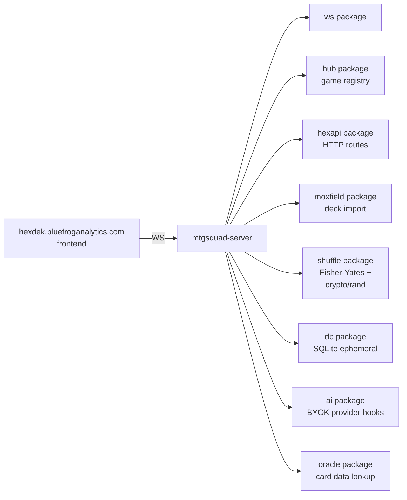

# Tool - Server

> Last updated: 2026-04-29
> Source: `cmd/mtgsquad-server/`, `internal/ws/`, `internal/hub/`, `internal/hexapi/`

WebSocket game server. Currently runs on `localhost:8099` for the [[HexDek]] frontend (`web/`).

## Stack

## Ship 1 Scope

Per the source comment: "Load Hex's Yuriko v1.1 from disk, shuffle via Fisher-Yates with `crypto/rand` entropy, expose a single endpoint that reveals the top N cards." Already exceeded — current state hosts WebSocket games with multi-seat sessions.

## Endpoints

- WS upgrade for live games (hub-multiplexed)
- HTTP routes via `hexapi` (deck import, party setup)
- pprof endpoint for profiling (`net/http/pprof`)

## BYOK Model

Per [[#Architecture decisions|2026-04-15 decision]]: users bring their own API key (Anthropic / OpenAI / local Ollama). Server doesn't host AI inference. Multi-model possible — Opus seat 1, GPT-4o seat 2, llama seat 3.

## Shuffle (§103.1)

[[Decklist to Game Pipeline|Fisher-Yates]] with `crypto/rand` entropy. Commit-reveal scheme for trustless shuffle attestation in the game layer (planned).

## Production Hosting

Deploys to MISTY for `hexdek.bluefroganalytics.com`. Frontend will host [[Tool - Heimdall|Heimdall]] replay viewer + [[Tool - Freya|Freya]] combo display per memory roadmap.

## Related

- [[Tool - Import]]
- [[Decklist to Game Pipeline]]
- [[Hat AI System]]
