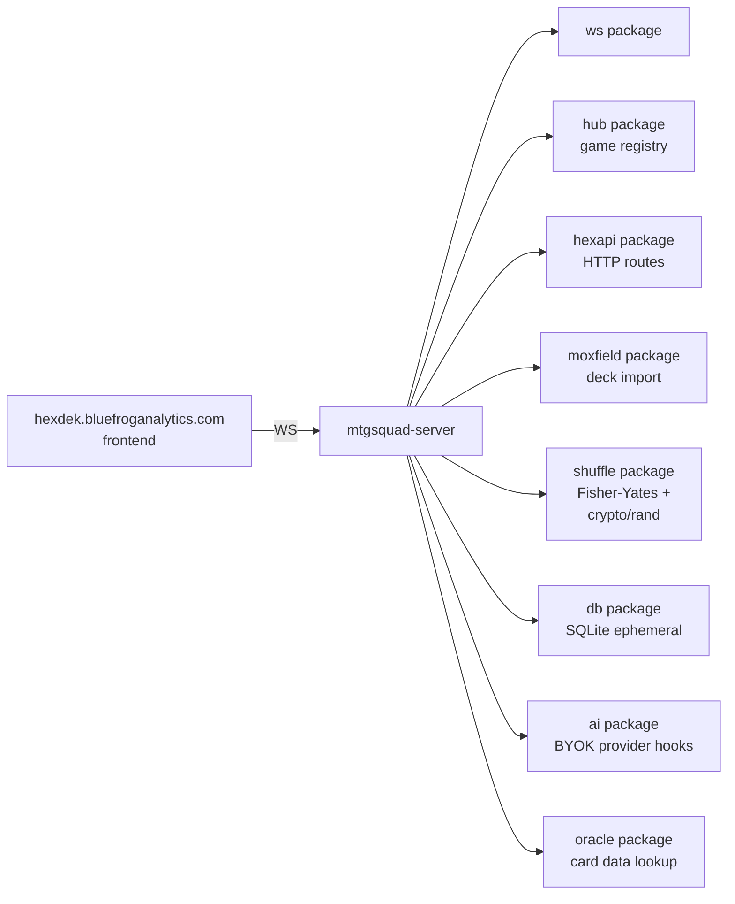

# Tool - Server

> Source: `cmd/mtgsquad-server/`, `internal/ws/`, `internal/hub/`, `internal/hexapi/`

WebSocket game server. Runs on `localhost:8099` for the HexDek frontend (`web/`). Production deployment target: MISTY for `hexdek.bluefroganalytics.com`.

## Stack



## Ship 1 Scope

Per the source comment: *"Load Hex's Yuriko v1.1 from disk, shuffle via Fisher-Yates with `crypto/rand` entropy, expose a single endpoint that reveals the top N cards."*

Already exceeded. Current state hosts WebSocket games with multi-seat sessions, deck import, and shuffle attestation. The HexDek frontend connects via WebSocket for live game updates.

## Endpoints

- **WS upgrade** for live games (hub-multiplexed, one game per session)
- **HTTP routes via `hexapi`** — deck import, party setup, game listing
- **pprof endpoint** for profiling (`net/http/pprof`)

## BYOK Model

Per the 2026-04-15 architecture decision (memory: `project_hexdek_architecture.md`): users bring their own API key (Anthropic / OpenAI / local Ollama). The server doesn't host AI inference — that's expensive and creates legal/safety surface area.

Multi-model is supported: Opus on seat 1, GPT-4o on seat 2, local Llama on seat 3. Each seat's hat routes to a different provider via the `ai` package's pluggable backend.

## Shuffle (§103.1)

Fisher-Yates with `crypto/rand` entropy. See [Decklist to Game Pipeline](Decklist%20to%20Game%20Pipeline.md). The cryptographic entropy source matters because the server might be playing trustless multiplayer games — predictable shuffle = exploitable.

Commit-reveal scheme for trustless shuffle attestation is planned (each player commits to a seed before reveal; combined seed feeds the shuffle).

## Production Hosting

Deploys to MISTY (`192.168.1.200`) for `hexdek.bluefroganalytics.com`. The MISTY node hosts:

- The Astro/React frontend (port 4321 SSR)
- This game server (port 8099)
- A Caddy reverse proxy fronting both

Frontend will host [Heimdall](Tool%20-%20Heimdall.md) replay viewer + [Freya](Tool%20-%20Freya.md) combo display per the memory roadmap.

## Game Lifecycle

1. Player connects via WebSocket
2. Player sends a deck (uploaded `.txt` or Moxfield URL)
3. Server resolves deck via [Moxfield Import Pipeline](Moxfield%20Import%20Pipeline.md) or [deckparser](Decklist%20to%20Game%20Pipeline.md)
4. Player joins or creates a game session
5. Hub assigns the player to a seat
6. When all seats filled, game starts
7. Engine drives the game via the same `TakeTurn` loop the tournament runner uses
8. Hat decisions for human seats route over WebSocket; hat decisions for AI seats route to the BYOK provider
9. Engine events stream back to all connected clients in real time
10. Game ends, results stored in SQLite

## Config

```bash
# Listen port
PORT=8099

# AST and oracle paths
AST_PATH=data/rules/ast_dataset.jsonl
ORACLE_PATH=data/rules/oracle-cards.json

# AI provider config (BYOK)
ANTHROPIC_API_KEY=sk-...
OPENAI_API_KEY=sk-...
OLLAMA_HOST=http://localhost:11434
```

## Usage

```bash
# Local dev
go run ./cmd/mtgsquad-server --port 8099

# Production
GOOS=linux GOARCH=amd64 go build -o mtgsquad-server ./cmd/mtgsquad-server/
scp mtgsquad-server josh@192.168.1.200:~/
ssh josh@192.168.1.200 "./mtgsquad-server --port 8099 &"
```

## Related

- [Tool - Import](Tool%20-%20Import.md) — deck-import path used by server
- [Decklist to Game Pipeline](Decklist%20to%20Game%20Pipeline.md) — shared with all tools
- [Hat AI System](Hat%20AI%20System.md) — BYOK hat is a custom Hat impl
- [Engine Architecture](Engine%20Architecture.md) — engine the server hosts
