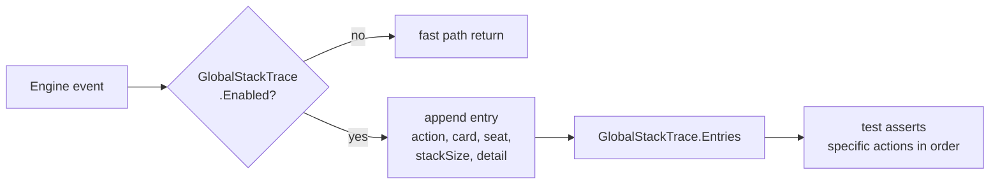

# Tool - Stack Trace

> Source: `internal/gameengine/stack_trace.go`

Lightweight CR-compliance audit logger. **Not a binary** — it's an in-engine global singleton, enabled by tests or by the tournament runner's `--audit` flag. When disabled, it's a single branch + return per call site, no allocations.

## Trace Surface



## Logged Events

| Action | CR | Engine Site |
|---|---|---|
| `push` | §601.2a / §603.3 | spell or ability pushed |
| `resolve` | §608.2 | top of stack resolves |
| `priority_pass` | §117.4 | all players pass |
| `sba_check` | §704.3 | SBAs run |
| `trigger_push` | §603.2 | triggered ability pushed |
| `trigger_resolve` | §608.2 | trigger resolves |

Each entry records:

```go
type StackTraceEntry struct {
    Action    string  // "push", "resolve", etc.
    Card      string  // source card name
    Seat      int     // controller's seat (-1 if N/A)
    StackSize int     // size after this action
    Detail    string  // free-form descriptor
}
```

## Why It Exists

Every engine subsystem touches the stack — combat triggers, mana abilities, replacement effects, per-card hooks. A bug in the priority-passing logic could cause an effect to resolve in the wrong order without crashing or violating any explicit invariant.

The stack trace is the audit log that lets you say "show me the exact sequence of pushes and resolves for this game" and verify it matches CR section-by-section.

## Usage in Tests

```go
GlobalStackTrace.Enable()
defer GlobalStackTrace.Disable()
GlobalStackTrace.Reset()

// Run game actions
gameengine.CastSpell(gs, 0, card, nil)

// Inspect entries
for _, e := range GlobalStackTrace.Entries {
    fmt.Printf("[%s] card=%s seat=%d stack=%d detail=%s\n",
        e.Action, e.Card, e.Seat, e.StackSize, e.Detail)
}

// Or assert specific sequences
require.Equal(t, "push", GlobalStackTrace.Entries[0].Action)
require.Equal(t, "Lightning Bolt", GlobalStackTrace.Entries[0].Card)
require.Equal(t, "priority_pass", GlobalStackTrace.Entries[1].Action)
require.Equal(t, "resolve", GlobalStackTrace.Entries[2].Action)
```

## Verified CR Compliance

The stack trace is what allowed the engine team to verify against specific Comprehensive Rules sections. Confirmed:

- **§405** — priority passes between push and resolve
- **§608** — LIFO stack resolution order
- **§704** — SBAs run after each resolution before priority reopens
- **§101.4** — APNAP trigger ordering
- **§603.3** — triggered abilities go on stack at next priority
- **§605.3a** — mana abilities exempt from stack (they don't appear in trace pushes)

Each compliance check has a corresponding test in `*_test.go` that enables stack trace, runs a scenario, and asserts the action sequence.

## Performance

When disabled (default for production tournament runs), every call site is a single branch:

```go
if !GlobalStackTrace.Enabled {
    return
}
```

No allocation, no work. Verified zero overhead in benchmarks.

When enabled, each event appends one entry and one short string. Modest overhead — fine for tests and audit-mode tournament runs, not for 50K production runs.

## Tournament Audit Mode

The [tournament runner](Tool%20-%20Tournament.md) `--audit` flag enables stack trace globally for the run. The output gets written alongside event logs for post-game analysis. Useful for verifying CR compliance against a specific deck-pool sample.

## Related

- [Stack and Priority](Stack%20and%20Priority.md) — primary instrumentation site
- [Trigger Dispatch](Trigger%20Dispatch.md) — trigger pushes are logged
- [Tool - Tournament](Tool%20-%20Tournament.md) — `--audit` enables this
