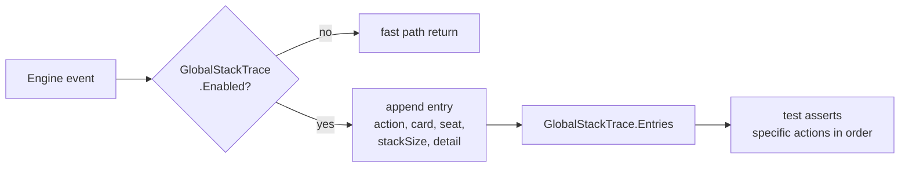

# Tool - Stack Trace

> Last updated: 2026-04-29
> Source: `internal/gameengine/stack_trace.go`

Lightweight CR-compliance audit logger. Global singleton, enable/disable per test. When disabled: single branch + return, no allocations.

## Trace Surface



## Logged Events

| Action | CR | Site |
|---|---|---|
| `push` | §601.2a / §603.3 | spell or ability pushed |
| `resolve` | §608.2 | top of stack resolves |
| `priority_pass` | §117.4 | all players pass |
| `sba_check` | §704.3 | SBAs run |
| `trigger_push` | §603.2 | triggered ability pushed |
| `trigger_resolve` | §608.2 | trigger resolves |

## Usage in Tests

```go
GlobalStackTrace.Enable()
defer GlobalStackTrace.Disable()
GlobalStackTrace.Reset()

// run game actions
gameengine.CastSpell(gs, 0, card, nil)

for _, e := range GlobalStackTrace.Entries {
    fmt.Printf("[%s] card=%s seat=%d stack=%d\n",
        e.Action, e.Card, e.Seat, e.StackSize)
}
```

## Verified CR Compliance

- §405 — priority passes between push and resolve
- §608 — LIFO stack resolution
- §704 — SBAs run after each resolution
- §101.4 — APNAP trigger ordering
- §603.3 — triggered abilities go on stack
- §605.3a — mana abilities exempt from stack

## Related

- [[Stack and Priority]]
- [[Trigger Dispatch]]
- [[Tool - Tournament]] (use `--audit` to enable in tournament runs)
