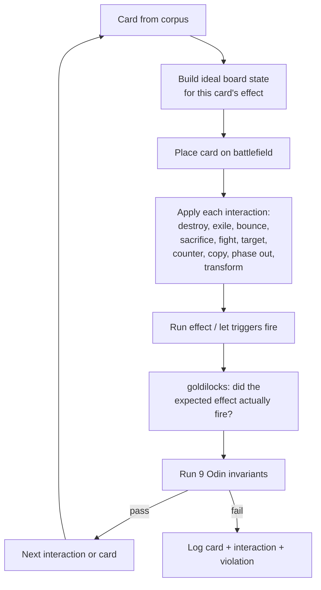

# Tool - Thor

> Last updated: 2026-04-29
> Source: `cmd/mtgsquad-thor/`
> Stats: 541K-793K tests across 36K cards

Per-card stress tester. For each card in the corpus, place it on the battlefield and apply every interaction type. Run all 9 [[Invariants Odin|Odin invariants]] after each.

## Goldilocks Loop



## Modules (18+)

| Module | Purpose |
|---|---|
| `goldilocks` | AST-aware effect verification, oracle-text-aware for keyword variants |
| `spell_resolve` | 7,269 instants/sorceries through stack pipeline |
| `keyword_matrix` | 30×30 keyword combat-pair tests |
| `combo_pairs` | 60 cEDH staples × 60 pair tests |
| `advanced_mechanics` | 145 edge cases, 12 categories |
| `deep_rules` | 100 tests across 20 packs + invariants |
| `claim_verifier` | 60 tests proving coverage-doc claims |
| `negative_legality` | 40 tests verifying illegal action rejection |
| `combo_demo` | Traced combo resolutions |

## Difference from Loki

[[Tool - Loki|Loki]] is random chaos. Thor is exhaustive and deterministic — every card gets every interaction. Output is a surgical hit list: "card X breaks under interaction Y."

## Usage

```bash
go run ./cmd/mtgsquad-thor --all
go run ./cmd/mtgsquad-thor --card "Blood Artist"
go run ./cmd/mtgsquad-thor --card-list /tmp/my_cards.txt --phases goldilocks
go run ./cmd/mtgsquad-thor --workers 10 --report data/rules/THOR_REPORT.md
```

## Current State (2026-04-28)

541K tests, 52 goldilocks failures (effects newly firing — recent additions exposing gaps), 0 panics.

## Related

- [[Tool - Loki]]
- [[Tool - Odin]]
- [[Invariants Odin]]
