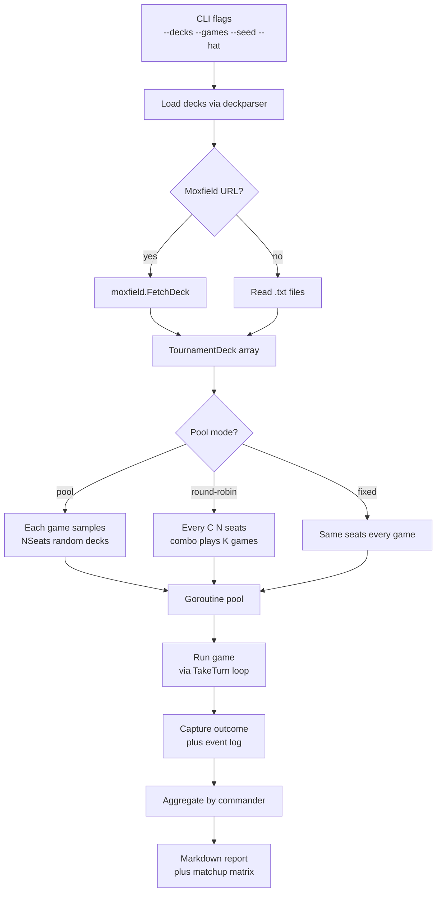

# Tool - Tournament

> Source: `cmd/mtgsquad-tournament/`, `internal/tournament/`

Parallel tournament runner. Workhorse for the 5K/10K/50K-game tests Josh + 7174n1c run on DARKSTAR. See [Tournament Runner](Tournament%20Runner.md) for runtime architecture.

## CLI Flow



## Run Modes

| Mode | Behavior |
|---|---|
| Fixed | Same N decks, every game |
| Pool | Random N decks sampled from full deck pool per game |
| Lazy pool | Pool mode + load decks on demand (memory ceiling) |
| Round-robin | Every C(N, seats) combination plays K games |

Lazy pool is the production setting for 50K-game runs — loading 1500+ decks into memory at once would be wasteful when only 4 are active per game.

## Hat Selection

`--hat greedy|poker|yggdrasil` — uniform per seat by default. Yggdrasil is current; greedy/poker retained for parity.

`--hat-budget 50` and `--turn-budget 100` are the recommended defaults. See [YggdrasilHat](YggdrasilHat.md) for what each controls.

## Audit Mode

`--audit` captures the full event stream for post-game rule auditing. Enables [Tool - Stack Trace](Tool%20-%20Stack%20Trace.md) globally for the run. The output supports CR compliance verification — every push/resolve/priority/SBA/trigger logged with rule citation.

Significantly slower (writes a lot of events). Use for targeted audit runs, not 50K production tournaments.

## Output

- Per-commander winrate
- Matchup matrix (commander × commander winrate when paired)
- Optional Markdown report (`--report path.md`)
- Per-game event logs (when `--audit`)

The matchup matrix is the most useful artifact for deck-tuning — shows which commanders are favored against which others.

## Production Run (50K Games)

```bash
mtgsquad-tournament \
  --lazy-pool \
  --decks data/decks/all \
  --games 50000 \
  --seats 4 \
  --workers 32 \
  --hat yggdrasil \
  --hat-budget 50 \
  --turn-budget 100 \
  --report /tmp/50k.md
```

DARKSTAR v10d binary: 1m34s wall-clock, 532 g/s, 2 timeouts (0.004%), 654/654 unique commanders.

The 90-second per-game timeout is enforced by `runOneGameSafe` — pathological combo loops or trigger storms get killed rather than blocking the whole tournament. cEDH pods historically timed out at high rates; combo win-condition resolution is the engine-side fix that's still pending.

## Per-Deck Hat Factories

`HatFactories` parallel `Decks` — one factory per deck. Factory returns a fresh hat per game (per-game state doesn't leak between games). [YggdrasilHat](YggdrasilHat.md) gets its `TurnRunner` injected here via `tournament.TurnRunnerForRollout()` (breaks the hat to tournament import cycle).

When [Freya](Tool%20-%20Freya.md) has produced a `strategy.json` for a deck, the factory loads it and constructs the hat with the strategy attached. When no strategy file exists, the hat falls back to archetype defaults.

## When You'd Use Tournament

- **Production tournament runs** — the 50K-game daily run on DARKSTAR
- **Hat A/B testing** — different hat factories per deck (Yggdrasil vs Greedy comparison)
- **Deck pool sampling** — `--lazy-pool` over the full Moxfield-imported corpus

## Related

- [Tournament Runner](Tournament%20Runner.md) — runtime architecture details
- [YggdrasilHat](YggdrasilHat.md) — production AI
- [Tool - Heimdall](Tool%20-%20Heimdall.md) — analytics consumer of event logs
- [Tool - Freya](Tool%20-%20Freya.md) — strategy producer
- [Tool - Stack Trace](Tool%20-%20Stack%20Trace.md) — audit-mode output
