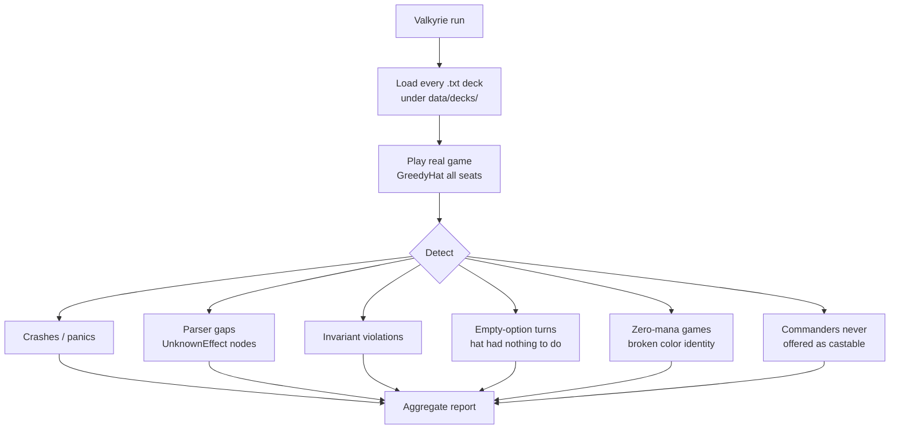

# Tool - Valkyrie

> Source: `cmd/mtgsquad-valkyrie/`

Deck regression runner. Loads every saved deck under `data/decks/`, plays real Commander games with [GreedyHat](Greedy%20Hat.md) opponents, reports issues. Designed as a CI smoke test against the curated portfolio (32 decks across 9 folders).

## What It Catches



## Why Valkyrie Is Distinct

| | Loki | Thor | Valkyrie |
|---|---|---|---|
| Deck source | random from corpus | per-card synthetic | curated, real decks |
| Goal | invariant violations | per-card effect bugs | regressions in decks Josh + 7174n1c play |
| Scale | 10K games | 793K tests | 100s of games (small) |

Valkyrie catches issues that **random decks miss because the random decks never assemble that specific cohort**. If "Sin + Tergrid + Yuriko + Coram" is a pod that surfaces an interaction, Valkyrie tests it every CI run; Loki might never randomly pick those four.

## Categories of Issue

- **Crashes / panics** — Go runtime errors. Should be zero.
- **Parser gaps** — `UnknownEffect` AST nodes show up at runtime. Means a card has an ability the parser couldn't categorize. Either fix the parser or write a [per-card handler](Per-Card%20Handlers.md).
- **Invariant violations** — same 20 [Odin invariants](Invariants%20Odin.md). State got into an illegal shape.
- **Empty-option turns** — the hat is offered an empty `castable` list and skips. Sometimes correct (no affordable spells); sometimes a bug (legal cast was filtered out).
- **Zero-mana games** — color identity validation failed; deck can't produce the mana its spells require. Often a deck-list authoring error.
- **Commanders never offered** — commander stays in command zone all game. Either the deck has bigger problems (no mana of the right color) or the cast offering filter is wrong.

## Usage

```bash
# Default run — all decks in data/decks/
go run ./cmd/mtgsquad-valkyrie

# Specific subfolder
go run ./cmd/mtgsquad-valkyrie --decks data/decks/lyon --games 10

# Verbose, fail on first issue
go run ./cmd/mtgsquad-valkyrie --verbose --fail-fast
```

## Output

Per-deck breakdown of failure categories, like:

```
=== Sin, Special Agent (data/decks/lyon/sin.txt) ===
Games: 10
Wins: 3
Crashes: 0
Parser gaps: 0
Invariants: 0
Empty turns: 1 (turn 14, expected — locked out)
Zero-mana games: 0
Commander never cast: 0

=== Yuriko, the Tiger's Shadow (...) ===
...
```

Useful for the CI dashboard — green on the line means the deck is regression-clean.

## When You'd Use Valkyrie

- **Pre-commit / pre-push** — quick smoke test (under a minute on the curated portfolio)
- **After a parser change** — catch UnknownEffect nodes that might have been introduced
- **After a per-card handler change** — verify the curated decks still play correctly

## Related

- [Tool - Loki](Tool%20-%20Loki.md) — random-deck chaos
- [Tool - Thor](Tool%20-%20Thor.md) — exhaustive per-card
- [Tool - Tournament](Tool%20-%20Tournament.md) — at-scale tournament
- [Engine Overview](Engine%20Overview.md) — curated deck portfolio
