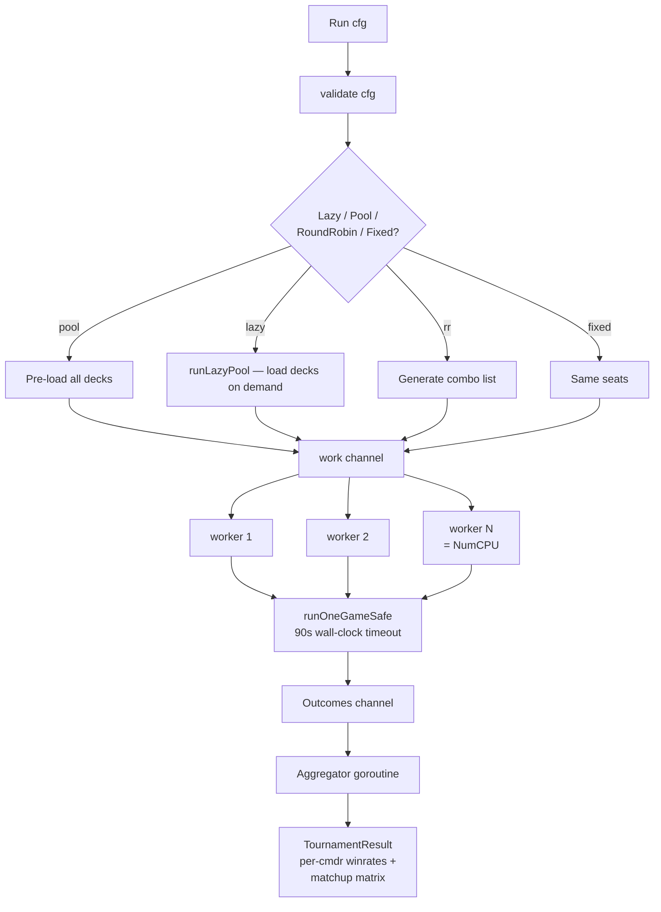

# Tournament Runner

> Last updated: 2026-04-29
> Source: `internal/tournament/runner.go`, `roundrobin.go`, `turn.go`

The runtime architecture under [[Tool - Tournament|mtgsquad-tournament]]. Goroutine-parallel game loop, configurable pod sourcing, ELO + TrueSkill aggregation.

## Worker Pool



## Per-Game Sequence

```mermaid
sequenceDiagram
    participant Setup as setupGame
    participant Loop as turn loop
    participant Take as TakeTurn
    participant SBA as StateBasedActions
    participant End as CheckEnd

    Setup->>Setup: load decks, build GameState
    Setup->>Setup: assign hats per seat
    Setup->>Setup: shuffle libraries, draw 7
    Setup->>Setup: mulligans
    loop until winner or maxTurns or 90s timeout
        Loop->>Take: takeTurnImpl(gs, hook)
        Take->>Take: untap → upkeep → draw → main1 →<br/>combat → extra combats →<br/>main2 → end → cleanup
        Take->>SBA: after each step
        SBA->>End: CheckEnd (eliminations)
        End-->>Loop: winner? continue?
    end
    Loop->>Loop: emit GameOutcome
```

## Per-Game Timeout

`runOneGameSafe` enforces a 90s wall-clock cap. Pathological games (combo loops without win resolution, infinite-trigger storms) get killed. cEDH pod historically timed out — disabled until combo win-condition resolution lands.

## Hat Factories

`HatFactories` parallel to `Decks` — one factory per deck. Factory returns a fresh hat per game (so per-game state doesn't leak between games). [[YggdrasilHat]] gets its `TurnRunner` injected here via `TurnRunnerForRollout()`.

## Aggregation

- `aggregate.go` — winrate per commander, matchup matrix
- `elo.go` — ELO ratings per deck across the run
- `trueskill/` — Microsoft TrueSkill multi-player rating

## Round Notation

`gs.Flags["round"]` increments on seat-rotation wrap. Hat decision logs use `R{round}.{seat}` format.

## Related

- [[Decklist to Game Pipeline]]
- [[Tool - Tournament]]
- [[YggdrasilHat]]
- [[Hat AI System]]
