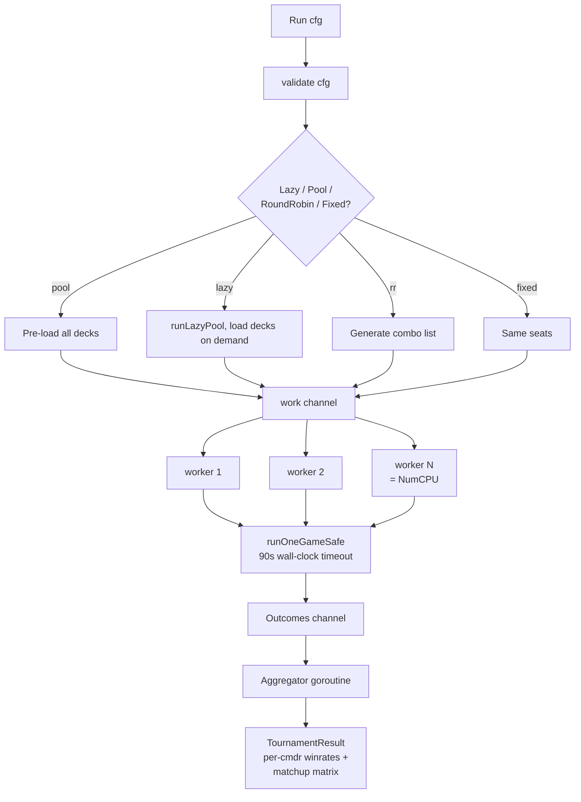

# Tournament Runner

> Source: `internal/tournament/runner.go`, `roundrobin.go`, `turn.go`, `aggregate.go`, `elo.go`

The runtime architecture under [mtgsquad-tournament](Tool%20-%20Tournament.md). Goroutine-parallel game loop, configurable pod sourcing, ELO + TrueSkill aggregation. This is the workhorse for HexDek's 50K-game-scale runs.

## Worker Pool



The runner uses Go's standard producer/consumer pattern. The driver (main goroutine) generates work items and writes them to a channel. N worker goroutines read from the channel, run games, and write outcomes to a separate channel. An aggregator goroutine reads outcomes and accumulates statistics.

`N = runtime.NumCPU()` by default, configurable via `--workers` flag.

## Per-Game Sequence

```mermaid
sequenceDiagram
    participant Setup as setupGame
    participant Loop as turn loop
    participant Take as TakeTurn
    participant SBA as StateBasedActions
    participant End as CheckEnd

    Setup->>Setup: load decks, build GameState
    Setup->>Setup: assign hats per seat
    Setup->>Setup: shuffle libraries, draw 7
    Setup->>Setup: mulligans
    loop until winner or maxTurns or 90s timeout
        Loop->>Take: takeTurnImpl(gs, hook)
        Take->>Take: untap, upkeep, draw, main1,<br/>combat, extra combats,<br/>main2, end, cleanup
        Take->>SBA: after each step
        SBA->>End: CheckEnd (eliminations)
        End-->>Loop: winner? continue?
    end
    Loop->>Loop: emit GameOutcome
```

`takeTurnImpl` (`internal/tournament/turn.go`) is the per-turn driver. Steps execute in CR order; SBAs run between every step; eliminations advance the active seat per [APNAP](APNAP.md).

## Per-Game Timeout

`runOneGameSafe` enforces a **90-second wall-clock cap**. Pathological games (combo loops without win resolution, infinite-trigger storms, mutual stax lock) get killed rather than blocking the whole tournament.

The game's outcome on timeout is recorded as `Timeout` (no winner). Heimdall analytics flag these for triage.

cEDH pods historically timed out at high rates because combo decks couldn't actually win their combos (the engine doesn't recognize assembled combos as wins). Memory note: cEDH disabled until [combo win-condition resolution](YggdrasilHat.md#known-ceilings) lands.

## Hat Factories

`HatFactories` parallel `Decks` — one factory per deck. Factory returns a fresh hat per game (so per-game state doesn't leak between games):

```go
type HatFactory func() gameengine.Hat

// Per-deck factory pattern
factory := func() gameengine.Hat {
    sp, _ := hat.LoadStrategyFromFreya(deckPath)
    yh := hat.NewYggdrasilHat(sp, budget)
    yh.TurnRunner = TurnRunnerForRollout()
    yh.TurnBudget = turnBudget
    return yh
}
```

[YggdrasilHat](YggdrasilHat.md) gets its `TurnRunner` injected here via `tournament.TurnRunnerForRollout()` — this breaks the hat-tournament import cycle.

## Work Modes

| Mode | Behavior | Use case |
|---|---|---|
| Fixed | Same N decks every game | Hat A/B testing on a fixed pod |
| Pool | Random N decks sampled from full pool per game | Random matchups across the corpus |
| Lazy pool | Pool + load decks on demand | Memory-constrained 50K runs |
| Round-robin | Every C(N, seats) combination plays K games | Full matchup matrix on a small pool |

Round-robin generates the combination list once and feeds the work channel. With 32 decks and 4 seats, that's `C(32, 4) = 35960` combinations × `K games each`. Fast even at 50K total games (each combo gets 1-2 games).

## Aggregation

Three components in `internal/tournament/`:

- `aggregate.go` — winrate per commander, matchup matrix
- `elo.go` — ELO ratings per deck across the run
- `internal/trueskill/` — Microsoft TrueSkill multi-player rating

ELO updates after every game outcome. TrueSkill updates similarly but uses Bayesian skill estimation that's better at distinguishing "deck X is genuinely better than Y" from "deck X had lucky pairings."

The matchup matrix is the most useful artifact for deck-tuning. It shows, for each commander pair, the winrate when those two are at the same table. *"Sin wins 62% of games against Yuriko"* is actionable; *"Sin's overall winrate is 28%"* is less so.

## Round Notation

`gs.Flags["round"]` increments on seat-rotation wrap. Hat decision logs use `R{round}.{seat}` format (e.g. `R3.2` = round 3, seat 2's turn).

This was added at Josh's request for human-readability when reading hat decision logs. *"Hat at R5.1 chose to cast X"* is parseable by humans; *"Turn 17 seat 1"* requires mental math to figure out which round of seat rotation that is.

## Configuration Knobs

Flags accepted by `mtgsquad-tournament`:

| Flag | Default | Effect |
|---|---|---|
| `--decks` | required | Path to decks directory |
| `--games` | 100 | Total games to run |
| `--seats` | 4 | Players per game |
| `--workers` | NumCPU | Parallel goroutines |
| `--seed` | random | Reproducibility seed |
| `--hat` | yggdrasil | Hat type (greedy / poker / yggdrasil) |
| `--hat-budget` | 50 | Yggdrasil search depth |
| `--turn-budget` | 100 | Per-turn eval budget |
| `--lazy-pool` | false | Lazy-load decks (memory ceiling) |
| `--audit` | false | Enable Stack Trace globally |
| `--report` | none | Markdown report output path |

## Production Run

```bash
mtgsquad-tournament \
  --lazy-pool \
  --decks data/decks/all \
  --games 50000 \
  --seats 4 \
  --workers 32 \
  --hat yggdrasil \
  --hat-budget 50 \
  --turn-budget 100 \
  --report /tmp/50k.md
```

DARKSTAR v10d binary: 1m34s wall-clock, 532 g/s, 2 timeouts (0.004%), 654/654 commanders covered.

## Related

- [Tool - Tournament](Tool%20-%20Tournament.md) — CLI reference
- [YggdrasilHat](YggdrasilHat.md) — production hat
- [Decklist to Game Pipeline](Decklist%20to%20Game%20Pipeline.md) — how decks become GameState
- [Tool - Heimdall](Tool%20-%20Heimdall.md) — analytics on tournament output
- [Engine Architecture](Engine%20Architecture.md) — engine the runner drives
