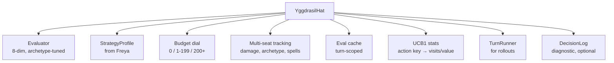

# YggdrasilHat

> Last updated: 2026-04-29
> Source: `internal/hat/yggdrasil.go`
> Status: **Current** — standard for all tournament play

The unified player brain. See [[MCTS and Yggdrasil]] for the budget/rollout architecture and [[Eval Weights and Archetypes]] for scoring. This note is the at-a-glance entry point.

## Why It Exists

Greedy/Poker/MCTS were a delegation chain: each hat wrapped the inner one and overrode methods. Brittle, no native multi-seat awareness, hard to add politics. Yggdrasil is one brain that natively knows about every opponent.

Named by 7174n1c after Yggdrasil, the Norse World Tree connecting the nine worlds — a single root with branches into every dimension of decision-making.

## Composition



## Construction

```go
gs.Seats[i].Hat = hat.NewYggdrasilHat(
    hat.WithStrategy(freyaProfile),
    hat.WithBudget(50),
    hat.WithTurnBudget(100),
    hat.WithTurnRunner(tournament.TurnRunnerForRollout()),
)
```

Tournament runner wires `TurnRunner` so rollouts can advance turns.

## Personality Knobs

- **Budget** — depth dial (heuristic / evaluator / rollout)
- **Noise** — gaussian σ on targeting scores (0=deterministic, 0.2=default)
- **TurnBudget** — eval points per turn (heuristic fallback when exhausted)
- **Archetype** — set on `StrategyProfile`, tunes weights via [[Eval Weights and Archetypes]]

## Implements All 21 Hat Methods Natively

No delegation. Every decision flows through the same evaluation pipeline. Politics layer adds multi-seat awareness as a native dimension, not an afterthought.

## Production Stats

50K-game tournament on DARKSTAR (v10d, 2026-04-28): 532 g/s, 2 timeouts (0.004%), 654/654 unique commanders covered. Top winrate commanders: Olivia Opulent (34.3%), Zinnia (34.2%), Muldrotha (33.5%). Graveyard recursion cmdrs dominate.

## Known Ceiling

Combo win conditions not fully implemented: 90%+ of wins are combat damage even for combo decks. The engine doesn't recognize assembled combos as wins — no infinite-damage, no mill kills, no "win the game" combo resolution. Combo decks beatdown only. Primary remaining ceiling on combo archetype performance.

## Related

- [[Hat AI System]]
- [[MCTS and Yggdrasil]]
- [[Eval Weights and Archetypes]]
- [[Freya Strategy Analyzer]]
