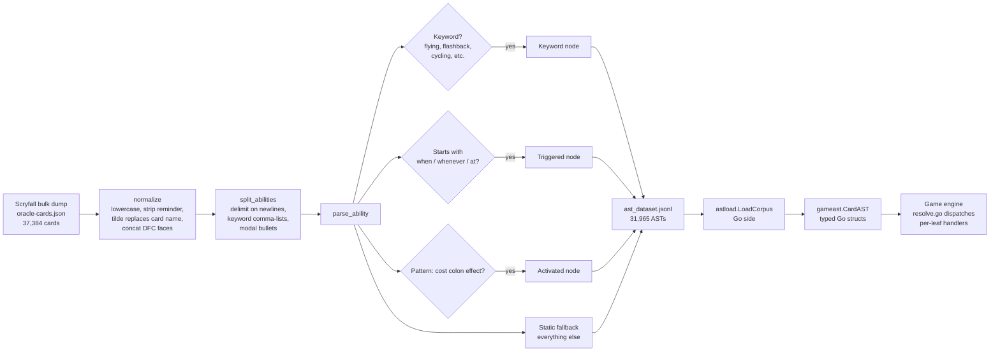
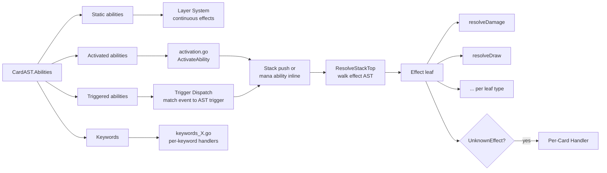
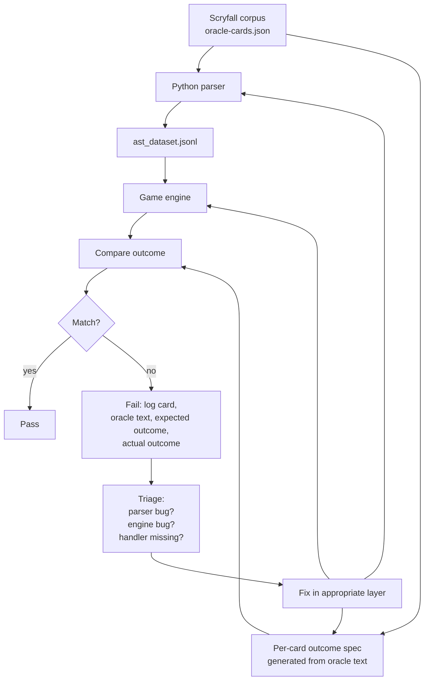

# Card AST and Parser

> Source: `scripts/parser.py` (parser), `internal/gameast/` (Go types), `internal/astload/` (loader)
> CR ref: §113 (definition of abilities)

Magic cards are written in stylized natural language. *"Whenever a creature you control dies, you gain 1 life."* That's beautiful for humans and impossible for a rules engine to dispatch directly. The parser turns oracle text into a typed abstract syntax tree (AST) that the engine can act on programmatically.

## Table of Contents

- [Why an AST](#why-an-ast)
- [The Pipeline](#the-pipeline)
- [The Four Top-Level Node Types](#the-four-top-level-node-types)
- [Supporting Types](#supporting-types)
- [Effect Leaves](#effect-leaves)
- [The 31,965-Row Dataset](#the-31965-row-dataset)
- [Coverage Status](#coverage-status)
- [Where the AST Gets Consumed](#where-the-ast-gets-consumed)
- [The Corpus Audit Workflow](#the-corpus-audit-workflow)
- [Layer Tagging in AST](#layer-tagging-in-ast)
- [Coverage Gaps](#coverage-gaps)
- [Related Docs](#related-docs)

## Why an AST

Oracle text uses a finite vocabulary of game concepts: damage, draw, mill, sacrifice, target, choose, until end of turn. With patience you could write a regex matcher for every clause. People have tried. They give up around card #500 because regexes don't compose.

An AST gives you composition. *"Sacrifice a creature: deal damage equal to its power to target creature or player"* parses to:

```
Activated{
    cost: Composite{Sacrifice{Filter: "creature"}},
    effect: Damage{
        amount: PowerOf{from: sacrificed_creature},
        target: Filter{"target creature or player"}
    }
}
```

Each leaf is a typed value the engine knows how to dispatch. `Damage` runs through `resolve.go::resolveDamage`. The amount-expression `PowerOf{from: sacrificed_creature}` evaluates against the just-sacrificed permanent. The filter narrows to legal targets, hat picks one.

Composition lets new cards work *without writing new code*. A new card whose oracle text decomposes into existing AST nodes runs immediately on the existing dispatchers.

## The Pipeline



The parser is **Python** because building a Magic-text parser is text-processing-heavy and the Python ecosystem is better at that. The Go engine consumes the parser's serialized output (JSONL).

Stages:

1. **Normalization** (`scripts/parser.py`):
   - Lowercase oracle text
   - Strip reminder text in parentheses
   - Replace card name with `~` (per CR convention)
   - Concatenate DFC (double-faced card) faces with separator
   - Strip any layout artifacts (token entries, art series)

2. **Splitting** (`split_abilities`):
   - Newlines separate abilities
   - Comma-separated keyword lists ("Flying, lifelink") split into individual keywords
   - Modal bullets (`•`) split into mode subexpressions

3. **Per-ability parsing** (`parse_ability`):
   - Try keyword match (against the ~700 known keywords)
   - Try triggered (starts with when/whenever/at)
   - Try activated (cost-colon-effect pattern)
   - Fall through to static (everything else)

4. **Serialization**:
   - Each ability becomes a JSON object
   - Cards become a JSON array of abilities
   - Output is one card per line (JSONL) for streaming consumption

5. **Go-side load** (`internal/astload/`):
   - `LoadCorpus("data/rules/ast_dataset.jsonl")` returns `map[string]*gameast.CardAST`
   - Each `CardAST` has `Abilities []Ability` — typed Go structs

## The Four Top-Level Node Types

Per CR §113, every Magic ability is one of four types. The AST mirrors this exactly:

| Node | Shape | Example | Engine handler |
|---|---|---|---|
| `Static` | `(condition?, modification?, raw)` | "Creatures you control get +1/+1" | [Layer System](Layer%20System.md) |
| `Activated` | `(cost, effect, timing?, raw)` | "{T}: Add {G}" | `activation.go::ActivateAbility` |
| `Triggered` | `(trigger, effect, intervening_if?, raw)` | "When ~ enters the battlefield, draw a card" | `triggers.go` + [Trigger Dispatch](Trigger%20Dispatch.md) |
| `Keyword` | `(name, args, raw)` | "Flying", "Flashback {2}{U}" | per-keyword handler in `keywords_*.go` |

Keywords are technically a subtype of static or triggered in CR — Flying is a static "evasion" keyword, Flashback is an alternative casting cost, Cycling is an activated. The parser categorizes by **named keyword** because oracle text uses canonical keyword forms ("Flying" not "this creature has flying"), and the engine has dedicated keyword dispatchers in `keywords_*.go`.

## Supporting Types

The `gameast` Go package (`internal/gameast/`) mirrors the Python AST:

```go
// Mana symbol — every kind of cost atom
type ManaSymbol struct {
    Type    string  // "W"/"U"/"B"/"R"/"G"/"C" (color), "generic", "X", "snow", "phyrexian"
    Count   int     // for generic costs
    Hybrid  []string  // {U/B} → ["U","B"]
}

// Mana cost — a composite cost
type ManaCost struct {
    Symbols []ManaSymbol
    Total   int  // CMC if static
}

// Filter — target spec
type Filter struct {
    Subject     string    // "creature", "permanent", "player", ...
    Restrictions []string // "you control", "target", "another", "nonland", ...
    Power       *Range
    Toughness   *Range
    Color       []string
    // ... ~20 more fields
}

// Trigger — what event fires this triggered ability
type Trigger struct {
    Slug   string  // canonical event name: "etb", "dies", "attacks", "upkeep", ...
    Actor  *Filter
    Target *Filter
    Phase  string  // optional phase restriction
}

// Cost — composite cost (mana + non-mana)
type Cost struct {
    Mana       *ManaCost
    Tap        bool
    Untap      bool
    Sacrifice  *Filter
    Discard    int
    Life       int
    ExileSelf  bool
    // ... extensible
}

// Condition — boolean predicate
type Condition struct {
    Kind string  // "you_control", "life_threshold", "card_count_zone", "tribal"
    Args []string
}
```

These types are stable contract between parser and engine. Adding a new game concept means adding to `gameast` first, then teaching the parser to emit it, then the engine to handle it.

## Effect Leaves

`gameast/effects.go` (527 lines) defines the typed effect vocabulary. As of 2026-04-29:

| Leaf | What it does |
|---|---|
| `Damage` | Deal N damage to target |
| `Draw` | Target player draws N cards |
| `Discard` | Target player discards N (random / chosen / specific) |
| `Mill` | Target player puts top N of library into graveyard |
| `Scry` | Look at top N, reorder or send bottom |
| `Surveil` | Look at top N, send to graveyard or top |
| `CounterSpell` | Counter target spell |
| `Destroy` | Destroy target permanent |
| `Exile` | Exile target permanent or card |
| `Bounce` | Return target permanent to owner's hand |
| `Tutor` | Search library for card matching filter |
| `Reanimate` | Return target card from graveyard to battlefield |
| `GainLife` | Target player gains N life |
| `LoseLife` | Target player loses N life |
| `Sacrifice` | Target controller sacrifices |
| `CreateToken` | Create N tokens of given type |
| `CounterMod` | Add/remove counters of a type |
| `Buff` | +X/+Y until end of turn (or permanent) |
| `GrantAbility` | Grant a keyword/ability |
| `AddMana` | Add to mana pool |
| `GainControl` | Take control of target permanent |
| `CopySpell` | Copy target spell |
| `ExtraTurn` | Take an additional turn |
| `ExtraCombat` | Add a combat phase |
| `WinGame` | Target player wins |
| `LoseGame` | Target player loses |
| `Replacement` | Register a §614 replacement effect |
| `Prevent` | Prevent N damage |
| `Sequence` | Apply effects in order |
| `Choice` | Player picks one effect from a list |
| `Optional_` | "You may" wrapper |
| `Conditional` | Apply effect only if condition |
| `UnknownEffect` | Parser didn't recognize — handed to per-card handler |

The `UnknownEffect` leaf is the bailout. When the parser produces this node, the runtime hands the card off to a [per-card handler](Per-Card%20Handlers.md). This is the seam where the AST stops at "I see an effect but can't categorize it" and bespoke code takes over.

## The 31,965-Row Dataset

The serialized AST lives at `data/rules/ast_dataset.jsonl`. Format:

```json
{"name": "Lightning Bolt", "abilities": [{"kind":"activated","cost":{"mana":"{R}"},"effect":{"kind":"damage","amount":3,"target":{"subject":"creature_or_player","restrictions":["target"]}}}]}
{"name": "Counterspell", "abilities": [{"kind":"activated","cost":{"mana":"{U}{U}"},"effect":{"kind":"counter_spell","target":{"subject":"spell","restrictions":["target"]}}}]}
...
```

One card per line. 31,965 cards as of 2026-04-29 corpus refresh. Some Scryfall entries are filtered out:

- Layout `art_series`, `token`, `double_faced_token`, `emblem` — non-playable
- Ante cards (9 cards, regulatory filter)
- WotC 2020 racist-imagery removal list (7 cards) — also filtered

So the playable card pool is ~31,965 even though Scryfall ships 37,384 oracle entries.

## Coverage Status

Per memory (`project_hexdek_corpus_audit.md`):

| Audit | Status | Tests | Notes |
|---|---|---|---|
| Phase 1: Outcome Verification | 100% | 18,834 / 31,963 | Every card's primary effect resolves to expected outcome |
| Phase 2: Coverage Depth | 100% | 68,944 / 31,963 | Every ability has functional coverage |
| Phase 3: Per-Card Handler Compliance | 100% | 275 / 275 | Hand-rolled handlers all match oracle text |
| Phase 4: AST-Oracle Fidelity | 100% | 31,963 / 31,963 | Every card's AST round-trips against oracle |

Run all four with Thor: `mtgsquad-thor --corpus-audit --coverage-depth --oracle-compliance --ast-fidelity`. Total: 96,159 tests in ~2.2 seconds, ~43K tests/sec. Zero failures.

The journey to 100% AST fidelity (memory): 89.0% → 97.7% → 99.4% → 99.6% → 99.8% → 99.9% → 100.0%. The last 0.1% required:

- Removing overly aggressive `:` and `—` line filters that blocked legitimate keywords
- Removing 10 keywords never emitted as Keyword AST nodes
- Adding suffix validation to oracle extractor
- Em-dash support in keyword prefix matching
- Token filter in `loadOracleCards` (Scarecrow / Phyrexian Hydra naming collisions)
- `normalize()` first-word guard (only replace when card name has comma — prevented "Escape Velocity" being parsed as keyword "escape")

These were one-line fixes that each unlocked a few cards. The cumulative effect was 100% syntactic coverage.

## Where the AST Gets Consumed



The engine entry points:

- `resolve.go::ResolveEffect` — dispatch on effect leaf type
- `triggers.go::PushPerCardTrigger` — find matching AST triggers per event
- `activation.go::ActivateAbility` — handle player-activated abilities
- `keywords_*.go` — per-keyword combat / cost / lifecycle handlers

## The Corpus Audit Workflow

The corpus audit is what proves the parser produces engine-executable output:



Run via `mtgsquad-thor --corpus-audit`. For each card:

1. Build "ideal board state" for the card to fire its effect (correct mana, valid targets, etc.)
2. Trigger the effect
3. Check that the post-state matches the oracle-text-implied outcome

When something fails, the audit log tells you which card, what the parser produced, what the engine did, and what was expected. Triage is then: parser fixed something wrong, engine missing a handler, or the test expectation is wrong.

## Layer Tagging in AST

Per the 2026-04-15 architecture decision (memory: `project_hexdek_architecture.md`), AST `Modification` nodes get a `layer: Optional[int]` per CR §613:

| Layer | What it controls |
|---|---|
| 1 | Copy effects |
| 2 | Control changes |
| 3 | Text changes |
| 4 | Type, subtype, supertype |
| 5 | Color |
| 6 | Ability add/remove |
| 7a | Power/toughness CDA |
| 7b | Set P/T |
| 7c | Modify P/T (counters, +N/+N) |
| 7d | Switch P/T |

The engine sorts by layer at resolution instead of re-deriving. This shifts work from runtime to parse time. See [Layer System](Layer%20System.md) for the engine side.

## Coverage Gaps

Despite 100% syntactic coverage, the engine doesn't *execute* every AST cleanly:

- **Engine-executable**: ~24% of the AST is fully typed leaves the runtime can dispatch
- **Stub coverage**: ~76% — `Modification(kind="custom", args=(slug,))` placeholders that get handed to per-card handlers

The 76% stub coverage means most cards have an AST but the AST contains an `UnknownEffect` for at least one ability. Those abilities get handled by the [Per-Card Handlers](Per-Card%20Handlers.md) registry — currently 1079+ handlers covering the cards Josh + 7174n1c actively play.

The plan is to keep moving abilities from the stub bucket into typed-leaf coverage. Each batch reduces the per-card-handler count by exposing more cards as "AST-only" runnable.

## Related Docs

- [Per-Card Handlers](Per-Card%20Handlers.md) — where `UnknownEffect` gets handled
- [Layer System](Layer%20System.md) — consumes layer-tagged static abilities
- [Trigger Dispatch](Trigger%20Dispatch.md) — consumes Triggered AST nodes
- [Engine Architecture](Engine%20Architecture.md) — top-level dataflow
- [Tool - Thor](Tool%20-%20Thor.md) — corpus audit runner
