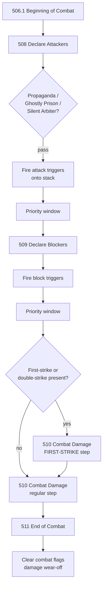
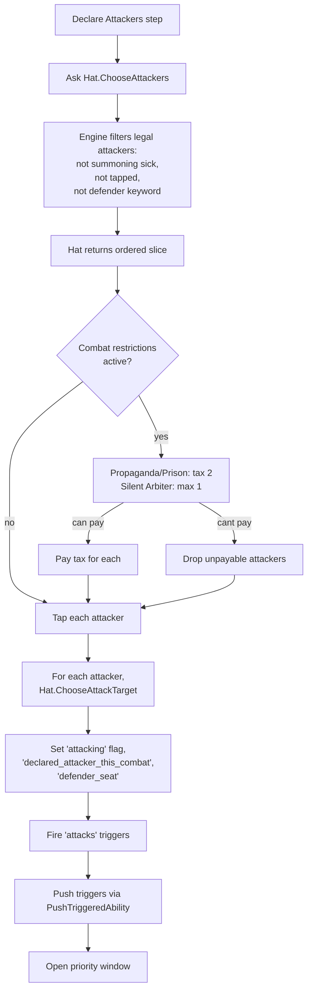
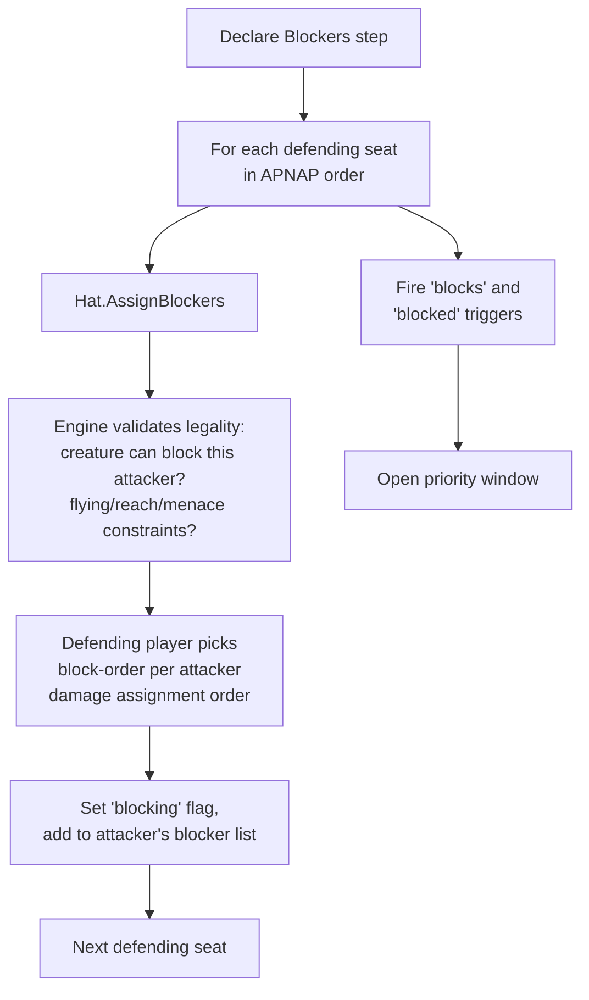
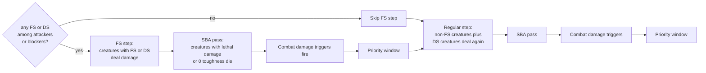
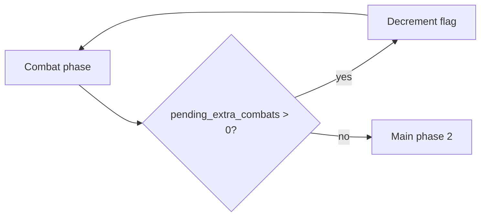

# Combat Phases

> Source: `internal/gameengine/combat.go` (1706 lines), `keywords_combat.go`, `combat_restrictions.go`
> CR refs: §506-§511, §702 (combat keywords), §802 (multiplayer attack targeting)

Combat is the part of Magic where most damage gets dealt and most creatures die. Five steps, each with its own rules, plus a parallel keyword combat system for first strike, deathtouch, lifelink, trample, and ~25 others. This doc walks through the whole phase from the top.

## Table of Contents

- [The 5-Step Combat Phase](#the-5-step-combat-phase)
- [Beginning of Combat (CR §506)](#beginning-of-combat-cr-506)
- [Declare Attackers (CR §508)](#declare-attackers-cr-508)
- [Multiplayer Attack Targeting (CR §802)](#multiplayer-attack-targeting-cr-802)
- [Declare Blockers (CR §509)](#declare-blockers-cr-509)
- [Combat Damage (CR §510)](#combat-damage-cr-510)
- [The First-Strike Damage Dance](#the-first-strike-damage-dance)
- [End of Combat (CR §511)](#end-of-combat-cr-511)
- [Combat Keywords](#combat-keywords)
- [Combat Restrictions and Taxes](#combat-restrictions-and-taxes)
- [Commander Damage](#commander-damage)
- [Extra Combats](#extra-combats)
- [Worked Example: 3-Way Combat](#worked-example-3-way-combat)
- [Related Docs](#related-docs)

## The 5-Step Combat Phase

Per CR §506, combat has exactly five steps in fixed order:

Driver function: `CombatPhase(gs)` in `combat.go`. Each step has a dedicated handler:

| Function | Step | CR |
|---|---|---|
| `beginningOfCombatStep` | 506 | §506 |
| `DeclareAttackers` | 508 | §508 |
| `DeclareBlockers` | 509 | §509 |
| `DealCombatDamageStep` | 510 | §510 |
| `EndOfCombatStep` | 511 | §511 |

Between every step, priority opens for all players. If anyone responds, the [stack pipeline](Stack%20and%20Priority.md) runs to completion before the next step starts.

## Beginning of Combat (CR §506)

The shortest step. Active player gets priority first. Triggers that key on "at the beginning of combat" fire here (Hero of Bladehold tokens, Goblin Trashmaster pumps).

There are no rule-mandated actions in this step beyond the trigger fan-out and priority window.

## Declare Attackers (CR §508)

The active player chooses which of their untapped creatures attack and what each is attacking.

Source: `combat.go` `DeclareAttackers`. Combat-state lives in `Permanent.Flags`:

| Flag | Set when |
|---|---|
| `attacking` | Creature declared as attacker |
| `declared_attacker_this_combat` | Set on declaration, persists through end of combat (some triggers key on this) |
| `attacked_this_combat` | Set after damage step (for "after combat" effects) |
| `defender_seat` | Stores `seat_index + 1` of who this attacker is attacking |

The `+1` offset on `defender_seat` is so flag absence (zero) is distinguishable from "attacking seat 0".

**Vigilance** is implemented inline: if the creature has `vigilance`, the tap step is skipped. `HasKeyword` (`combat.go:52`) checks AST keywords, granted abilities, runtime flags (`kw:<name>`), and keyword counters (CR §122.1c).

## Multiplayer Attack Targeting (CR §802)

In multiplayer, each attacker independently chooses its defending player or planeswalker. The engine asks the hat per attacker via `ChooseAttackTarget(gs, seatIdx, attacker, legalDefenders)`.

`legalDefenders` includes:

- All living opponent seat indices
- (Future) Planeswalker permanents the active player can attack

[YggdrasilHat](YggdrasilHat.md) uses a 7-dimensional threat score plus politics layers (retaliation, grudge, finish-low-life). [GreedyHat](Greedy%20Hat.md) uses the simpler `ThreatScoreBasic` (lowest life first, then board power).

## Declare Blockers (CR §509)

Each defending player (in [APNAP](APNAP.md) order) chooses how to block attackers attacking them.

The blocker list **order matters**. Per §509.1h, the defending player declares the order of blockers per attacker — that's the damage-assignment order (the attacker chooses how to allocate damage among blockers in that order).

`Hat.AssignBlockers` returns `map[*Permanent][]*Permanent` — attacker mapped to ordered blocker list. A missing or empty slice means the attacker is unblocked.

## Combat Damage (CR §510)

The damage step is where things get spicy. Without first/double strike, it's one step — every attacker and unblocked attacker deals damage simultaneously, every blocker deals damage to its attacker simultaneously. With first or double strike, there's an extra step before regular damage.

`DealCombatDamageStep` handles both step types. Damage is dealt **simultaneously per step**, then a SBA pass catches deaths.

## The First-Strike Damage Dance

When at least one attacker or blocker has first strike or double strike, combat splits into two damage steps:

So a creature with **double strike** deals damage in *both* steps. A first-striker only deals damage in the first step (and might survive long enough to skip the second). A creature with no strike keyword deals damage only in the regular step.

This is the "4-step damage dance" in dense combat with mixed keywords:

1. FS step damage assignment + tap (for §509.1h ordering)
2. FS damage applied simultaneously
3. SBA + triggers
4. Repeat with regular step

## End of Combat (CR §511)

Triggers that key on "end of combat" fire (Aurelia's Fury, Strionic Resonator copies). After triggers resolve, `EndOfCombatStep` clears all combat flags:

- `attacking`, `declared_attacker_this_combat`, `attacked_this_combat`, `blocking`
- `defender_seat`
- Until-end-of-combat damage modifications wear off

## Combat Keywords

Implemented in `keywords_combat.go` and the various `keywords_*.go` batch files. Full list as of 2026-04-29:

| Keyword | CR | Behavior |
|---|---|---|
| Flying | §702.9 | Can only be blocked by creatures with flying or reach |
| Reach | §702.17 | Can block creatures with flying |
| Trample | §702.19 | Excess damage carries to defending player |
| Deathtouch | §702.2 | Any damage from this is lethal |
| Lifelink | §702.15 | Damage dealt is also gained as life |
| Menace | §702.110 | Can't be blocked except by 2+ creatures |
| Vigilance | §702.20 | Doesn't tap when attacking |
| First strike | §702.7 | Damage dealt in FS step |
| Double strike | §702.4 | Damage dealt in BOTH FS and regular steps |
| Indestructible | §702.12 | Lethal damage and "destroy" effects don't kill |
| Hexproof | §702.11 | Can't be targeted by opponents' spells/abilities |
| Ward | §702.158 | Counters target unless additional cost paid |
| Prowess | §702.108 | +1/+1 until EOT when noncreature spell cast |
| Banding | §702.21 | Attacker chooses damage allocation among banded blockers |
| Flanking | §702.25 | Blocker without flanking gets -1/-1 EOT |
| Bushido | §702.45 | +N/+N when blocking or blocked |
| Provoke | §702.39 | Attacker forces a creature to block |
| Battle cry | §702.91 | Other attackers get +1/+0 |
| Myriad | §702.115 | Make a token copy attacking each other defender |
| Annihilator | §702.84 | Defending player sacrifices N permanents |
| Intimidate | §702.13 | Can only be blocked by artifacts or creatures sharing color |
| Fear | §702.36 | Can only be blocked by artifacts or black creatures |
| Shadow | §702.27 | Can only block/be blocked by creatures with shadow |
| Horsemanship | §702.31 | Can only be blocked by creatures with horsemanship |
| Skulk | §702.118 | Can't be blocked by creatures with greater power |
| Defender | §702.3 | Can't attack |
| Exalted | §702.82 | +1/+1 until EOT when creature you control attacks alone |

Some keywords interact with combat structure (vigilance modifies tap step), some modify damage (deathtouch, lifelink, trample), some modify legality (flying, fear, shadow). All compose — a creature with flying, lifelink, deathtouch, double strike is fully supported.

## Combat Restrictions and Taxes

`combat_restrictions.go` (memory: Batch 17, 2026-04-26) implements attack taxes:

| Card | Effect |
|---|---|
| Propaganda | Pay {2} for each creature attacking you |
| Ghostly Prison | Pay {2} for each creature attacking you |
| Windborn Muse | Pay {2} for each creature attacking you |
| Baird, Argivian Recruiter | Pay {1} for each creature attacking you |
| Silent Arbiter | Each player can attack with at most 1 creature |
| Crawlspace | Each player can attack with at most 2 creatures |

Wired into `DeclareAttackers`. After the hat picks attackers, the engine iterates them, applies taxes, drops unpayable ones, and applies "max N" caps.

These were a major step toward correct stax behavior — before this batch, Propaganda was a no-op and stax decks couldn't lock the table.

## Commander Damage

Per CR §704.6c, a player who has been dealt 21+ combat damage from a single commander loses the game. HexDek tracks per-source commander damage in `Seat.CommanderDamage[srcID]`.

When a creature deals combat damage to a player and `IsCommander(creature)` is true, the engine increments `defender.CommanderDamage[creature.SourceID]`. The check happens in [State-Based Actions](State-Based%20Actions.md) §704.6c — when any source's accumulated damage hits 21, the seat loses.

Partner support is included: each partner is a separate source with its own 21-damage threshold.

## Extra Combats

Cards like Aggravated Assault, World at War, Aurelia, the Warleader, Sphinx of the Second Sun grant additional combat phases. These are tracked via `gs.Flags["pending_extra_combats"]`.

The turn loop in `tournament/turn.go` checks this flag after each combat phase and re-enters combat if it's > 0:

Each extra combat resets the `attacked_this_combat` flag (so creatures can attack again, modulo summoning sickness).

## Worked Example: 3-Way Combat

Concrete scenario showing keyword interactions:

**Setup:** P1 (active) is attacking P2 with three creatures:

- **Trampler** — 5/5 trample
- **Deathtoucher** — 2/2 deathtouch
- **First Striker** — 3/3 first strike

P2 has two blockers:

- **Big Blocker** — 4/5
- **Small Blocker** — 1/2

**Declare Attackers:**

- P1.Hat.ChooseAttackers returns [Trampler, Deathtoucher, First Striker]
- Each attacker calls Hat.ChooseAttackTarget — all target P2 (only living opponent in this example)
- Tap all three (none have vigilance)
- "Attacks" triggers fire (none in this scenario)

**Declare Blockers:**

- P2.Hat.AssignBlockers returns:
  - Trampler — blocked by Big Blocker
  - Deathtoucher — blocked by Small Blocker
  - First Striker — unblocked
- P2 picks block order (single blocker per attacker, trivial)

**First-Strike Damage Step (because First Striker has FS):**

- First Striker is the only striker, deals 3 damage to P2 (unblocked) — P2 life loses 3
- SBAs run: P2 still alive
- Triggers fire: nothing in this scenario

**Regular Damage Step:**

- Trampler vs Big Blocker:
  - Trampler must assign at least 4 damage to Big Blocker (lethal). Excess 1 damage tramples to P2.
  - Big Blocker deals 4 damage to Trampler.
- Deathtoucher vs Small Blocker:
  - Deathtoucher's 2 damage is lethal (deathtouch). Small Blocker dies.
  - Small Blocker deals 1 damage to Deathtoucher.

All damage applied simultaneously. Then:

**Post-damage SBAs:**

- Big Blocker: 4 damage on a 4/5 — not lethal, survives
- Trampler: 4 damage on a 5/5 — not lethal, survives
- Small Blocker: 2 damage on a 1/2 — lethal, dies
- Deathtoucher: 1 damage on a 2/2 — not lethal, survives

**Post-damage triggers:**

- "Whenever ~ deals combat damage to a player" triggers fire for First Striker and Trampler
- "Whenever a creature dies" triggers fire for Small Blocker

**End of combat step:** flags clear, damage wears off.

**Net P2 life:** -4 (3 from First Striker + 1 from Trampler trample). One creature died.

## Related Docs

- [Stack and Priority](Stack%20and%20Priority.md) — between every combat step
- [State-Based Actions](State-Based%20Actions.md) — death cleanup after damage
- [Trigger Dispatch](Trigger%20Dispatch.md) — attack/block/damage triggers
- [Layer System](Layer%20System.md) — keyword grants come from layers
- [APNAP](APNAP.md) — defending player order
- [YggdrasilHat](YggdrasilHat.md) — attacker/blocker decisions
