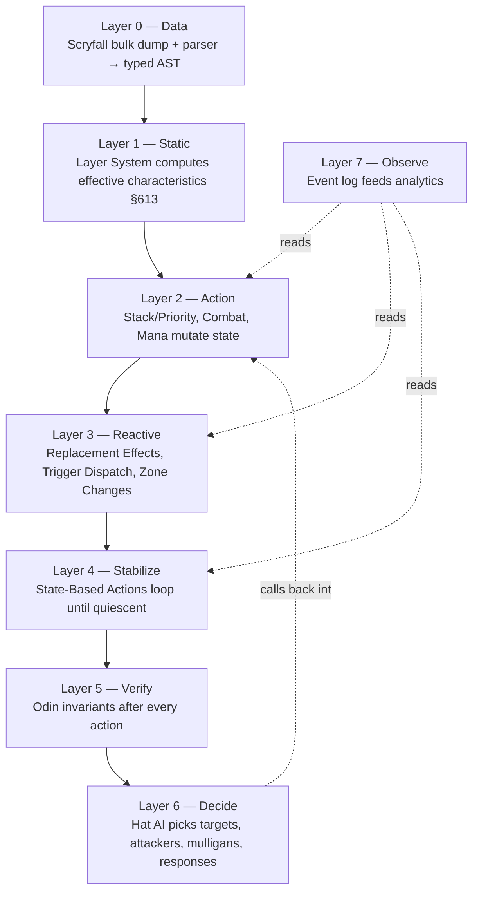
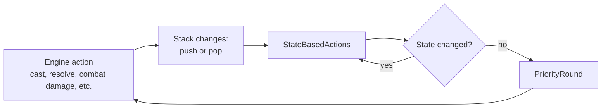
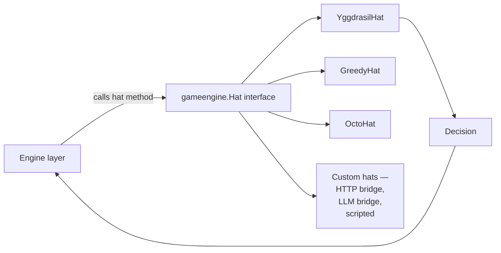

# Engine Architecture

> Source: `internal/gameengine/`
> Language: Go 1.21+

Top-level dataflow for the HexDek rules engine: Scryfall corpus → AST → game state → turn loop → analytics. This page is the system overview — every subsystem mentioned has its own deep-dive linked.

## Table of Contents

- [The Big Picture](#the-big-picture)
- [Layered Pipeline](#layered-pipeline)
- [Key Files](#key-files)
- [The Turn Loop in Detail](#the-turn-loop-in-detail)
- [The Stack-SBA Heartbeat](#the-stack-sba-heartbeat)
- [The Event Log](#the-event-log)
- [The Hat Boundary](#the-hat-boundary)
- [Throughput and Bottlenecks](#throughput-and-bottlenecks)
- [Where to Read Next](#where-to-read-next)
- [Related Docs](#related-docs)

## The Big Picture

```mermaid
flowchart LR
    SCRY[Scryfall<br/>oracle-cards.json<br/>37,384 cards] --> PARSER[Python parser<br/>scripts/parser.py]
    PARSER --> AST[ast_dataset.jsonl<br/>31,965 ASTs]
    AST --> ASTLOAD[astload.LoadCorpus]
    DECK[decklist .txt] --> DECKPARSER[deckparser]
    ASTLOAD --> CARDS[Card pool]
    DECKPARSER --> CARDS
    CARDS --> GS[GameState<br/>state.go]
    HAT[Hat AI System] -. decisions .-> GS
    GS --> TURN[TakeTurn]
    TURN --> CAST[CastSpell]
    TURN --> COMBAT[CombatPhase]
    CAST --> RESOLVE[ResolveStackTop]
    RESOLVE --> ZONE[MoveCard]
    ZONE --> REPL[FireEvent]
    REPL --> TRIG[FireZoneChangeTriggers]
    TRIG --> SBA[State-Based Actions]
    SBA --> INV[Odin invariants]
    INV --> EVENTS[Event log]
    EVENTS --> HEIM[Heimdall analytics]
```



Every box maps to source code:

| Box | Doc | Code |
|---|---|---|
| Scryfall corpus | [Card AST and Parser](Card%20AST%20and%20Parser.md) | `data/rules/oracle-cards.json` |
| Python parser | [Card AST and Parser](Card%20AST%20and%20Parser.md) | `scripts/parser.py` |
| AST dataset | [Card AST and Parser](Card%20AST%20and%20Parser.md) | `data/rules/ast_dataset.jsonl` |
| astload | [Decklist to Game Pipeline](Decklist%20to%20Game%20Pipeline.md) | `internal/astload/` |
| deckparser | [Decklist to Game Pipeline](Decklist%20to%20Game%20Pipeline.md) | `internal/deckparser/` |
| GameState | (this doc) | `internal/gameengine/state.go` |
| Hat AI | [Hat AI System](Hat%20AI%20System.md) | `internal/gameengine/hat.go`, `internal/hat/` |
| TakeTurn | [Tournament Runner](Tournament%20Runner.md) | `internal/tournament/turn.go` |
| CastSpell | [Stack and Priority](Stack%20and%20Priority.md) | `internal/gameengine/stack.go` |
| CombatPhase | [Combat Phases](Combat%20Phases.md) | `internal/gameengine/combat.go` |
| ResolveStackTop | [Stack and Priority](Stack%20and%20Priority.md) | `internal/gameengine/stack.go` |
| MoveCard | [Zone Changes](Zone%20Changes.md) | `internal/gameengine/zone_move.go` |
| FireEvent | [Replacement Effects](Replacement%20Effects.md) | `internal/gameengine/replacement.go` |
| Trigger fan-out | [Trigger Dispatch](Trigger%20Dispatch.md) | `internal/gameengine/triggers.go` |
| SBA loop | [State-Based Actions](State-Based%20Actions.md) | `internal/gameengine/sba.go` |
| Invariants | [Invariants Odin](Invariants%20Odin.md) | `internal/gameengine/invariants.go` |
| Heimdall | [Tool - Heimdall](Tool%20-%20Heimdall.md) | `internal/analytics/`, `cmd/mtgsquad-heimdall/` |

## Layered Pipeline

The architecture has a stack-of-layers shape. Each layer depends on layers below it; nothing depends "up." The layering is conceptual — Go has no enforcement — but it's load-bearing for understanding the system.



A few important interactions:

- **L6 (Hat) calls back into L2 (Action).** When the hat picks a spell to cast, the engine calls `CastSpell` — which is L2 logic. The hat is fundamentally embedded in the action layer.
- **L4 (SBA) re-runs L1 (Layers).** Toughness checks in §704.5f require fresh layer-resolved characteristics. The layer cache is invalidated whenever layer-relevant state changes; SBA reads through the cache.
- **L5 (Invariants) is read-only.** Invariant predicates never mutate state. They observe and either return nil (pass) or error (fail).

Per memory (`project_hexdek_architecture.md` decision 1): layer tagging at parse time is planned, which would push layer info into L0 and reduce L1's runtime cost.

## Key Files

The engine package files, sized by importance:

```
internal/gameengine/
├── state.go              # GameState, Seat, Permanent, Card, StackItem types
├── stack.go              # 1555 — cast pipeline, priority, resolution, DrainStack
├── combat.go             # 1706 — 5-step combat, keyword combat math
├── sba.go                # 1462 — §704 state-based action loop
├── zone_move.go          # 125 — universal MoveCard entry point
├── zone_change.go        # 676 — destroy/exile/sacrifice/bounce + zone triggers
├── replacement.go        # 1240 — FireEvent dispatcher (§614/§616)
├── triggers.go           # 112 — APNAP trigger ordering
├── trigger_stack_bridge.go  # bridge: triggers → stack
├── observer_triggers.go  # passive observers (Rhystic Study, Mystic Remora)
├── event_aliases.go      # event-name normalization
├── layers.go             # 1629 — §613 continuous-effect layer system
├── mana.go               # 710 — typed colored mana pool
├── mana_artifacts.go     # ~30 specific mana rocks
├── multiplayer.go        # 632 — N-seat / §800 / APNAP helpers
├── invariants.go         # 20 Odin predicates
├── stack_trace.go        # CR-compliance audit logger
├── loop_shortcut.go      # CR §727 loop projection
├── per_card_hooks.go     # Per-card handler registry seam
├── per_card/             # 96 .go files, 1079+ handlers
├── keywords_*.go         # Per-keyword combat / cost handlers
├── replacement.go + replacement_canonical.go  # canonical replacement handlers
└── ...                   # 98 .go files total
```

The four files you read first if you're new: `state.go` (data shape), `stack.go` (cast pipeline), `sba.go` (the engine heartbeat), `combat.go` (where most events happen).

## The Turn Loop in Detail

`internal/tournament/turn.go::takeTurnImpl` is the per-turn driver.

```mermaid
sequenceDiagram
    participant Loop as turn loop
    participant TakeTurn as TakeTurn
    participant Stack as Stack pipeline
    participant Combat as CombatPhase
    participant SBA as SBAs
    participant End as CheckEnd

    Loop->>TakeTurn: round start
    TakeTurn->>TakeTurn: Untap step
    TakeTurn->>Stack: open priority (no triggers expected)
    TakeTurn->>TakeTurn: Upkeep step + fire phase triggers
    TakeTurn->>Stack: priority window
    TakeTurn->>TakeTurn: Draw step (active player draws 1)
    TakeTurn->>Stack: priority window
    TakeTurn->>TakeTurn: Main phase 1
    loop until pass
        TakeTurn->>Stack: ChooseCastFromHand / ChooseLandToPlay
        Stack->>SBA: between resolutions
    end
    TakeTurn->>Combat: CombatPhase
    Combat->>Combat: 5 steps + extra combats loop
    TakeTurn->>TakeTurn: Main phase 2
    TakeTurn->>TakeTurn: End step + cleanup
    TakeTurn->>End: CheckEnd
    End-->>Loop: continue or terminate
```

After each step, the engine:

1. Fires phase triggers (`FirePhaseTriggers` for AST-declared triggers, `FireCardTrigger` for per-card hooks)
2. Opens a priority window
3. Drains the stack of any responses
4. Runs SBAs

This is the "every step ends with a stable state" guarantee that lets the next step start cleanly.

## The Stack-SBA Heartbeat

The single most important pattern in the engine:



Every meaningful state transition emits an event, then SBAs run, then priority opens. This is what implements CR §704.3 ("whenever a player would get priority, perform all applicable SBAs").

`DrainStack` (`stack.go:66`) wraps this loop with safety caps: 500 max iterations of the resolve-SBA-priority cycle, 10 max recursion depth on `DrainStack→CastSpell→DrainStack`, 50 max for `PushTriggeredAbility→PriorityRound→ResolveStackTop`. All three caps came from real bugs hit in production simulation.

## The Event Log

Every state mutation emits a typed event:

```go
type Event struct {
    Kind    string  // "stack_push", "stack_resolve", "creature_dies", "damage_dealt", ...
    Seat    int
    Source  string  // card name, optional
    Target  int     // target seat, -1 if N/A
    Details map[string]interface{}
}
```

The event log is `[]Event` on the `GameState`. Three consumers:

1. **Observer triggers** ([Trigger Dispatch](Trigger%20Dispatch.md)) — passive watchers fire on relevant events
2. **Hat ObserveEvent** — every hat hears every event for adaptive tracking
3. **Heimdall analytics** ([Tool - Heimdall](Tool%20-%20Heimdall.md)) — post-game analysis reads the event stream

Event volume: a typical turn produces 50-200 events. A 4-player game over 15 turns can be 5000+ events. Heimdall's analytics scale linearly in event count.

## The Hat Boundary

The clean architectural seam: every player choice flows through the [Hat AI System](Hat%20AI%20System.md) interface. The engine never inspects what kind of hat is in a seat.



This boundary makes the engine deterministic given a fixed set of hats and a seed. Same hats + same seed = same game outcome. Critical for reproducible tournament runs and parity testing.

## Throughput and Bottlenecks

Per memory (`project_hexdek_parser.md` v10d, 2026-04-28):

- **DARKSTAR (Ryzen 9 9950X, 32 workers):** 532 games/sec on 50K-game tournament. 1m34s wall-clock. 2 timeouts (0.004%).
- **KEYHOLE-01 (Ryzen 7 5700U, 8 workers):** 95 games/sec on the same workload.

Where the time goes (rough breakdown):

| Component | % of CPU |
|---|---|
| Hat decisions (eval + UCB1) | ~40% |
| Stack pipeline (resolve + SBA + triggers) | ~25% |
| Layer system (continuous effect re-derivation) | ~15% |
| Replacement dispatch | ~5% |
| Event logging | ~5% |
| Other | ~10% |

Optimization fixes that landed:

- **Eval cache** (turn-scoped, invalidated only on turn change) — reduced redundant evaluation by ~10x
- **Adaptive budget** (heuristic-only when battlefield ≥ 60) — eliminates pathological cost on huge boards
- **Per-turn budget** (cap eval points per turn) — bounds worst-case
- **CR §727 loop shortcut** (`loop_shortcut.go`) — projects repeating loops forward, eliminates 3 timeout cases
- **Pre-lowered oracle text** (`OracleTextCache`) — avoid repeated `strings.ToLower` on hot path
- **Hoisted singularize map** — class-level cache for type-line normalization

## Where to Read Next

Suggested reading paths:

**To understand the engine flow:**

1. [Stack and Priority](Stack%20and%20Priority.md)
2. [State-Based Actions](State-Based%20Actions.md)
3. [Combat Phases](Combat%20Phases.md)
4. [Replacement Effects](Replacement%20Effects.md)
5. [Trigger Dispatch](Trigger%20Dispatch.md)
6. [Zone Changes](Zone%20Changes.md)

**To understand the AI:**

1. [Hat AI System](Hat%20AI%20System.md)
2. [YggdrasilHat](YggdrasilHat.md)
3. [Eval Weights and Archetypes](Eval%20Weights%20and%20Archetypes.md)
4. [MCTS and Yggdrasil](MCTS%20and%20Yggdrasil.md)
5. [Freya Strategy Analyzer](Freya%20Strategy%20Analyzer.md)

**To understand the data layer:**

1. [Card AST and Parser](Card%20AST%20and%20Parser.md)
2. [Per-Card Handlers](Per-Card%20Handlers.md)
3. [Layer System](Layer%20System.md)
4. [Decklist to Game Pipeline](Decklist%20to%20Game%20Pipeline.md)

**To understand verification:**

1. [Invariants Odin](Invariants%20Odin.md)
2. [Tool - Thor](Tool%20-%20Thor.md)
3. [Tool - Loki](Tool%20-%20Loki.md)
4. [Tool - Odin](Tool%20-%20Odin.md)

## Related Docs

- [Engine Overview](Engine%20Overview.md) — landing page MOC
- [Hat AI System](Hat%20AI%20System.md) — decision protocol
- [Tool Suite](Tool%20Suite.md) — Norse pantheon tool MOC
- [Tournament Runner](Tournament%20Runner.md) — production deployment
