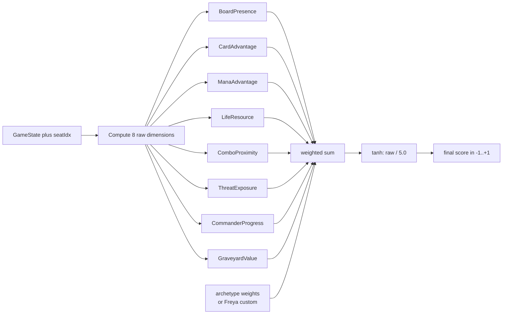
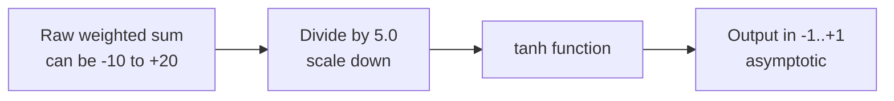
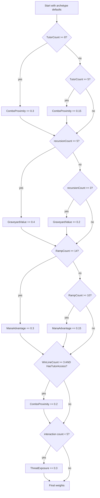

# Eval Weights and Archetypes

> Source: `internal/hat/eval_weights.go`, `internal/hat/evaluator.go`

The evaluator is what gives [YggdrasilHat](YggdrasilHat.md) numerical opinions. Given a `GameState` and a seat index, it returns a single score in `[-1, +1]` representing how good the position is for that seat. `+1` is winning, `-1` is losing, `0` is neutral.

That score drives every non-trivial decision in the engine: which spell to cast, which target to pick, whether to counter, whether to attack. The evaluator is consulted hundreds of times per turn.

This page covers what gets measured (8 dimensions), how those dimensions get combined (archetype-tuned weights), why the output is tanh-normalized, and how Freya overrides defaults per deck.

## Table of Contents

- [The Output: A Single Number](#the-output-a-single-number)
- [The 8 Dimensions](#the-8-dimensions)
- [Archetype Weights](#archetype-weights)
- [Why tanh Normalization](#why-tanh-normalization)
- [Worked Example: Niv-Mizzet Combo](#worked-example-niv-mizzet-combo)
- [Worked Example: Tergrid Stax](#worked-example-tergrid-stax)
- [How ComputeEvalWeights Adjusts](#how-computeevalweights-adjusts)
- [Combo Urgency Bonus](#combo-urgency-bonus)
- [Eval Cache](#eval-cache)
- [Weakness Profile Adjustments](#weakness-profile-adjustments)
- [Related Docs](#related-docs)

## The Output: A Single Number



`Evaluate` is the entry point (`evaluator.go:46`). Internally it calls `EvaluateDetailed` which returns the per-dimension breakdown alongside the final score — useful for diagnostic logging.

Two short-circuit cases:

- Seat is `Lost` or `LeftGame` → return `-1` immediately
- Seat has `Won` flag → return `+1` immediately

Otherwise compute all 8 dimensions and combine.

## The 8 Dimensions

Each dimension is computed by a method in `evaluator.go` and returns an unbounded float. The weighted sum is normalized at the end.

### 1. BoardPresence

> *"How big is my board relative to opponents'?"*

Source: `evaluator.go:104-132` (`scoreBoard`).

Sums total power of your creatures, compares against the average of living opponents. Adds a small bonus per noncreature permanent (artifacts, enchantments, planeswalkers count for *something* even when they don't have power).

```go
return (myPow - oppAvg) / 10.0 + float64(noncreatures) * 0.1
```

Higher = bigger board than the average opponent. Aggro decks weight this heavily; combo decks barely care.

### 2. CardAdvantage

> *"Do I have more cards in hand and library than my opponents?"*

Source: `evaluator.go:135-157` (`scoreCards`).

Hand size differential normalized by 4 (a typical mid-game hand) plus library differential normalized by 40 (full-deck scale).

```go
return (myHand - avgHand) / 4.0 + (myLib - avgLib) / 40.0
```

Control decks live and die by this. Combo decks need *some* of it (you need cards to find the combo) but not as much.

### 3. ManaAdvantage

> *"Can I afford to do things this turn and next?"*

Source: `evaluator.go:160-201` (`scoreMana`).

Counts lands plus mana artifacts, compares to opponent average. **Adds a color-coverage bonus** when `StrategyProfile.ColorDemand` is set: if your deck demands {U}{U}{U} (e.g. Cyclonic Rift) and you have zero blue sources, that's a problem the evaluator surfaces.

```go
rawScore := (mySources - oppAvg) / 4.0
// + color coverage bonus (+/- 0.4) when demand is high
```

Ramp decks weight this 1.8 — almost double midrange. The whole archetype is "have more mana than the table."

### 4. LifeResource

> *"Am I in danger of dying?"*

Source: `evaluator.go:205-220` (`scoreLife`).

Non-linear. Below 10 life it counts double; above 10 it's mostly noise. The intuition: 35 life vs 30 life almost doesn't matter, but 8 life vs 12 life is huge.

```go
ratio := float64(seat.Life) / starting
if seat.Life <= 10 {
    return ratio - 0.5         // sharp signal
}
return (ratio - 0.5) * 0.5     // dampened
```

Returns `-1` immediately if life ≤ 0 (dead).

### 5. ComboProximity

> *"How close am I to assembling my win?"*

Source: `evaluator.go:223-263` (`scoreCombo`).

If `StrategyProfile.ComboPieces` is set (Freya wrote them), iterate every combo plan and compute the fraction of pieces present in hand or on battlefield. Take the max across plans.

```go
bestRatio := 0.0
for cp in ComboPieces {
    found := count of cp.Pieces present
    ratio := float64(found) / float64(len(cp.Pieces))
    bestRatio = max(bestRatio, ratio)
}
if bestRatio >= 1.0 { return 2.0 }   // assembled — huge signal
return bestRatio * 1.5
```

When `ComboPieces` is missing, falls back to `scoreComboHardcoded` which checks a built-in `knownCombos` list. The Freya-driven path is strictly better when available.

This is the dimension that combo decks weight `2.0` in archetype defaults — the highest weight of any dimension across any archetype.

### 6. ThreatExposure

> *"Are opponents about to kill me?"*

Source: `evaluator.go:292-333` (`scoreThreat`).

Computes lethal ratio — max single opponent's board power as a fraction of your life. Ratio ≥ 1 means an opponent has lethal damage on board, returns `-1`. Otherwise returns negative proportional to the threat.

Adds **dangerous-permanents bonus**: scans opponent battlefields for damage-on-ETB clauses, drain triggers, "each opponent loses life" effects, damage doublers. Each adds a small negative.

```go
lethalRatio := maxOppPow / float64(seat.Life)
if lethalRatio >= 1.0 { return -1.0 }
return -lethalRatio*0.8 - dangerousPermanents*0.3
```

This is the always-negative dimension. It only ever subtracts from your eval. Stax decks weight it 1.5 because their whole game plan is "make threats not happen."

### 7. CommanderProgress

> *"How is my commander situation?"*

Source: `evaluator.go:336-379` (`scoreCommander`).

Three components:

1. Commander on battlefield: +0.3
2. Commander in command zone (not on field) with cast tax: subtract `0.15 * tax_count` (high tax is bad)
3. Commander damage you've dealt to opponents: `+ damage / 21.0`

The 21-life threshold is exactly commander damage lethal — so a commander that's dealt 21 damage adds `+1.0` to this dimension.

Returns 0 in non-Commander formats.

### 8. GraveyardValue

> *"How much do I have to recur?"*

Source: `evaluator.go:384-423` (`scoreGraveyard`).

Counts creatures (+0.15 each) and cards with flashback / escape / unearth / retrace text (+0.25 each). Adds a small differential vs opponent average graveyard size.

Reanimator decks weight this `1.8` — the highest of any non-combo dimension across archetypes.

## Archetype Weights

Defined in `eval_weights.go:18-109` as `archetypeWeights map[string]EvalWeights`. There are 9 archetypes:

| Archetype | Board | Card | Mana | Life | Combo | Threat | Cmdr | Grave |
|---|---|---|---|---|---|---|---|---|
| **Aggro** | **1.5** | 0.4 | 0.3 | 0.8 | 0.1 | 0.6 | 0.9 | 0.2 |
| **Combo** | 0.4 | 0.8 | 0.7 | 0.3 | **2.0** | 0.5 | 0.6 | 0.5 |
| **Control** | 0.5 | **1.5** | 0.8 | 0.6 | 0.4 | 1.2 | 0.5 | 0.4 |
| **Midrange** | 1.0 | 1.0 | 0.8 | 0.7 | 0.5 | 0.8 | 0.7 | 0.5 |
| **Ramp** | 0.6 | 0.7 | **1.8** | 0.5 | 0.3 | 0.6 | 0.8 | 0.3 |
| **Stax** | 0.7 | 1.2 | 1.0 | 0.5 | 0.3 | **1.5** | 0.8 | 0.4 |
| **Reanimator** | 0.8 | 0.6 | 0.5 | 0.4 | 0.6 | 0.7 | 0.6 | **1.8** |
| **Spellslinger** | 0.4 | **1.4** | 0.9 | 0.5 | 0.5 | 0.8 | 0.5 | 0.4 |
| **Tribal** | **1.4** | 0.6 | 0.5 | 0.7 | 0.4 | 0.6 | **1.0** | 0.6 |

Bold = standout dimensions for that archetype. The pattern matches Magic intuition:

- Aggro maxes BoardPresence (you win by having creatures attacking)
- Combo maxes ComboProximity (everything else is a means to find pieces)
- Control maxes CardAdvantage (the fundamental control plan)
- Ramp maxes ManaAdvantage (out-mana the table)
- Stax maxes ThreatExposure attention (anti-threat is the whole strategy)
- Reanimator maxes GraveyardValue (your hand is your graveyard)

Tribal/tempo/voltron archetypes that don't have explicit profiles fall through to midrange via `DefaultWeightsForArchetype` (`eval_weights.go:113-118`):

```go
func DefaultWeightsForArchetype(archetype string) EvalWeights {
    if w, ok := archetypeWeights[archetype]; ok {
        return w
    }
    return archetypeWeights[ArchetypeMidrange]
}
```

## Why tanh Normalization

The weighted sum can be arbitrarily large (positive or negative). UCB1 needs scores in a bounded range or its exploration term gets dominated. Tanh squashes any real number into `(-1, +1)`:

```
tanh(x) = (e^x - e^-x) / (e^x + e^-x)
```



The `/ 5.0` divisor is tuning. With 8 dimensions weighted up to ~2.0 each and dimension values typically in `[-1, +2]`, raw sums in `[-15, +30]` are common. Dividing by 5 keeps the inputs to tanh in roughly `[-3, +6]`, which is the steep part of the curve where most of the resolution lives.

The strategic upshot: small position differences at the extremes (winning hard, losing hard) get smoothed. Differences in the middle (close game) get sharp resolution. That's the right shape for Magic — when you're winning by a lot, getting "more winning" doesn't matter; when the game is close, every percent counts.

## Worked Example: Niv-Mizzet Combo

A 5-color spellslinger combo deck. Key cards: Niv-Mizzet, Parun + Curiosity (infinite damage). Many tutors. Light on creatures.

**Archetype:** Combo (Freya: combo cluster, secondary spellslinger).

**Weights:** Combo defaults — `ComboProximity: 2.0`, `CardAdvantage: 0.8`, `ThreatExposure: 0.5`, `BoardPresence: 0.4`.

**ComputeEvalWeights adjustments** (`deckprofile.go:226`): With 9 tutors → `ComboProximity += 0.3` → `2.3`. 14 ramp/draw → `CardAdvantage` stays. Final weights:

| Dim | Weight | Why |
|---|---|---|
| ComboProximity | **2.3** | Combo-tutor density boost |
| CardAdvantage | 0.8 | Combo baseline |
| ManaAdvantage | 0.7 | |
| Life | 0.3 | We don't care about life (combo wins or dies) |
| BoardPresence | 0.4 | We barely have creatures |
| ThreatExposure | 0.5 | |
| CmdrProgress | 0.6 | |
| GraveyardValue | 0.5 | |

**Mid-game scenario:** turn 6, Niv-Mizzet on battlefield, Curiosity in hand, 4 mana up.

- ComboProximity: 1/2 pieces (Niv on field, Curiosity in hand counts) → ratio = 1.0 → returns `2.0`
- weighted: `2.3 × 2.0 = 4.6`

That single dimension dominates the eval. The hat will *pass priority* on a kill spell to hold up combo mana — combo proximity is screaming "we're about to win, don't waste resources."

This is exactly the play pattern combo decks need.

## Worked Example: Tergrid Stax

Mono-black stax/reanimator. Key cards: Tergrid, God of Fright, discard payoffs, sacrifice payoffs, lock pieces (Defense Grid, Bottomless Pit).

**Archetype:** Stax (Freya: stax cluster, secondary reanimator).

**Weights:** Stax defaults — `ThreatExposure: 1.5`, `CardAdvantage: 1.2`, `ManaAdvantage: 1.0`, `BoardPresence: 0.7`.

**ComputeEvalWeights adjustments**: With 5 recursion sources → `GraveyardValue += 0.4` → `0.8`. With 12 lock pieces / removal → no further bumps. Final weights:

| Dim | Weight | Why |
|---|---|---|
| ThreatExposure | **1.5** | Stax is anti-threat |
| CardAdvantage | 1.2 | Discard payoffs need cards in hand |
| ManaAdvantage | 1.0 | |
| GraveyardValue | 0.8 | Reanimator secondary |
| BoardPresence | 0.7 | |
| Life | 0.5 | |
| ComboProximity | 0.3 | |
| CmdrProgress | 0.8 | Tergrid is a real threat |

**Mid-game scenario:** turn 7, Tergrid on field, Smokestack with 2 counters, 2 opponents at 30 life and 25 life.

The high `ThreatExposure` weight means even when the *other* opponents look threatening, the eval correctly identifies that *we're not under threat* (Smokestack is mowing their boards) and the eval stays positive. The hat will keep playing patient lock pieces instead of panicking into removal.

This is where archetype tuning earns its keep: a midrange-weighted hat in this position would over-weight the opponent's larger creature and waste resources removing it instead of letting Smokestack do the work.

## How ComputeEvalWeights Adjusts

`deckprofile.go:226` adjusts archetype defaults using deck-specific signals. The full logic:



> **Inconsistency** (also noted in [Freya Strategy Analyzer](Freya%20Strategy%20Analyzer.md)): Freya's `defaultWeights` map only covers 5 archetypes (aggro/combo/control/midrange/ramp), while the engine's `archetypeWeights` map covers 9. Stax/reanimator/spellslinger/tribal Freya outputs end up using midrange weights at the Freya layer; the engine then re-maps via `DefaultWeightsForArchetype` which has all 9. Net effect: the final weights are correct only when Freya doesn't write a `weights` field (and the engine looks up archetype defaults). Worth aligning the Freya map with the engine map.

## Combo Urgency Bonus

In addition to the `ComboProximity` evaluator dimension, Yggdrasil applies a **combo urgency bonus** at decision time (`yggdrasil.go` `comboUrgency()`).

For each `ComboPlan` in the strategy profile:

- Last missing piece in hand or castable → `+1.0` heuristic bonus on that piece
- Second-to-last missing → `+0.5`

So when you're 2/3 of the way to a combo, the third piece becomes massively prioritized. This converts the abstract "ComboProximity dimension" into a concrete "cast this specific card" preference.

Combo and control decks additionally get a UCB1 boost on **passing priority** when combo proximity is ≥50%: `pass_score += ratio * 0.3`. Translation: hold up mana to combo next turn, don't blow your mana on incremental value.

## Eval Cache

Source: `yggdrasil.go:52-53`.

```go
evalCache     map[evalCacheKey]float64
evalCacheTurn int
```

Keyed on seat index. Invalidated only when `gs.Turn` changes. The board state is stable across stack pushes (the spell hasn't *resolved* yet), so an evaluation cached at the start of a priority round is valid for every subsequent decision in that round.

This was a major performance fix. A complex priority window can have 30+ decisions; without the cache, each one would re-walk every permanent, every card in hand, every opponent's life. With the cache, it's a single map lookup.

## Weakness Profile Adjustments

When a `WeaknessProfile` is attached (from Heimdall analytics aggregating across past games), the evaluator applies cross-game adjustments (`evaluator.go:80-92`):

```go
if w.VulnerableToWipes > 0.3 {
    raw += r.ThreatExposure * w.VulnerableToWipes * 0.5
    raw += r.CardAdvantage * w.VulnerableToWipes * 0.3
}
if w.OverExtends > 0.3 && r.BoardPresence > 1.0 {
    raw -= (r.BoardPresence - 1.0) * w.OverExtends * 0.4
}
if w.SlowToClose > 0.3 {
    raw += r.ComboProximity * w.SlowToClose * 0.3
}
```

Translation:

- Decks that frequently lose to wipes get bonus signal from `ThreatExposure` (be more cautious) and `CardAdvantage` (have backup).
- Decks that over-extend then lose get *penalized* for big board presence (slow down).
- Decks that stall with winning positions get *amplified* combo signal (close it out).

The `WeaknessProfile` is currently optional and only set by analytics-driven workflows; vanilla tournament runs don't populate it.

## Related Docs

- [YggdrasilHat](YggdrasilHat.md) — the hat that uses this evaluator
- [MCTS and Yggdrasil](MCTS%20and%20Yggdrasil.md) — how scores feed UCB1
- [Freya Strategy Analyzer](Freya%20Strategy%20Analyzer.md) — produces the strategy profile
- [Hat AI System](Hat%20AI%20System.md) — interface contract
- [Tool - Heimdall](Tool%20-%20Heimdall.md) — produces WeaknessProfile data
