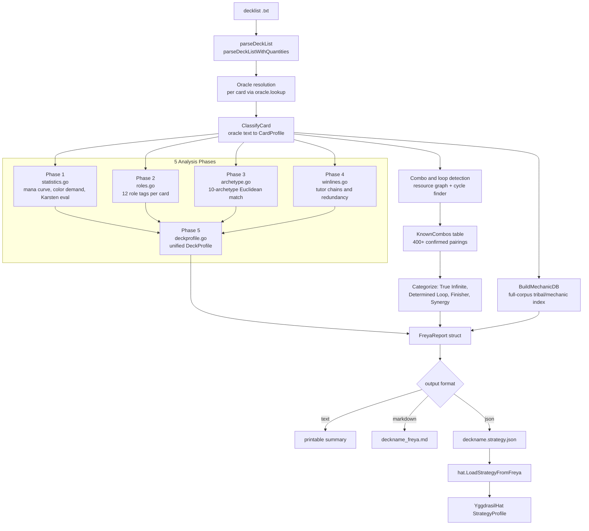
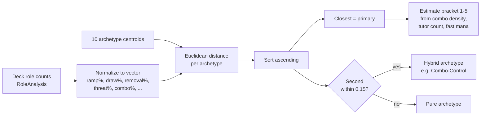
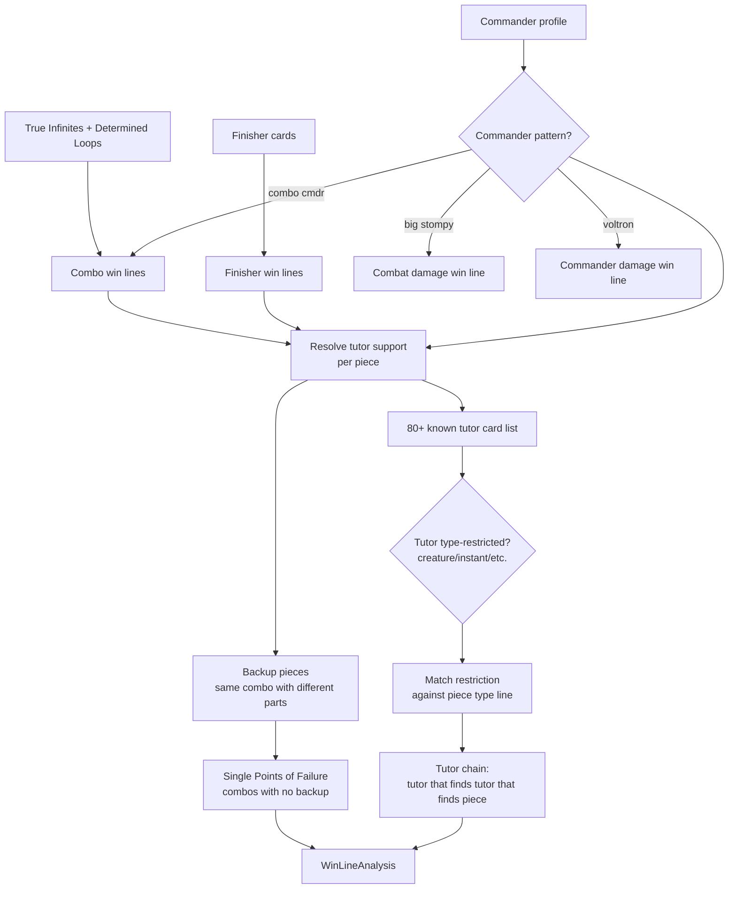
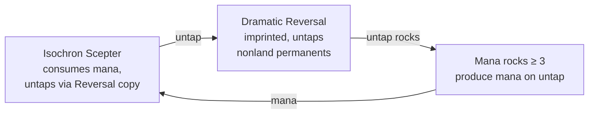
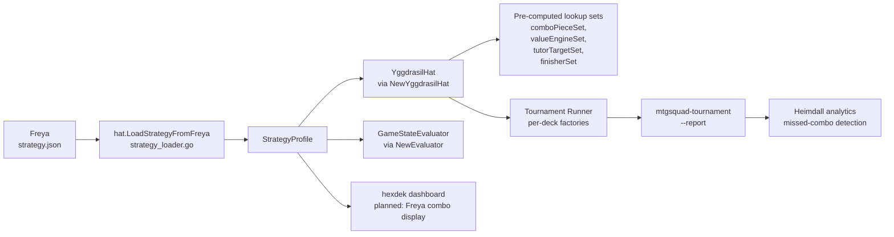

# Freya Strategy Analyzer

> Source: `cmd/mtgsquad-freya/`
> Output: `<deck>.strategy.json` + `<deck>_freya.md`
> Status: Production. ~13K lines of Go across 13 files. Drives [YggdrasilHat](YggdrasilHat.md) strategy.

Freya is the static-analysis brain of HexDek. You feed it a decklist, it reads every card's oracle text, and it tells you what the deck wants to do — combos, win lines, archetype, mana stress, role coverage, and a power bracket. Its output gets baked into a `StrategyProfile` that the AI hat consumes during play, so the simulation doesn't have to "discover" what the deck is from scratch every game.

Think of Freya as a Magic deckbuilder doing the analysis you'd do at the kitchen table — *"this is a graveyard recursion deck with a Sin combo line, the engine is mill plus mass land return, the backup plan is commander beatdown"* — except formalized, deterministic, and runnable across thousands of decks in seconds.

## Table of Contents

- [Why Freya Exists](#why-freya-exists)
- [End-to-End Pipeline](#end-to-end-pipeline)
- [Phase 0 — Resolve and Classify](#phase-0--resolve-and-classify)
- [Phase 1 — Statistics](#phase-1--statistics)
- [Phase 2 — Roles](#phase-2--roles)
- [Phase 3 — Archetype](#phase-3--archetype)
- [Phase 4 — Win Lines](#phase-4--win-lines)
- [Phase 5 — Deck Profile](#phase-5--deck-profile)
- [Combo and Loop Detection](#combo-and-loop-detection)
- [Output Categories](#output-categories)
- [The strategy.json Schema](#the-strategyjson-schema)
- [ComputeEvalWeights](#computeevalweights)
- [Known False Positives](#known-false-positives)
- [Where Freya Output Gets Used](#where-freya-output-gets-used)
- [CLI Usage](#cli-usage)
- [Related Docs](#related-docs)

## Why Freya Exists

The naive way to make an AI play a deck is to throw a generic heuristic at it: "play your highest-CMC affordable spell, attack with everything." That works for 60% of decks and fails miserably for the other 40% — combo decks won't assemble pieces, control decks won't hold up mana, reanimator decks won't fill the graveyard.

The traditional fix is **manual annotation**: have a human label every card with its role and every deck with its plan. That doesn't scale past a few dozen decks, and the labeling is subjective.

Freya solves this by reading the deck the way a tournament-grade player would: oracle text in, structured strategy out. Two design constraints drove it:

1. **Deck-aware AI without manual annotation.** Every signal Freya uses comes from oracle text, type lines, and mana costs — data that ships with the Scryfall bulk dump.
2. **Determinism.** The same deck file produces the same `strategy.json` byte-for-byte. Critical for reproducible tournament runs and parity testing.

Memory note (`project_hexdek_architecture.md` decision 6, 2026-04-15): Freya is *the* mechanism by which deck intelligence gets injected into the engine. It exists so that [YggdrasilHat](YggdrasilHat.md) can be archetype-tuned without carrying per-deck hardcoded logic.

## End-to-End Pipeline



Source files at a glance:

| File | Lines | Responsibility |
|---|---|---|
| `main.go` | 817 | CLI, oracle loading, single-deck and all-decks dispatch, JSON serialization |
| `analysis.go` | 3157 | `ClassifyCard`, `AnalyzeDeck`, resource graph, combo detection, categorization |
| `mechdb.go` | 519 | `MechanicDB` — full-corpus index of tribal types, lord effects, ETB effects |
| `statistics.go` | 291 | Phase 1 — mana curve, color supply/demand, Frank Karsten land evaluation |
| `roles.go` | 364 | Phase 2 — 12 role tags, multi-role assignment, balance warnings |
| `archetype.go` | 493 | Phase 3 — 10-archetype Euclidean match, hybrid detection, bracket estimation |
| `archetypes.go` | 230 | Archetype reference profiles (the centroids) |
| `winlines.go` | 555 | Phase 4 — win lines, tutor chains, redundancy, single points of failure |
| `deckprofile.go` | 371 | Phase 5 — unified `DeckProfile`, `ComputeEvalWeights` |
| `valuechains.go` | 502 | Multi-step value chain detection (post-combo evolution) |
| `known_combos.go` | 402 | Hand-curated `KnownCombos` table — confirmed combos, mandatory flags, outlets |
| `legality.go` | 429 | Pre-flight: format legality, color identity check, banned cards |
| `report.go` | 1408 | Output formatters (text, markdown, JSON) |

## Phase 0 — Resolve and Classify

Before any of the five phases run, Freya does the unsexy work of getting card data into a typed shape.

**Two-pass parse.** The decklist is read twice:

1. **Unique cards** — for synergy detection. Basics filtered, deduplicated.
2. **With quantities** — for mana curve, land counting, color supply. Basics included.

This split exists because synergy detection wants `Sol Ring` once even if you somehow had four copies, but the mana curve cares about every Forest.

**Oracle lookup.** Each card name is normalized (lowercase, curly-quote folding, leading-article fallback) and looked up in the Scryfall bulk dump (`data/rules/oracle-cards.json`, ~37K cards). Token / art-series / emblem layouts are skipped at load time. Reskin names (e.g. "The Monstrous Serpent" for Koma, Cosmos Serpent) get resolved through a normalization layer.

**ClassifyCard.** This is the workhorse. For each resolved card, Freya scans oracle text and produces a `CardProfile` with ~50 boolean and slice fields. A few of the most consequential ones (full list at `analysis.go:39-110`):

```go
type CardProfile struct {
    Name     string
    TypeLine string
    CMC      int
    Produces []ResourceType  // mana, token, card, life, counter, graveyard, untap, ...
    Consumes []ResourceType  // what this card needs as a cost
    Triggers []string        // "whenever a creature dies", "at the beginning of upkeep"
    Effects  []string        // damage, draw, mill, tutor, ...

    IsOutlet    bool  // can sacrifice OTHER permanents (Phyrexian Altar, Goblin Bombardment)
    IsTutor     bool  // searches library
    IsRemoval   bool  // destroys/exiles targets
    IsWinCon    bool  // can win the game directly
    IsMassWipe  bool
    IsRecursion bool

    // Combo-pattern flags
    LifegainToDrain bool  // Sanguine Bond pattern
    LifelossToPump  bool  // Exquisite Blood pattern
    CounterToDamage bool  // Shalai and Hallar pattern
    DamageToCounter bool  // The Red Terror pattern

    // Win-condition pattern flags
    WinsWithEmptyLib    bool  // Lab Maniac, Thassa's Oracle
    EmptiesLibrary      bool  // Demonic Consultation, Tainted Pact
    IsManaPayoff        bool  // Walking Ballista
    HasETBDamage        bool  // Purphoros pattern
    HasDeathDrain       bool  // Blood Artist pattern
    MakesInfiniteTokens bool

    // Constraint flags (the false-positive guards)
    SelfExilesOnDeath  bool
    RecursionDest      string  // "hand", "battlefield", "top", ""
    RecursionCostsMana bool
    RequiresCombat     bool
    HasRandomSelection bool
}
```

Classification is **deliberately conservative** (`analysis.go:182-188`): a creature card does NOT "produce creatures" — only cards that *create tokens* or *reanimate* produce them. This conservatism is the difference between a clean resource graph and a graph where every card connects to every other card.

**MechanicDB.** Built once at startup over the full 37K-card corpus. Indexes:

- Every creature type that has any associated lord/payoff in the corpus
- Every "whenever you cast a noncreature spell" payoff
- Every "creatures you control get +X/+X" lord
- Every blink/flicker pattern

This is what lets Freya say "your deck has 18 zombies and 4 zombie lords — that's a tribal payoff" without a hardcoded zombie list per deck.

## Phase 1 — Statistics

`statistics.go` produces `DeckStatistics`:

| Field | Source |
|---|---|
| `ManaCurve [8]int` | CMC 0-6 + 7+ bucket from quantity-aware pass |
| `AvgCMC` | nonland CMC average |
| `CurveShape` | "aggro" if avgCMC < 2.5, "midrange" if < 3.5, "control" otherwise |
| `ColorDemand[col]` | total pip count by color (W/U/B/R/G), counted per copy |
| `ColorSupply[col]` | sources producing that color, counted per copy |
| `ColorMismatch[]` | warnings when demand-supply gap exceeds 5 percentage points |
| `LandCount` | total lands across copies |
| `KarstenEvaluation` | per-color land-count check against Frank Karsten's published thresholds (3 sources for {C}, 6 for {U}{U}, 13 for {1}{U}{U}{U}, etc.) |
| `RampCount` | mana rocks + ramp spells |
| `DrawCount` | repeatable card draw |

**Frank Karsten land evaluation** is the marquee feature here. Karsten's tables tell you the minimum number of color sources you need for a given pip cost at a given turn. Freya checks: do you have enough white sources for that double-white turn-3 spell? It flags shortfalls in `ColorMismatch[]`.

## Phase 2 — Roles

`roles.go` assigns up to N tags per card from a fixed vocabulary:

| Role | Detection signal |
|---|---|
| Ramp | `Produces: ResMana`, mana cost ≤ 3, not a creature attacker |
| Draw | "draw a card" with repeatable trigger or activation |
| Removal | `IsRemoval` flag |
| BoardWipe | `IsMassWipe` flag |
| Counterspell | "counter target spell" |
| Tutor | `IsTutor` flag |
| Threat | base power ≥ 4, or commander |
| Combo | matches any piece in a `KnownCombo` |
| Protection | hexproof grant, indestructible grant, "can't be countered", regenerate |
| Stax | resource-denial static (Rule of Law, Smokestack, Notion Thief) |
| Utility | passes oracle-text utility regexes (proliferate, populate, scry sources) |
| Land | `IsLand` flag |

A card gets multiple roles when its oracle text supports multiple. Eternal Witness is `[Recursion, Threat]`. Cyclonic Rift is `[Removal, BoardWipe]`. Demonic Tutor is `[Tutor]`.

`RoleAnalysis` then does balance checks: a deck with 0 ramp and 0 draw at avg CMC 4.2 gets warned; a deck with 8 counterspells and 0 removal also gets warned.

## Phase 3 — Archetype

`archetype.go` matches the deck against 10 archetype centroids using **Euclidean distance over normalized role-and-stat vectors**.



The 10 archetypes (centroids in `archetypes.go`):

| Archetype | Defining signature |
|---|---|
| Combo | high tutor count, KnownCombo presence, low avg CMC |
| Stax | high static resource-denial count, low threat density |
| Control | high counterspell + removal, high card draw, low threat |
| Voltron | one large commander, high equipment/aura count, low creature count |
| Aristocrats | high sacrifice outlet + death drain count, token producers |
| Spellslinger | high noncreature payoff (Niv-Mizzet, Storm-Kiln Artist), instant/sorcery majority |
| Tribal | tribal lord present + ≥12 same-type creatures |
| Reanimator | high recursion count, intentional self-mill, big graveyard targets |
| Aggro | high creature count, low CMC, evasion keywords prevalent |
| Midrange | balanced — the "everything else" bucket |

**Hybrid detection**: when the second-closest centroid is within 0.15 distance of the primary, the deck gets tagged `PrimaryArchetype: "Combo"`, `SecondaryArchetype: "Control"`. Many real decks are hybrids (Sin is Reanimator-Combo, Ragost is Combo-Aristocrats).

**Bracket estimation**: 1-5 power bracket per the WotC bracket guidelines. Drives by:

- Bracket 5: any True Infinite + tutor chain to assemble it in turn ≤ 5
- Bracket 4: KnownCombo present, tutor count ≥ 5
- Bracket 3: ramp ≥ 12, draw ≥ 8, no infinite combo
- Bracket 2: typical precon — balanced, no combo, no fast mana
- Bracket 1: jank / theme / new player

## Phase 4 — Win Lines

`winlines.go` is where Freya stops just describing the deck and starts saying *how it wins*.

A **win line** is a structured plan: pieces required, type (infinite / determined / finisher / combat / commander_damage), tutor support that can find each piece, and backup options.



**80+ known tutors**: Demonic Tutor, Vampiric Tutor, Mystical Tutor, Worldly Tutor, Eladamri's Call, Green Sun's Zenith, Chord of Calling, Survival of the Fittest, etc. Each is tagged with its restriction (creature, instant, sorcery, X-cost, color, etc.). Win-line resolver matches restriction against the type line of each combo piece to determine if a given tutor can find that piece.

**Tutor chains** are the recursive case: Demonic Tutor finds Imperial Seal finds Hermit Druid. Three-step chains show up in cEDH a lot.

**Redundancy** is whether the deck has *backup* combos — Sin's deck has 3-4 distinct mill loops, so even if Worldgorger Dragon gets exiled there's still Bridge from Below or Living Death. A deck with one combo and no backup gets flagged as a single point of failure.

## Phase 5 — Deck Profile

`deckprofile.go` collapses everything above into one struct:

```go
type DeckProfile struct {
    DeckName            string
    Commander           string
    PrimaryArchetype    string
    SecondaryArchetype  string  // empty if pure
    Bracket             int     // 1-5
    BracketLabel        string  // "casual", "focused", "optimized", "competitive", "cEDH"

    // Identity
    ColorIdentity       []string

    // Stats summary
    TotalCards          int
    LandCount           int
    AvgCMC              float64
    RampCount           int
    DrawCount           int

    // Plan
    PrimaryWinLine      string  // Freya's best guess at the deck's win
    BackupCount         int     // how many backup lines
    HasTutorAccess      bool
    WinLineCount        int

    // Auto-derived
    Strengths           []string  // bullet list
    Weaknesses          []string
    GameplanSummary     string    // one-line narrative
}
```

`buildGameplanSummary` (deckprofile.go:322) emits the human-readable one-liner. Sample outputs:

- *"Combo deck that wins via Worldgorger Dragon + Animate Dead infinite mana. 2 backup lines available. Supported by 9 tutors. Plays at bracket 4/5 (optimized)."*
- *"Aggro deck that wins via combat damage. Plays at bracket 2/5 (focused)."*

Strengths/weaknesses come from comparing the deck's role distribution against archetype norms. Combo deck with 12 ramp = strength. Combo deck with 0 protection = weakness.

## Combo and Loop Detection

This is the part Freya is most often called out for. Worth a careful walkthrough.

There are **two parallel mechanisms**:

### 1. Resource Graph + Cycle Finder

Build a directed graph: edges go from `Produces` to `Consumes`. If card A produces ResUntap and card B consumes ResUntap and produces ResMana, and card C consumes ResMana and produces ResUntap, that's a cycle. The cycle finder runs a depth-limited DFS over the resource graph.



This catches the *shape* of a combo even when it's not in the `KnownCombos` table — if the resource flow is closed, Freya flags it.

### 2. KnownCombos Table

Hand-curated, ~400 entries in `known_combos.go`. Each entry is:

```go
{
    Name:        "Worldgorger Dragon + Animate Dead",
    Pieces:      []string{"Worldgorger Dragon", "Animate Dead"},
    Type:        "true_infinite",
    Mandatory:   true,
    Description: "Worldgorger Dragon ETB exiles all your permanents. ...",
    Outlets:     []string{"Walking Ballista", "Aetherflux Reservoir", ...},
    Stops:       []string{"Exile either piece in response", ...},
}
```

When all `Pieces` resolve in the deck, the combo is flagged with 100% confidence regardless of what the resource graph says. This catches combos the graph misses (e.g. ones that depend on specific oracle text the classifier didn't tokenize).

### Categorization

After both mechanisms run, each detected combo gets categorized:

| Category | Definition |
|---|---|
| 🔴 **True Infinite** | Loop is mandatory, never terminates without an outlet, deterministic. Worldgorger + Animate Dead. Sanguine Bond + Exquisite Blood. |
| 🟢 **Determined Loop** | Loop terminates at some condition (life total, library size, opponent count). Not strictly infinite, but you can compute the result. Aetherflux Reservoir + Storm. |
| 🟡 **Game Finisher** | Single-card or single-action win button — Approach of the Second Sun, Triumph of the Hordes, Craterhoof, Torment of Hailfire, mass mill. Doesn't loop. |
| 🔵 **Synergy** | Strong 2-card interaction that's not infinite. Smothering Tithe + wheel. Sword of Feast and Famine + commander attacker. |

## Output Categories

Two example decks make the categories concrete.

**Sin, Special Agent (Reanimator-Combo).** Freya finds:

- 🔴 1 True Infinite: Worldgorger Dragon + Animate Dead (mana)
- 🟢 2 Determined Loops: Bridge from Below + Carrion Feeder + token spam, mill self with Hermit Druid
- 🟡 2 Finishers: Living Death, Razaketh activation chain
- 🔵 8 Synergies: Sin + sacrifice outlets, dredge + Bone Miser, etc.

**Yuriko, the Tiger's Shadow (Aggro-Tempo).** Freya finds:

- 🔴 0 True Infinites
- 🟢 0 Determined Loops
- 🟡 1 Finisher: Yuriko reveal-trigger top-deck pile (commander damage path)
- 🔵 12 Synergies: ninjutsu enablers, evasion creatures, Yuriko trigger payoffs

The category counts alone tell you the archetype: Sin is combo-heavy, Yuriko is synergy-driven beatdown.

## The strategy.json Schema

This is the contract between Freya and the AI. Generated by `main.go:saveFreyaData` and `main.go:formatJSON`. Annotated:

```json
{
    "deck_name": "sin_special_agent",
    "commander": "Sin, Special Agent",
    "archetype": "Reanimator",
    "secondary_archetype": "Combo",
    "bracket": 4,

    "combo_pieces": [
        {
            "pieces": ["Worldgorger Dragon", "Animate Dead"],
            "type": "infinite",
            "cast_order": ["Animate Dead", "Worldgorger Dragon"]
        }
    ],

    "tutor_targets": [
        "Worldgorger Dragon",
        "Animate Dead",
        "Razaketh, the Foulblooded"
    ],

    "value_engine_keys": [
        "Razaketh, the Foulblooded",
        "Bone Miser",
        "Sidisi, Brood Tyrant"
    ],

    "finisher_cards": [
        "Living Death",
        "Torment of Hailfire"
    ],

    "card_roles": {
        "Worldgorger Dragon": "Combo",
        "Animate Dead": "Combo",
        "Bone Miser": "Draw",
        "Sol Ring": "Ramp"
    },

    "color_demand": {"B": 47, "U": 12, "G": 8},

    "weights": {
        "board_presence":     0.4,
        "card_advantage":     0.8,
        "mana_advantage":     0.7,
        "life_resource":      0.3,
        "combo_proximity":    2.3,
        "threat_exposure":    0.5,
        "commander_progress": 0.6,
        "graveyard_value":    0.9
    },

    "gameplan_summary": "Reanimator-Combo deck that wins via Worldgorger Dragon + Animate Dead. 2 backup lines available. Supported by 9 tutors. Plays at bracket 4/5 (optimized).",

    "elo_games_played": 0
}
```

Key fields and what they drive in the hat:

| Field | Hat behavior it drives |
|---|---|
| `archetype` | Default eval weights when `weights` is absent |
| `combo_pieces` | `comboUrgency()` boost — pass UCB+ when 50%+ pieces present |
| `tutor_targets` | Tutor ChooseTarget priority list |
| `value_engine_keys` | Cast priority bump, removal protection priority |
| `finisher_cards` | Recognize as win-button on cast |
| `card_roles` | `categorizeWithFreya` overrides heuristic categorization |
| `color_demand` | `scoreMana` color coverage check (evaluator.go:180-200) |
| `weights` | Direct override of the 8-dim eval weights |
| `gameplan_summary` | Decision-log header for diagnostic reads |
| `elo_games_played` | `BudgetForELO` adjusts hat search depth based on confidence |

## ComputeEvalWeights

`deckprofile.go:226` is where deck features modify archetype-default weights. Walkthrough of the actual logic:

```go
defaults := defaultWeights[arch]   // from the 5-archetype default map
w := *defaults                      // start with archetype baseline

// Tutor density boosts combo proximity weight.
if report.TutorCount >= 8       { w.ComboProximity += 0.3 }
else if report.TutorCount >= 5  { w.ComboProximity += 0.15 }

// Recursion-heavy decks get graveyard value boost.
if recursionCount >= 5      { w.GraveyardValue += 0.4 }
else if recursionCount >= 3 { w.GraveyardValue += 0.2 }

// Heavy ramp package boosts mana advantage weight.
if dp.RampCount >= 14      { w.ManaAdvantage += 0.3 }
else if dp.RampCount >= 10 { w.ManaAdvantage += 0.15 }

// Multiple win lines with tutor access boosts combo proximity.
if dp.WinLineCount >= 3 && dp.HasTutorAccess { w.ComboProximity += 0.2 }

// Low interaction decks should weight threat exposure higher.
if interaction < 5 { w.ThreatExposure += 0.3 }
```

The intuition: a Combo archetype has `ComboProximity: 2.0` baseline. A Combo deck with 9 tutors and 3 win lines plus tutor access ends up at `2.0 + 0.3 + 0.2 = 2.5`. A Combo deck with 4 tutors and 1 win line stays at baseline. The hat's eval becomes that much more aggressive about racing to a combo when the deck is actually built to combo.

> **Inconsistency note:** The Go evaluator (`internal/hat/eval_weights.go`) has 9 archetype defaults (aggro/combo/control/midrange/ramp/stax/reanimator/spellslinger/tribal). Freya's `defaultWeights` map (`deckprofile.go:283-309`) only has 5 (aggro/combo/control/midrange/ramp). Stax/reanimator/spellslinger/tribal Freya outputs end up using midrange weights here even though the archetype field is correctly set. The hat then uses `DefaultWeightsForArchetype` which has all 9, so the final result is correct only if Freya doesn't write a `weights` field. Worth aligning.

## Known False Positives

Audited 2026-04-26 across 7174n1c's Coram, Sin, and Varina decks (memory: `project_hexdek_freya_bugs.md`). Roughly 20 of 28 detected loops were false positives.

The mechanism behind each:

### 1. Self-Exile Clauses

**Mechanism:** Resource graph sees `graveyard → graveyard` edge; doesn't read "exile it" qualifier on the death trigger.

**Example:** Moldgraf Monstrosity says *"When this creature dies, exile it, then return two creature cards at random from your graveyard to the battlefield."* The graph sees a recursion edge, but the card is gone after the first trigger.

**Fix status:** Detection of "exile it" / "exile this" / "exile [name]" in death triggers exists in `ClassifyCard`, populates `SelfExilesOnDeath`. Cycle finder still has gaps when the exile happens through a different card.

### 2. Hand vs Battlefield Destination

**Mechanism:** All graveyard recursion treated identically in the graph. Returning to hand needs another cast (mana, timing, possibly another resolution window) — that's not a free-form loop.

**Example:** Eternal Witness returns a card to *hand*, not battlefield. It's not a 2-card combo with a sacrifice outlet — you have to recast the witness, which costs `{1}{G}{G}`.

**Fix status:** `RecursionDest` field tracks "hand" / "battlefield" / "top". `RecursionCostsMana` flags when recursion requires paying a cost. Cycle classification uses these but the bar for "infinite" vs "determined" still has edge cases.

### 3. Attack-Trigger Dependency

**Mechanism:** Trigger conditions like "whenever this attacks" require a combat phase per iteration. Not priority-speed.

**Example:** Temmet, Naktamun's Will triggers draw + discard *only on attack*. Bone Miser draws on noncreature/nonland discard. The graph sees Temmet→Bone Miser→Temmet, but each iteration needs a combat step.

**Fix status:** `RequiresCombat` flag exists. Combos involving a `RequiresCombat` card are downgraded to "determined" (bounded by combats per turn) instead of "infinite."

### 4. Randomness

**Mechanism:** Cycle finder assumes deterministic target choice. "At random" breaks the assumption.

**Example:** Moldgraf Monstrosity returns creatures *at random*. The "loop" only sustains if the right creatures get picked, which in expectation breaks within a few iterations.

**Fix status:** `HasRandomSelection` flag tags cards using "at random". Cycle finder excludes them from "true infinite" classification, downgrades to "determined" with a note.

### Net Impact

Confirmed real combo from the audit: **Deadeye Navigator + Eternal Witness** in Sin's deck (with infinite mana) — that one's legitimately infinite. The other 7 reported "true infinites" in Sin's report fell to one of the four causes above.

This is why memory says: **combo/loop counts in Freya reports should be treated as upper bounds, not exact counts.** The statistical / role / archetype / mana modules are accurate; combo detection has a known false-positive ceiling.

## Where Freya Output Gets Used



- **YggdrasilHat** (`yggdrasil.go:166-187`) builds O(1) lookup sets from `combo_pieces`, `value_engine_keys`, `tutor_targets`, `finisher_cards` on construction. Used during decision-making to fast-categorize cards in hand.
- **GameStateEvaluator** (`evaluator.go:33-42`) reads the `weights` field directly when present, falls back to archetype defaults otherwise.
- **Tournament Runner** wires Freya output per-deck via `HatFactories`. Each deck's factory builds a fresh hat with the deck's `StrategyProfile`.
- **Heimdall** (`internal/analytics/`) cross-references deck combo lines against actual game outcomes — flags games where a combo was live but never executed (a hat failure).
- **Web dashboard** at `hexdek.bluefroganalytics.com` is planned to surface Freya's combo and gameplan output for human deck review.

## CLI Usage

```bash
# Single deck, text output (default).
go run ./cmd/mtgsquad-freya --deck data/decks/benched/ragost.txt

# Single deck, machine-readable JSON.
go run ./cmd/mtgsquad-freya --deck my_deck.txt --format json > strategy.json

# Whole directory of decks, markdown report.
go run ./cmd/mtgsquad-freya --all-decks data/decks/lyon/ --format markdown
```

`saveFreyaData` always writes a `<deckname>.strategy.json` next to the deck file (in a `freya/` subfolder), regardless of the `--format` flag. Tournament runners pick up these files automatically.

## Related Docs

- [Hat AI System](Hat%20AI%20System.md) — how strategy gets injected into player decisions
- [YggdrasilHat](YggdrasilHat.md) — the production AI that consumes Freya output
- [Eval Weights and Archetypes](Eval%20Weights%20and%20Archetypes.md) — the 8-dim scoring Freya tunes
- [Tool - Freya](Tool%20-%20Freya.md) — at-a-glance CLI reference
- [Tool - Heimdall](Tool%20-%20Heimdall.md) — analytics consumer of Freya output
- [Tournament Runner](Tournament%20Runner.md) — how Freya files feed parallel tournament runs
