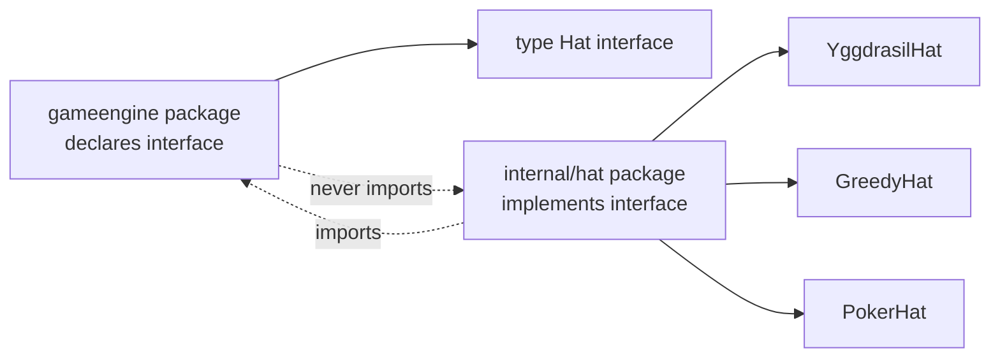
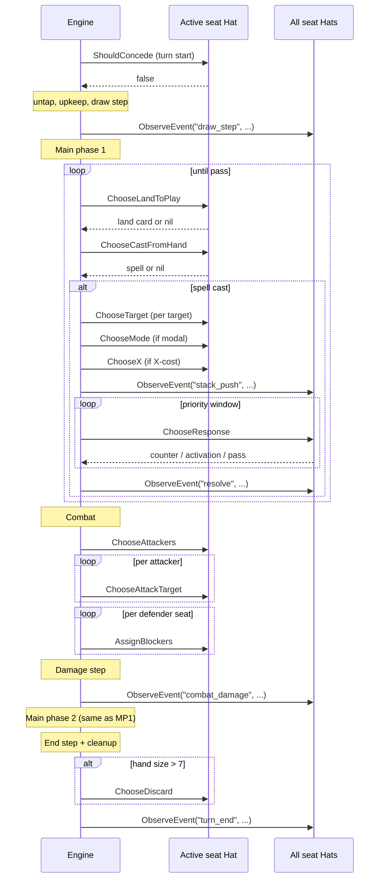
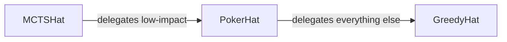
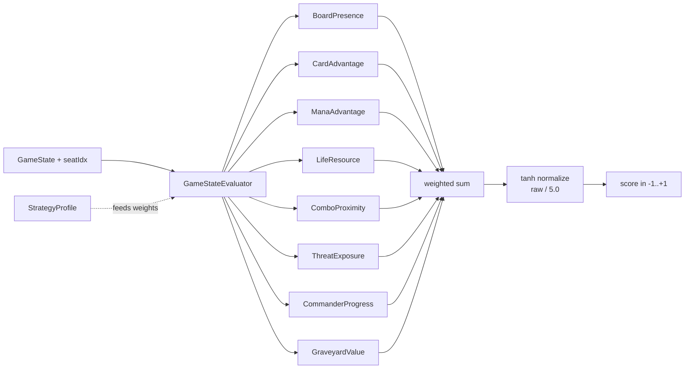

# Hat AI System

> Source: `internal/gameengine/hat.go` (interface), `internal/hat/` (implementations)

A **Hat** is HexDek's pluggable player-decision protocol. Every choice the rules leave to a player — what to mulligan, what to cast, which target to pick, when to counter a spell, how to assign blockers — flows through a Hat. The engine never inspects what kind of Hat a seat has, by architectural directive.

> "Hats are swappable, engine never inspects them." — 7174n1c, project lead, in `internal/gameengine/hat.go:10-11`.

This page is the contract. For the production implementation see [YggdrasilHat](YggdrasilHat.md). For the search algorithm see [MCTS and Yggdrasil](MCTS%20and%20Yggdrasil.md). For deck-aware strategy injection see [Freya Strategy Analyzer](Freya%20Strategy%20Analyzer.md).

## Table of Contents

- [The Core Idea](#the-core-idea)
- [Why Pluggable](#why-pluggable)
- [Where the Interface Lives](#where-the-interface-lives)
- [The 21 Hat Methods](#the-21-hat-methods)
- [Decision Lifecycle During a Turn](#decision-lifecycle-during-a-turn)
- [The ObserveEvent Broadcast](#the-observeevent-broadcast)
- [Mutation Contract](#mutation-contract)
- [Implementations](#implementations)
- [Strategy Profile Injection](#strategy-profile-injection)
- [Eval Pipeline (Yggdrasil)](#eval-pipeline-yggdrasil)
- [Hot-Swap and Mixed Pods](#hot-swap-and-mixed-pods)
- [Related Docs](#related-docs)

## The Core Idea

Magic's rules engine is mostly mechanical: when a creature has lethal damage, it dies. When you have lethal poison counters, you lose. These outcomes are determined by the rules.

But Magic also has *choices*. Which target should Lightning Bolt hit? Should I keep this 7-card hand or mulligan? Which of the four blockers gets assigned to my 5/5 trampler? Those choices belong to a *player*, and the rules don't tell you which one to make.

Every such choice in HexDek is exposed as a method on the `Hat` interface. The engine reaches a decision point, calls the relevant method on the seat's Hat, and applies whatever the Hat returned. The Hat could be:

- A simple heuristic (greedy "highest CMC affordable")
- A search-based AI (MCTS rollouts + UCB1)
- A network bridge to a human web client
- A scripted policy ("always pick the green target")
- An LLM-backed agent ("ask Claude what to do")

The engine doesn't care. It applies the result and moves on.

## Why Pluggable

Several wins fall out of the abstraction:

1. **Mixed pods.** Seat 0 can be Yggdrasil, seat 1 a human, seat 2 a Greedy baseline, seat 3 a debug stub. All four play in the same game with no special handling.
2. **Hot-swap mid-game.** Replace `seat.Hat` between turns to change the AI personality. Useful for benchmarking ("when does Yggdrasil pull ahead of Greedy?").
3. **Parity testing.** Bind every seat to `GreedyHat` and the run becomes byte-deterministic — same seed, same outcome, every time. This is what makes [Tool - Parity](Tool%20-%20Parity.md) work as a regression backstop.
4. **Engine tests stay clean.** Unit tests don't have to mock player decisions; they construct `OctoHat` (says yes to everything) or a tiny scripted hat for the test.
5. **Future BYOK model.** Per the 2026-04-15 architecture decision, users bring their own LLM API key. Each seat can route to a different provider — Opus on seat 1, GPT-4o on seat 2, local Llama on seat 3. The hat interface is the seam where that plugs in.

## Where the Interface Lives

The `Hat` interface is declared in **`gameengine/hat.go`**, not `internal/hat/`. This is deliberate.

`Seat.Hat` is a field on the engine's `Seat` struct, so the engine package needs to reference the Hat type. If the interface lived in `internal/hat/`, the engine would have to import `hat`, and `hat` would have to import `engine` for `GameState` types — that's a cycle.

The fix is the standard Go interface pattern: declare the interface where it's *consumed* (engine), implement it where it's *produced* (`internal/hat/`).



`var _ gameengine.Hat = (*YggdrasilHat)(nil)` lines at the top of each implementation file are compile-time conformance checks — if any hat method goes out of sync with the interface, the build breaks immediately.

## The 21 Hat Methods

Grouped by what kind of choice they handle. Source: `gameengine/hat.go:165-313`.

### Card Selection (5)

| Method | When called | What it returns |
|---|---|---|
| `ChooseMulligan` | Opening hand offered (CR §103.4, recursive on each restart) | `bool` — mulligan or keep |
| `ChooseBottomCards` | After a kept mulligan, London-mulligan bottom step (CR §103.5) | `[]*Card` of length = mulligan count |
| `ChooseLandToPlay` | Each main phase, lands in hand | `*Card` to play, or `nil` to skip |
| `ChooseCastFromHand` | Each priority window, affordable spells | `*Card` to cast, or `nil` to pass |
| `ChooseActivation` | Each priority window, legal activations | `*Activation`, or `nil` to pass |

### Combat (3)

| Method | CR | What it returns |
|---|---|---|
| `ChooseAttackers` | §508 | Slice of attackers in declaration order |
| `ChooseAttackTarget` | §506.1 | Seat index (or planeswalker) to attack |
| `AssignBlockers` | §509.1 | Map attacker → ordered blocker list |

The blocker list **order matters** — that's the damage-assignment order per §509.1h.

### Stack and Priority (1)

| Method | CR | What it returns |
|---|---|---|
| `ChooseResponse` | §117.3 | A `*StackItem` to push (counter, removal, etc.), or `nil` to pass |

### Targeting and Modes (2)

| Method | CR | What it returns |
|---|---|---|
| `ChooseTarget` | §608.2a | One target from the legal list |
| `ChooseMode` | §601.2c | Mode index for a modal effect, or -1 for none |

### Replacement Ordering (1)

| Method | CR | What it returns |
|---|---|---|
| `OrderReplacements` | §616.1 | The candidate list, reordered |

### Trigger Ordering (1)

| Method | CR | What it returns |
|---|---|---|
| `OrderTriggers` | §603.3b | Same-controller triggers reordered (after [APNAP](APNAP.md) grouping) |

### Discard (1)

| Method | CR | What it returns |
|---|---|---|
| `ChooseDiscard` | §701.8 | Exactly N cards from hand |

### Commander (2)

| Method | CR | What it returns |
|---|---|---|
| `ShouldCastCommander` | §903.8 | `bool` — cast from command zone? (tax already computed) |
| `ShouldRedirectCommanderZone` | §903.9a/b | `bool` — apply command-zone replacement? |

### X Costs (1)

| Method | CR | What it returns |
|---|---|---|
| `ChooseX` | §107.3 | Value of X, in `[0, availableMana]` |

### Library Manipulation (3)

| Method | CR | What it returns |
|---|---|---|
| `ChooseScry` | §701.18 | `(top, bottom)` partition of the scry cards |
| `ChooseSurveil` | §701.46 | `(graveyard, top)` partition |
| `ChoosePutBack` | n/a | Brainstorm-style: `count` cards to put back on top |

### Concession (1)

| Method | CR | What it returns |
|---|---|---|
| `ShouldConcede` | §104.3a | `bool` — start of each turn check |

### Observation (1)

| Method | When called | Mutates |
|---|---|---|
| `ObserveEvent` | Every logged event, broadcast to **every** seat | Hat's own internal state only |

That's 21 methods total. Every one of them has a docstring at the source file pointing to the relevant Comprehensive Rules section.

## Decision Lifecycle During a Turn



Two things worth pulling out:

**Priority windows happen at every event.** After a spell is pushed, every seat — starting with the active player and going [APNAP](APNAP.md) — gets `ChooseResponse` called on them in turn until everyone passes. Then the engine resolves the top of the stack, runs SBAs, and reopens priority if the stack still has items.

**ObserveEvent is the broadcast channel.** Every Hat hears every event — even events for seats other than its own. This is how adaptive hats build up information about opponents (PokerHat used this to detect mode changes; Yggdrasil uses it for the politics layer).

## The ObserveEvent Broadcast

```go
// gameengine/hat.go:306-312
ObserveEvent(gs *GameState, seatIdx int, event *Event)
```

Every Hat receives every game-logged event. The signature is:

- `gs` — full game state (read-only by contract)
- `seatIdx` — *this* hat's seat index, for filtering "is this event mine?"
- `event` — the event payload (`Kind`, `Seat`, `Source`, `Target`, `Details`)

Hats that don't track per-seat history can ignore the broadcast. Hats that do (Yggdrasil tracks `damageDealtTo`, `damageReceivedFrom`, `spellsCastBy`, `perceivedArchetype` for every opponent) accumulate state here.

The event vocabulary is the same one the engine uses for analytics — see the kind list in `internal/gameengine/state.go` event-kinds table. Notable: `stack_push`, `stack_resolve`, `damage_dealt`, `card_drawn`, `card_discarded`, `creature_dies`, `permanent_etb`, `combat_damage`, `lifegain`, `lifeloss`.

## Mutation Contract

The contract from `gameengine/hat.go:155-164`:

> Hats MUST NOT mutate `*GameState`. The contract is:
>
> - methods return a decision the engine applies
> - `ObserveEvent` is the only method that updates the Hat's OWN internal state; it is called for every seat on every logged event

This is enforced by convention, not by the type system (Go has no `const` for pointers). Violations have caused real bugs in the past — a hat that "helpfully" tapped a land before returning would corrupt the engine's state and cause invariant violations in [Odin](Tool%20-%20Odin.md) runs.

The other side of the contract: **every hat method must tolerate empty/nil inputs**. The engine calls hat methods in edge positions — no legal attackers, empty hand, dead opponents. A hat that panics on `len(legal) == 0` would hang the tournament runner.

## Implementations

| Hat | File | Status | Purpose |
|---|---|---|---|
| YggdrasilHat | `yggdrasil.go` (3342 lines) | **Current** | Production AI for all tournament play. See [YggdrasilHat](YggdrasilHat.md). |
| GreedyHat | `greedy.go` (1059 lines) | **Deprecated, retained** | Stateless heuristic. Byte-equivalent to pre-Phase-10 inline behavior. Kept for parity tests. See [Greedy Hat](Greedy%20Hat.md). |
| PokerHat | `poker.go` (1956 lines) | Deprecated | HOLD/CALL/RAISE adaptive hat. Superseded by Yggdrasil's politics layer. See [Poker Hat](Poker%20Hat.md). |
| MCTSHat | `mcts.go` (525 lines) | Deprecated | Wrapped an inner hat (typically Poker), overrode high-impact decisions with UCB1. Superseded by Yggdrasil integrating UCB1 natively. |
| OctoHat | `octo.go` (407 lines) | Test-only | Says yes to everything. Used for engine stress tests where you want every legal action exercised. |

### Why Yggdrasil Replaced the Others

Greedy / Poker / MCTS were a **delegation chain**: each hat wrapped the inner one and overrode methods. The chain was:



Three problems:

1. **No native multi-seat awareness.** Each layer saw a different mental model. Threat scoring lived in Poker; rollouts lived in MCTS; baseline picks lived in Greedy. Synthesizing "what does this Hat actually do across all seats simultaneously?" was painful.
2. **Politics had no home.** Multiplayer dynamics — retaliation, grudge, finish-low-life priority — are fundamentally cross-seat. The wrapping pattern made cross-seat reasoning a layering nightmare.
3. **Brittle.** Adding a new method meant updating three implementations, debugging which layer's override actually got called.

Yggdrasil collapses all three into one struct. Every method goes through the same evaluation pipeline: `assessAllThreats() → enumerateActions() → scoreCandidates() → UCB1Select()`. Politics is a first-class layer, not an afterthought.

`OctoHat` is kept because it's useful — when you want to verify that *every* legal action path resolves cleanly, a hat that says yes to everything is the right tool.

## Strategy Profile Injection

The hat-level mechanism for deck-awareness is `*StrategyProfile` (`internal/hat/strategy.go`):

```go
type StrategyProfile struct {
    Archetype       string         // "Combo", "Reanimator", ...
    ComboPieces     []ComboPlan    // win lines from Freya
    TutorTargets    []string       // prioritized search targets
    ValueEngineKeys []string       // protect these
    GameplanSummary string
    Bracket         int            // 1-5
    Weights         *EvalWeights   // override archetype defaults
    CardRoles       map[string]string
    FinisherCards   []string
    ColorDemand     map[string]int
    Weakness        *WeaknessProfile  // from Heimdall analytics
    ELOGamesPlayed  int
}
```

The profile is built by [Freya Strategy Analyzer](Freya%20Strategy%20Analyzer.md) statically (oracle text → analysis → `strategy.json`), or by Heimdall analytics adding the `Weakness` field after games run.

Tournament runners load profiles via `hat.LoadStrategyFromFreya(deckPath)` in `strategy_loader.go` and pass them to the hat constructor:

```go
sp, _ := hat.LoadStrategyFromFreya("data/decks/lyon/sin.txt")
seat.Hat = hat.NewYggdrasilHat(sp, /*budget*/ 50)
```

When the profile is `nil`, the hat falls back to generic heuristics (no combo recognition, midrange weights, no tutor priorities).

## Eval Pipeline (Yggdrasil)



Detail: [Eval Weights and Archetypes](Eval%20Weights%20and%20Archetypes.md). The evaluator is what every Yggdrasil decision ultimately consults — for the candidates being considered, it scores the resulting state and picks the highest UCB1.

## Hot-Swap and Mixed Pods

Because the engine never inspects hat type, this is just legal Go:

```go
// Mixed pod
gs.Seats[0].Hat = &hat.GreedyHat{}
gs.Seats[1].Hat = hat.NewYggdrasilHat(comboProfile, 100)
gs.Seats[2].Hat = hat.NewYggdrasilHat(controlProfile, 50)
gs.Seats[3].Hat = hat.NewPokerHat()

// Hot-swap mid-game (between turns is safest)
if gs.Turn > 10 {
    gs.Seats[1].Hat = hat.NewYggdrasilHat(comboProfile, 200)  // bump budget late game
}
```

Tournament runs sometimes use this for ablation studies — "what's the winrate delta when seat 0 plays at budget 50 vs budget 200?"

## Related Docs

- [YggdrasilHat](YggdrasilHat.md) — production unified brain
- [MCTS and Yggdrasil](MCTS%20and%20Yggdrasil.md) — search algorithm details
- [Eval Weights and Archetypes](Eval%20Weights%20and%20Archetypes.md) — 8-dimensional scoring
- [Greedy Hat](Greedy%20Hat.md) — deprecated baseline, kept for parity
- [Poker Hat](Poker%20Hat.md) — deprecated experiment
- [Freya Strategy Analyzer](Freya%20Strategy%20Analyzer.md) — strategy profile producer
- [APNAP](APNAP.md) — multiplayer ordering rule
- [Stack and Priority](Stack%20and%20Priority.md) — where ChooseResponse fits in
