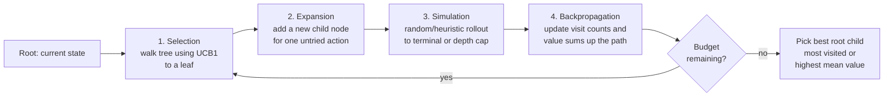
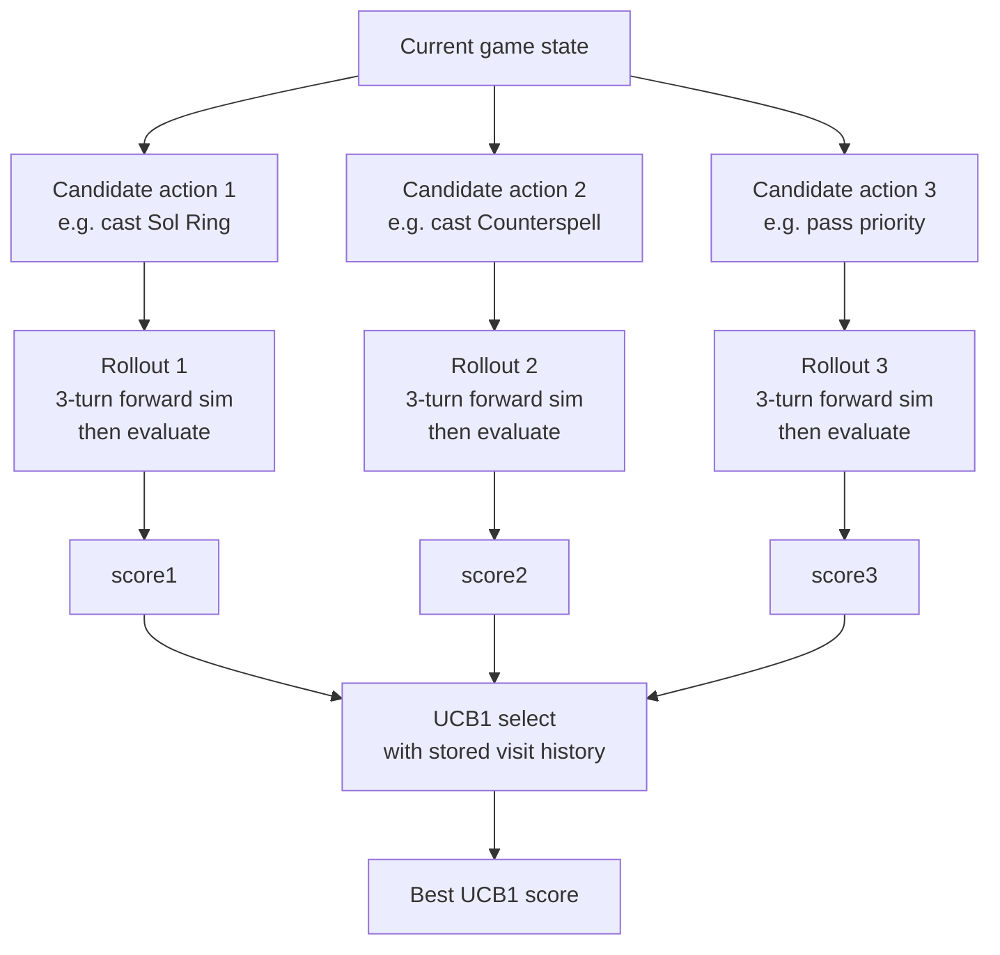
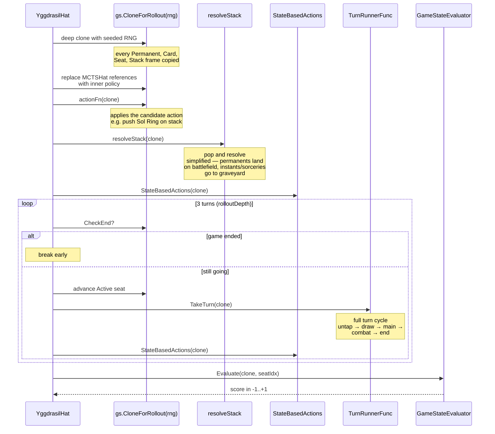

# MCTS and Yggdrasil

> Source: `internal/hat/yggdrasil.go`, `mcts.go`, `rollout.go`
> Status: Yggdrasil current; MCTSHat deprecated (kept as reference)

How HexDek uses Monte Carlo Tree Search and the UCB1 exploration formula to drive decisions inside [YggdrasilHat](YggdrasilHat.md). Written for someone who hasn't met MCTS before.

## Table of Contents

- [Why MCTS](#why-mcts)
- [Textbook MCTS in Four Steps](#textbook-mcts-in-four-steps)
- [The UCB1 Formula](#the-ucb1-formula)
- [How HexDek Differs from Textbook](#how-hexdek-differs-from-textbook)
- [The Budget Dial](#the-budget-dial)
- [The Rollout Itself](#the-rollout-itself)
- [TurnRunner Injection](#turnrunner-injection)
- [Tree Shape and Pruning](#tree-shape-and-pruning)
- [Evaluation at the Leaf](#evaluation-at-the-leaf)
- [Cost and Performance](#cost-and-performance)
- [Related Docs](#related-docs)

## Why MCTS

The fundamental problem: at any decision point in Magic, there are many legal options. Casting Lightning Bolt, you might have five legal targets. A single turn can have a dozen priority windows with multiple options each. Searching the full game tree to optimal depth is computationally impossible — branching factor is high, horizon is unbounded.

MCTS doesn't search the full tree. It samples it. You spend a fixed budget exploring promising branches, exploiting branches that have shown good results so far, and at the end you pick the action whose subtree had the best aggregate outcome.

The two key mechanisms:

1. **Random rollouts** estimate the value of any state. Run a few turns of "default play" forward, see who's winning, that's a rough value estimate.
2. **UCB1** balances exploration and exploitation when picking which child to expand next. It biases toward unvisited nodes early and high-value nodes later.

In HexDek, MCTS isn't the whole search — it's a depth dial that kicks in when the [budget](#the-budget-dial) is high enough.

## Textbook MCTS in Four Steps



1. **Selection.** Starting at the root (current game state), walk down the tree by repeatedly picking the child with the highest UCB1 score. Stop at the first node that has unvisited children, or at a leaf.
2. **Expansion.** Add a new child node corresponding to one of the unvisited actions.
3. **Simulation (rollout).** From this new node, play forward using a fast policy (typically random or a simple heuristic). Stop at a terminal state or a depth cap. Record the outcome.
4. **Backpropagation.** Walk back up the path you took. For each node, increment its visit count and add the rollout outcome to its accumulated value.

Repeat until budget is exhausted. Pick the root's child with the most visits (or the highest mean value — both are common, "most visits" is more robust).

## The UCB1 Formula

UCB1 stands for **Upper Confidence Bound, version 1**. It's the workhorse selection rule.

For a node with average value `Q` and visit count `n`, where `N` is the total visits at the parent, and `C` is an exploration constant:

```
UCB1 = Q + C * sqrt(ln(N) / n)
```

Two terms:

- **`Q`** — exploitation. Average outcome from this node so far. Higher = "this looks good, keep going."
- **`C * sqrt(ln(N) / n)`** — exploration. Larger when this node has been visited fewer times relative to its parent. Higher = "we don't know much yet, try this."

`C = sqrt(2)` is the standard constant (provably optimal for bandits with bounded rewards in [0,1]). HexDek uses it: `mcts.go:77` has `math.Sqrt(2.0) * math.Sqrt(math.Log(float64(h.totalVisits+1))/float64(stat.visits))`.

**Unvisited nodes get an exploration bonus of `+2.0`** in HexDek's implementation (`mcts.go:74`):

```go
if stat == nil || stat.visits == 0 {
    return baseValue + 2.0  // exploration bonus for unvisited
}
```

This guarantees every untried action gets sampled at least once before exploitation dominates.

## How HexDek Differs from Textbook

Textbook MCTS builds an explicit tree in memory. Yggdrasil **does not**. It's a bandit-style flat search — the "tree" has only one level (root + candidates), and rollouts run from each candidate independently.



This is closer to **multi-armed bandit search** than full MCTS. The simplification is deliberate:

- **No tree allocation.** Each decision is one flat enumeration. No `*node` allocation per child, no garbage collection pressure.
- **Action-keyed UCB1 stats persist across decisions.** `actionStats` is a `map[string]*actionStat` keyed by `t{turn}:{action_name}`. Visit counts and value sums survive across consecutive decisions in the same turn, so UCB1 explores untried casts before re-examining tried ones.
- **Each "rollout" is its own forward simulation.** The simulation isn't a random uniform policy — it uses the same engine machinery, with hat decisions delegated to the inner heuristic policy.

This is **shallow MCTS** by design. Deeper tree search is implementable on top but not currently shipped.

The deprecated `MCTSHat` (`mcts.go`, 525 lines) was an earlier experiment that wrapped an inner Hat and overrode high-impact decisions. Yggdrasil internalized the same pattern, then went further.

## The Budget Dial

Source: `yggdrasil.go:29`, `rollout.go:10-13`.

| Budget | Behavior | Cost per decision |
|---|---|---|
| `0` | Pure heuristic. No evaluator, no rollouts. | ~0 |
| `1-199` | Evaluator-guided UCB1. Score each candidate's *immediate* post-action state, no forward simulation. | 1 eval per candidate |
| `200+` | Rollout mode. Each candidate gets a 3-turn forward simulation. | 1 clone + 3 turns + 1 eval per candidate |

The `200` threshold is `rolloutBudgetGe = 200` in `rollout.go:12`. Below this, `canRollout()` returns false and the hat falls back to evaluator-only.

Why these specific tiers?

- **0** — heuristic mode is for parity testing and sanity baselines.
- **1-199** — eval-guided is the default tournament setting. Cheap (one evaluation per candidate), surprisingly competitive (the evaluator is good).
- **200+** — rollouts are expensive (a clone is non-trivial allocations, 3 turns is 3× the cost of a normal turn) but capture strategic implications heuristics miss. Reserved for showmatches and benchmarking.

## The Rollout Itself

`rollout.go:30-64` is the entire rollout function.



A few important details from `rollout.go`:

**RNG seeding** — each rollout gets its own deterministic RNG keyed on `(turn × 1000 + seatIdx × 100 + rolloutSeedCounter)`. This makes rollouts reproducible while still distinguishing candidates from each other.

**Hat replacement on the clone** — when cloning, `MCTSHat` references are swapped for the inner policy. Otherwise rollouts would recursively call themselves, blowing up.

**Simplified stack resolution** — `resolveStack` (`rollout.go:70`) is intentionally simpler than the production stack pipeline. It handles permanent landings and graveyard sends, but skips complex targeting/modal effects. The rollout is approximate by design; a fully-faithful 3-turn simulation would cost too much.

**`rolloutDepth = 3`** — three turns of forward sim. This is a tuned constant. Too shallow and you miss strategic implications; too deep and the cost dominates and the simulation accumulates compounding approximation error.

## TurnRunner Injection

The classic Go cycle problem: `internal/hat` would need to import `internal/tournament` to drive turns, but `internal/tournament` already imports `internal/hat` to construct hats.

Fix: declare a function-pointer type in `hat`, inject the implementation from `tournament`.

```go
// rollout.go:17
type TurnRunnerFunc func(gs *gameengine.GameState)

// In tournament/turn.go:
func TurnRunnerForRollout() hat.TurnRunnerFunc {
    return func(gs *gameengine.GameState) {
        takeTurnImpl(gs, nil)
    }
}

// In tournament/runner.go (when constructing hats):
yh.TurnRunner = TurnRunnerForRollout()
```

This is a common Go pattern when two packages need bidirectional dependency. The interface boundary is the function type itself.

## Tree Shape and Pruning

Yggdrasil doesn't build a search tree, so there's nothing to prune. But it does prune **the candidate list itself** before evaluation:

- **Single-candidate fast path.** If only one action is legal, return it immediately. No scoring.
- **Affordability filter.** `castable []*Card` is already pre-filtered by the engine — only spells that can actually be paid for show up.
- **Counterspell fast path** (`ChooseResponse`). Scan for an affordable counterspell *before* running the evaluator. Most seats skip evaluation entirely on most priority windows.
- **Adaptive budget** — when the battlefield reaches 60+ permanents, force heuristic mode for the rest of the turn. Skip both eval and rollouts.
- **Turn budget exhaustion** — after `TurnBudget` points are spent, force heuristic for remaining decisions.

The combination is what makes Yggdrasil run at 532 games/sec on DARKSTAR despite doing real evaluation work.

## Evaluation at the Leaf

Whether the candidate score comes from immediate eval or from a rollout's terminal eval, the evaluator is the same: the 8-dimensional `GameStateEvaluator` documented in [Eval Weights and Archetypes](Eval%20Weights%20and%20Archetypes.md).

The score is in `[-1, +1]` (tanh-normalized):

- `+1` — winning position (your seat won)
- `0` — neutral
- `-1` — lost (your seat is dead)

UCB1 then operates on these scores to balance exploration vs exploitation.

## Cost and Performance

Per memory (`project_hexdek_parser.md`):

- v10 loop-shortcut: **582 g/s** on DARKSTAR (5K-game scale)
- v10d resolve-depth on KEYHOLE-01: **95 g/s** (50K-game scale, 1 timeout)
- v10d resolve-depth on DARKSTAR: **532 g/s** (50K-game scale, 2 timeouts)

Budget effect on speed (illustrative, single-game):

| Budget | Avg ms / decision | Notes |
|---|---|---|
| 0 | ~0.1 | heuristic, ~zero alloc |
| 50 | ~0.5 | one eval per candidate |
| 200 | ~5-15 | clone + 3 turns + eval per candidate |

The eval cache and turn budget are what keep budget-50 at 0.5ms/decision instead of 5ms — most decisions hit the cache because the game state hasn't materially changed since the last decision in the same priority round.

## Related Docs

- [YggdrasilHat](YggdrasilHat.md) — the production AI that uses this search
- [Hat AI System](Hat%20AI%20System.md) — the interface contract
- [Eval Weights and Archetypes](Eval%20Weights%20and%20Archetypes.md) — 8-dim scoring at the rollout terminal
- [Tournament Runner](Tournament%20Runner.md) — TurnRunner injection point
- [Freya Strategy Analyzer](Freya%20Strategy%20Analyzer.md) — drives weight selection
