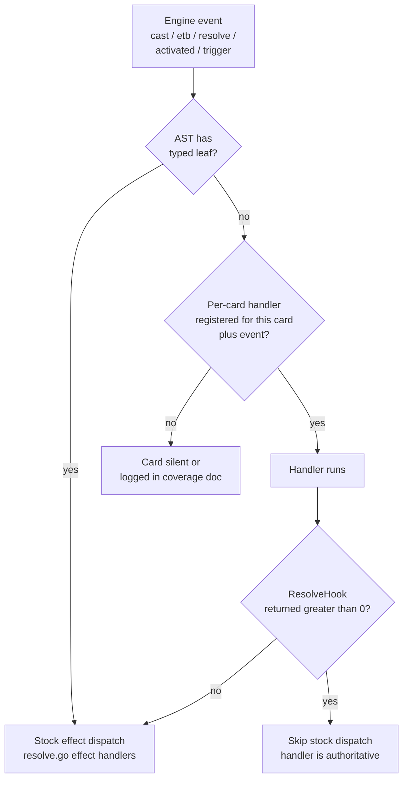
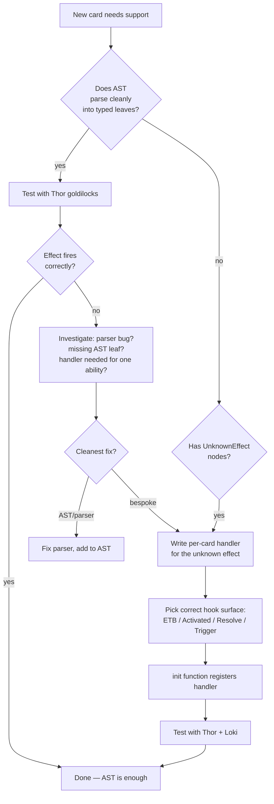

# Per-Card Handlers

> Source: `internal/gameengine/per_card/` (~96 .go files), `per_card_hooks.go`
> Count: 1079+ snowflake handlers as of 2026-04-29

When [the AST](Card%20AST%20and%20Parser.md) can't cleanly express a card's behavior, the engine falls back to a hand-rolled handler in the `per_card` subpackage. This page covers when that happens, how the handler-registry contract works, and how the 17 batch shipments cumulated to 1000+ cards.

## Table of Contents

- [Why Per-Card Handlers Exist](#why-per-card-handlers-exist)
- [The Cycle-Avoidance Hook System](#the-cycle-avoidance-hook-system)
- [Dispatch Decision Tree](#dispatch-decision-tree)
- [Hook Surfaces](#hook-surfaces)
- [Batch Organization](#batch-organization)
- [The Discard Centralization](#the-discard-centralization)
- [The ETB Cascade](#the-etb-cascade)
- [Trigger Guards](#trigger-guards)
- [Trigger Dispatch Audit](#trigger-dispatch-audit)
- [When to Write a New Handler](#when-to-write-a-new-handler)
- [Related Docs](#related-docs)

## Why Per-Card Handlers Exist

The AST is good. It's not perfect. There are roughly four classes of card the AST can't fully represent:

1. **Cards with unique mechanics no other card uses.** Doomsday's "search your library, exile all but five cards" is one-of-a-kind. Building a generic AST node for it would mean adding game-state-mutating "exile-all-but-five" semantics that nothing else needs.
2. **Cards whose oracle text is computationally compressed.** Demonic Consultation says *"Name a card. Exile the top six cards of your library, then exile all cards from the top of your library until you exile a card with the chosen name. Put that card into your hand and shuffle."* Encoding "until you exile a card with the chosen name" as an AST node when no other card uses that pattern is overengineering.
3. **Cards with cross-state dependencies.** Doubling Season touches token creation *and* counter placement *and* planeswalker loyalty — three different effects. Easier to register three replacement handlers in one place than to ask the AST to express the joint policy.
4. **Cards whose AST is technically correct but the handler is much simpler.** Aetherflux Reservoir's "lifegain accumulator + 50-life payoff to deal 50 damage" is technically expressible but the handler is 30 lines of clear code vs. a tangle of typed AST nodes.

So the engine ships ~1079 handlers covering specific cards. Most of these are short — 10-50 lines each.

## The Cycle-Avoidance Hook System

The classic Go cycle: `internal/gameengine/per_card/` needs to import `gameengine` (it manipulates `*GameState`), but `gameengine` would need to import `per_card` to call its handlers. That's a cycle.

Fix: function-pointer registry. `gameengine/per_card_hooks.go` declares the hook types and provides registration / lookup / dispatch. The per-card subpackage *registers* handlers via `init()` functions. The engine *invokes* handlers through the registry without importing the subpackage.

```mermaid
flowchart LR
    PCSubpkg[per_card subpackage<br/>imports gameengine] --> Init[Each .go file's init()<br/>RegisterTriggerHook,<br/>RegisterETBHook, etc.]
    Init --> Registry[per_card_hooks.go<br/>maps event/card → fn]
    Engine[gameengine package<br/>does not import per_card] --> Lookup[FireCardTrigger,<br/>FireETBHook,<br/>etc.]
    Lookup --> Registry
    Registry --> Run[Run registered handler]
```

The cycle is broken because the registry is *in* gameengine. The per-card subpackage imports gameengine and calls registration functions. Gameengine never imports per-card.

## Dispatch Decision Tree



When both a typed AST leaf and a per-card handler exist, the typed leaf runs first and the handler runs after (ETBHook pattern). When only the handler exists, it's the only thing that runs. When the handler returns a nonzero "I handled it" signal, the engine skips stock dispatch (authoritative mode).

## Hook Surfaces

The five canonical hook types:

| Hook | Fires When | Example Cards |
|---|---|---|
| `ETBHook` | After stock ETB triggers in `resolvePermanentSpellETB` | Doubling Season, Panharmonicon, Yarok |
| `CastHook` | After stack push, before priority opens | (reserved, batch 1 unused) |
| `ResolveHook` | Inside `ResolveStackTop`, before stock dispatch | Doomsday, Demonic Consultation, Tainted Pact |
| `ActivatedHook` | When an activated ability resolves | Aetherflux Reservoir, Walking Ballista |
| `TriggerHook` | Engine emits a named game event | Rhystic Study, Mystic Remora, Cloudstone Curio, Hullbreaker Horror, Bone Miser |

Registration looks like:

```go
// In internal/gameengine/per_card/aetherflux_reservoir.go
func init() {
    gameengine.RegisterActivatedHook("Aetherflux Reservoir", func(gs *gameengine.GameState, perm *gameengine.Permanent, abilityIdx int) int {
        // pay 50 life, deal 50 damage to target
        // ...
        return 1  // authoritative — don't fall through to stock
    })
}
```

## Batch Organization

The 1079 handlers shipped in 17 batches, organized by theme. Each batch was a focused session covering ~20-50 cards from a coherent group.

| Batch | Theme | Sample cards |
|---|---|---|
| 1-8 | cEDH staples | Thoracle, Doomsday, Food Chain, Rhystic Study, Necropotence, Mana Crypt |
| 9 | Test-deck commanders | 28 commander handlers for the active deck pool |
| 10 | Combo pieces | Treasure Nabber, Ragost combo, Vecna trilogy (Eye, Hand, Book) |
| 11 | Aristocrats | Blood Artist, Zulaport Cutthroat, Syr Konrad, Cruel Celebrant |
| 12 | Discard infra | Hymn to Tourach, Mind Twist, Tergrid payoffs (forced-discard spells) |
| 13 | Discard payoffs | Waste Not, Liliana's Caress, Megrim, Tinybones |
| 14 | Stax lock | Defense Grid, Notion Thief, Trinisphere |
| 15 | Obeka support | Braid of Fire, Sphinx of the Second Sun, Dragonmaster Outcast, Court of Embereth |
| 16 | Tribal lords | Death Baron, Undead Warchief, Rooftop Storm, Endless Ranks of the Dead |
| 17 | Combat restrictions + 32-card sweep | Propaganda, Howling Mine, Black Market Connections, Maralen, Lich's Mastery, Foundry Inspector |

Each batch landing was followed by a [Thor](Tool%20-%20Thor.md) corpus run to verify zero regressions.

## The Discard Centralization

A pattern that emerged from the trigger audit (memory: `project_hexdek_trigger_audit.md`): 18 different discard paths in the engine, each implementing discard slightly differently. Some fired the `card_discarded` trigger, some didn't. Tergrid, Waste Not, Liliana's Caress, Bone Miser — all silently broken on the wrong path.

Fix: a single canonical helper.

```go
// gameengine.DiscardCard — exported public API for per-card handlers
func DiscardCard(gs *GameState, card *Card, seat int)
```

Every discard, everywhere, must route through this. It runs the `MoveCard` zone-change pipeline (so Rest in Peace and friends fire correctly) and dispatches the `card_discarded` event (so payoffs fire).

Migrated 18 sites in Round 4 of the trigger audit:

- Cycling
- Connive
- Transmute
- Retrace
- Jump-start
- Learn
- Reinforce
- Cleanup-step (over-7 hand)
- Lion's Eye Diamond
- Torment of Hailfire
- Chains of Mephistopheles
- Combat discard effects
- Varina, Lich Queen
- Plus 5 others

Same pattern for life gain (`GainLife`) — 14 paths consolidated. Same for ETB triggers (`FirePermanentETBTriggers`) — 31 sites across 16 files.

## The ETB Cascade

Memory note (Round 8 of the trigger audit): permanents entering the battlefield fire a *cascade* of triggers — self-AST ETB, per-card ETB hook, ascend (descend), `permanent_etb`, `nonland_permanent_etb`, observer ETBs.

Before centralization, 31 sites added a permanent to `Battlefield[]` and tried to fire some subset of these. Most missed at least one.

Fix: a single helper.

```go
// FirePermanentETBTriggers — full cascade, idempotent, used by every battlefield entry
func FirePermanentETBTriggers(gs *GameState, perm *Permanent)
```

Every battlefield entry in the codebase now calls this after appending to `Battlefield[]`. CR §708.4 (face-down permanents skip self-triggers but fire observer ETBs) is honored.

The 31 sites included: keyword resolves (persist, undying, afterlife, morph, incubate, squad, manifest twice, myriad, unearth, embalm, eternalize, encore, fabricate, living weapon, cloak, craft), token creation (3 paths), tutor placement, reanimate resolve, populate, aura swap, bestow, blight return, champion return, ninjutsu — basically every way a card hits the battlefield without going through a normal cast.

## Trigger Guards

`per_card/registry.go:fireTrigger` enforces:

- **Per-chain depth: 8** — recursion through trigger handlers caps at 8
- **Total per game: 2000** — cumulative trigger fire count

Why caps?

Some legal Magic configurations produce thousands of triggers per turn. Sliver Queen + Goblin Sharpshooter creates "untap → tap → ping → death" triggers across every Sliver. Without a cap, the engine spins forever.

Memory: per-chain depth was reduced from 15 to 8 in v10d (faster fail). Both caps are conservative; in 50K production games the per-chain cap is occasionally observed but the per-game total cap is rarely hit (loop shortcut catches most repeating patterns first).

## Trigger Dispatch Audit

Memory: `project_hexdek_trigger_audit.md` (2026-04-27).

The audit found systemic bugs in event dispatch. Eight per-card handlers were registered with wrong event names and never fired (Ragavan, Sword of Feast and Famine, Eye of Vecna, Oppression, Hand of Vecna, Sylvan Library, Book of Vile Darkness, Necrogen Mists). Plus the `upkeep_controller` event wasn't even being emitted by `turn.go` — meaning Mana Crypt, Eye of Vecna, The One Ring, Mystic Remora, Oloro, Necrogen Mists, and Bottomless Pit had registered triggers that never fired.

Three rounds of fixes:

1. **Round 1 — Dead trigger names (7 fixes):** rename to canonical event names.
2. **Round 2 — Zone-change cleanup (9 fixes):** removed redundant `Library[1:]` before `MoveCard` (double-removal).
3. **Round 3 — Rules correctness (4 fixes):**
   - Zulaport Cutthroat: added missing `controller_seat` check
   - Tergrid discard: reject non-permanent cards (oracle says "permanent card" only)
   - Tergrid sacrifice: new `permanent_sacrificed` event so it only fires on sacrifice, not destruction
   - `creature_dies` scope: CR §700.4 fix — only fires for graveyard, NOT exile

Plus event-aliases retrofit (so future name mismatches normalize automatically) and the centralized `DiscardCard` / `GainLife` / `FirePermanentETBTriggers` helpers above.

Total: ~76 fixes across 8 rounds, 0 crashes in a 500-game tournament after.

## When to Write a New Handler

Decision tree when adding a new card:



Prefer extending the AST when the card's behavior generalizes (multiple cards do similar things). Prefer per-card handler when the behavior is genuinely one-of-a-kind.

## Related Docs

- [Card AST and Parser](Card%20AST%20and%20Parser.md) — what handlers complement
- [Trigger Dispatch](Trigger%20Dispatch.md) — TriggerHook fires here
- [Zone Changes](Zone%20Changes.md) — `MoveCard` is the discard / mill / etc. plumbing
- [Engine Architecture](Engine%20Architecture.md) — top-level dataflow
- [Tool - Thor](Tool%20-%20Thor.md) — handler verification
