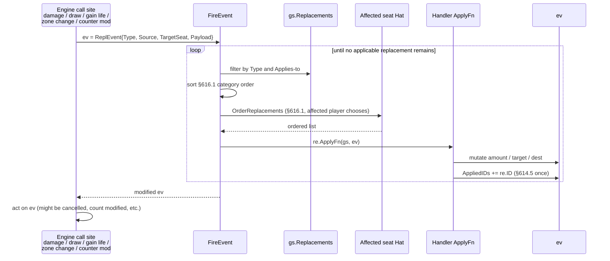
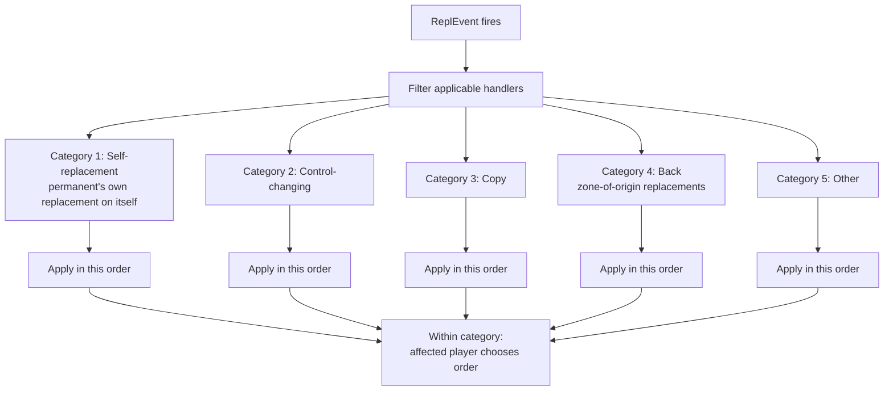

# Replacement Effects

> Source: `internal/gameengine/replacement.go` (1240 lines)
> CR refs: §614 (replacement effects), §616 (interaction of replacement effects), §101.4 (APNAP)

A replacement effect changes a game event before it happens. *"If you would draw a card, instead..."* *"If a creature would die, exile it instead..."* *"If you would gain life, gain twice that much instead."*

The engine's `FireEvent` dispatcher is the single place where every "would-X" check goes. It walks the registered replacement effects, applies them in CR §616.1 order, and returns the modified event for the caller to act on.

## Table of Contents

- [The Core Pattern](#the-core-pattern)
- [Why FireEvent Exists](#why-fireevent-exists)
- [The §616.1 Ordering](#the-6161-ordering)
- [The Affected Player Chooses](#the-affected-player-chooses)
- [§614.5 Applied-Once Rule](#6145-applied-once-rule)
- [The 12 Canonical Handlers](#the-12-canonical-handlers)
- [Wired Call Sites](#wired-call-sites)
- [Replacement vs Trigger](#replacement-vs-trigger)
- [Special: Dredge as a Draw Replacement](#special-dredge-as-a-draw-replacement)
- [Special: Bestow Lives in Layers](#special-bestow-lives-in-layers)
- [Common Ordering Puzzles](#common-ordering-puzzles)
- [Iteration Cap](#iteration-cap)
- [Related Docs](#related-docs)

## The Core Pattern



The `ReplEvent` struct (`replacement.go:65-110`) is the mutable wrapper:

```go
type ReplEvent struct {
    Type       string  // "would_draw", "would_gain_life", "would_die", ...
    Source     *Permanent
    TargetSeat int     // -1 if N/A
    TargetPerm *Permanent
    Payload    map[string]any  // "count", "counter_type", "to_zone", etc.
    Cancelled  bool
    AppliedIDs map[string]bool
}
```

A handler is registered with:

```go
type ReplacementEffect struct {
    HandlerID string
    Type      string                              // event type to match
    Source    *Permanent                          // optional — limit to source
    Category  ReplCategory                        // for §616.1 ordering
    Applies   func(gs *GameState, ev *ReplEvent) bool
    ApplyFn   func(gs *GameState, ev *ReplEvent)
}
```

`Applies` is the predicate (does this replacement match this specific event?). `ApplyFn` is the mutation. Together they're the contract: predicate true → mutator runs.

## Why FireEvent Exists

Before `FireEvent`, replacement-style effects were ad hoc. Doubling Season had its own bespoke check inside the token-creation code path. Rest in Peace had its own check inside the destroy code path. There were ~12 different code paths that each implemented "if X would happen, do Y."

This was brittle. Adding a new "would" effect meant finding all the places that emit that event and adding the check. Forgetting one meant a card silently didn't work.

`FireEvent` collapsed it: every "would-X" call site emits a `ReplEvent` and asks the dispatcher to walk all registered handlers. New cards register a handler; the dispatcher takes care of finding every event site that emits a matching type.

## The §616.1 Ordering

When multiple replacements all match the same event, CR §616.1 specifies a strict ordering:



The categories matter for resolution semantics. A self-replacement always goes first because it's the permanent's "intrinsic" rule. A back-replacement (e.g. "if you would die, instead exile it") groups together so they don't conflict with later non-zone-change replacements.

Within a single category, when multiple replacements match the same event, **the affected player chooses the order** (§616.1).

## The Affected Player Chooses

`Hat.OrderReplacements(gs, seatIdx, candidates)` is called with the same-category candidate list. The hat returns the ordered list. Default policy: order by handler ID (deterministic, source-stable).

The affected player is the one *being affected* by the event. For damage events, that's the damaged player. For draw events, that's the drawing player. For "would die" events, that's the *creature's controller* (per §616.1 errata).

This rule is what makes "Doubling Season + Hardened Scales" behave correctly — you choose the order of these two same-category replacements when both apply to the same +1/+1 counter event.

## §614.5 Applied-Once Rule

> *"Once a replacement effect modifies an event, that effect can't apply again to that same event."*

Implemented via `ReplEvent.AppliedIDs map[string]bool`. When a handler's `ApplyFn` runs, it adds its `HandlerID` to the set. The next iteration of the inner loop skips any handler already in the set.

This is what prevents Doubling Season from doubling itself's output indefinitely. It applies once, doubles the count, then sits out the rest of the event chain.

## The 12 Canonical Handlers

Source: `replacement.go` plus per-card hooks. The original 12 handlers shipped together as the Phase 7 framework rollout:

| Card | Replaces | Effect |
|---|---|---|
| Laboratory Maniac | `would_lose_game` (empty library) | turn into a win |
| Jace, Wielder of Mysteries | `would_lose_game` (empty library) | turn into a win |
| Alhammarret's Archive | `would_draw`, `would_gain_life` | double |
| Boon Reflection | `would_gain_life` | double |
| Rhox Faithmender | `would_gain_life` | double |
| Rest in Peace | `would_be_put_into_graveyard` | exile instead |
| Leyline of the Void | `would_be_put_into_graveyard` (opponents) | exile instead |
| Anafenza, the Foremost | `would_die` (opponent creature) | exile instead |
| Doubling Season | `would_create_token`, `would_put_counter` | double |
| Hardened Scales | `would_put_counter` (+1/+1) | +1 to count |
| Panharmonicon | `would_fire_etb_trigger` | fire twice |
| Platinum Angel | `would_lose_game`, `would_lose_life`(at 0) | cancel |

Plus newer additions (Notion Thief 2026-04-27, Yarok, etc.) — the count is now ~20+.

## Wired Call Sites

Every "would-X" event in the engine emits through `FireEvent`. Source: search for `FireEvent(` in the engine package.

| Event Type | Call Site | Cards That Hook |
|---|---|---|
| `would_be_dealt_damage` | `resolve.go` damage application | Boon Reflection, Rhox Faithmender, Prevent X damage |
| `would_draw` | `resolve.go` per-card draw | Lab Maniac, Notion Thief, Dredge |
| `would_gain_life` | `resolve.go` GainLife | Alhammarret's Archive, Boon Reflection, Rhox |
| `would_lose_life` | `resolve.go` LoseLife | Platinum Angel |
| `would_put_counter` | `resolve.go` CounterMod | Doubling Season, Hardened Scales |
| `would_create_token` | `resolve.go` CreateToken | Doubling Season, Anointed Procession, Parallel Lives |
| `would_die` | `sba.go` destroyPermSBA | Rest in Peace, Leyline of the Void, Anafenza |
| `would_be_put_into_graveyard` | `sba.go` destroyPermSBA | Rest in Peace, Leyline of the Void |
| `would_lose_game` | `sba.go` 5a, 5b | Platinum Angel, Lab Maniac |
| `would_fire_etb_trigger` | `combat.go` ETB | Panharmonicon, Yarok |

## Replacement vs Trigger

A common confusion: a replacement effect and a triggered ability look similar in oracle text. The distinction:

| | Replacement | Triggered Ability |
|---|---|---|
| Wording | "if X would happen, [Y] instead" | "when/whenever/at X, Y" |
| Goes on stack? | No | Yes |
| Can be responded to? | No | Yes |
| Modifies the event? | Yes | No (event already happened) |
| CR section | §614 | §603 |

So *"If a creature would die, exile it instead"* is a replacement (§614). *"When a creature dies, draw a card"* is a triggered ability (§603).

The engine routes them differently: replacements through `FireEvent` (modify-in-place), triggers through `PushTriggeredAbility` (push to stack).

## Special: Dredge as a Draw Replacement

CR §702.52 — Dredge is technically a replacement effect on the draw step, not a triggered ability. The card with Dredge in your graveyard offers an alternative: *"if you would draw a card, instead you may put N cards from the top of your library into your graveyard, then return this card to your hand."*

Implementation:

1. Dredge card in graveyard registers a `would_draw` replacement on the dredger's draw events.
2. Hat is asked (effectively, via the standard order-replacements flow) whether to apply the dredge alternative.
3. If yes, mill N, return the dredge card to hand.
4. If no, the regular draw proceeds.

This is why Dredge can chain (each dredged-into-graveyard dredge card immediately becomes available as a `would_draw` replacement on the next draw).

## Special: Bestow Lives in Layers

Bestow (CR §702.103) is *technically* a replacement-style effect on the spell type — when cast for its bestow cost, it becomes an aura instead of a creature. But HexDek implements it via the [Layer System](Layer%20System.md) (Layer 4: type-changing effects) rather than as a `FireEvent` handler.

The reasoning: the type change is continuous, not event-based. Layer 4 already handles "this thing is now a different type"; bestow fits cleanly. Implementing bestow as a `FireEvent` would require an event for "would be cast" which we don't otherwise need.

## Common Ordering Puzzles

### Doubling Season + Hardened Scales + a +1/+1 Counter Event

Both are `would_put_counter` replacements. Same category (Other). The affected player (the player putting the counters) chooses order:

- **Doubling Season first:** 1 counter → doubled to 2 → Hardened Scales adds 1 → final: 3 counters.
- **Hardened Scales first:** 1 counter → +1 to 2 → Doubling Season doubles → final: 4 counters.

You'd order Hardened Scales first to maximize. Most hats currently apply alphabetically as a stable default — this is one place where intelligent hat behavior would matter for combo decks.

### Rest in Peace + Anafenza + Creature Death

Rest in Peace is `would_be_put_into_graveyard`. Anafenza is `would_die`. Different event types — they don't conflict at the dispatch level, but they cascade.

The creature dies → `would_die` fires → Anafenza handler exiles the corpse instead of allowing graveyard placement → no graveyard event happens at all → Rest in Peace doesn't fire.

### Leyline of the Void Plus Soul Foundry / Recurring Threats

Leyline of the Void's effect ("if a card would go to an opponent's graveyard, instead exile it") fires on every opponent's would-be-graveyard event — destroyed creatures, milled cards, discarded cards, resolved instants/sorceries. Comprehensive coverage means a single Leyline shuts down all graveyard-based strategies for opponents.

## Iteration Cap

CR §616.1f says replacements iterate "until no applicable replacement remains." The dispatcher implements this with a safety cap of 64 iterations. The expected count is small (1-3 in normal play, ~6 in dense Doubling Season + Parallel Lives + Anointed Procession token boards).

64 is large enough that no realistic interaction would hit it; if it does, something is wrong (likely a handler that fails to mark itself as applied and re-fires forever).

## Related Docs

- [Zone Changes](Zone%20Changes.md) — `MoveCard` is a major call site for graveyard / exile replacements
- [State-Based Actions](State-Based%20Actions.md) — `would_die`, `would_lose_game` hooks
- [Trigger Dispatch](Trigger%20Dispatch.md) — the other side of the event-routing dichotomy
- [Layer System](Layer%20System.md) — where bestow's type-change actually lives
- [Hat AI System](Hat%20AI%20System.md) — `OrderReplacements` choice
- [APNAP](APNAP.md) — multi-affected-player tiebreak
