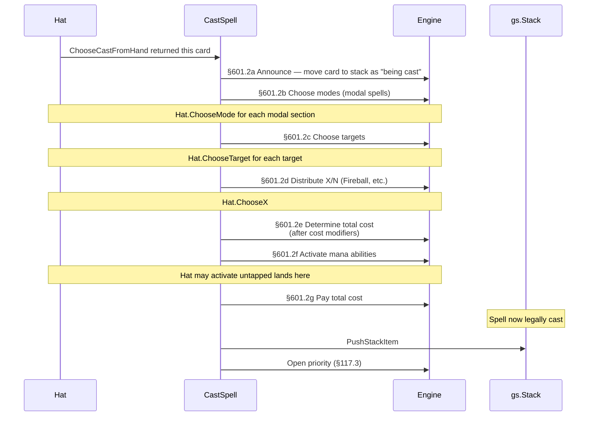
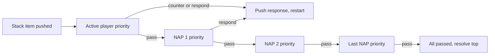
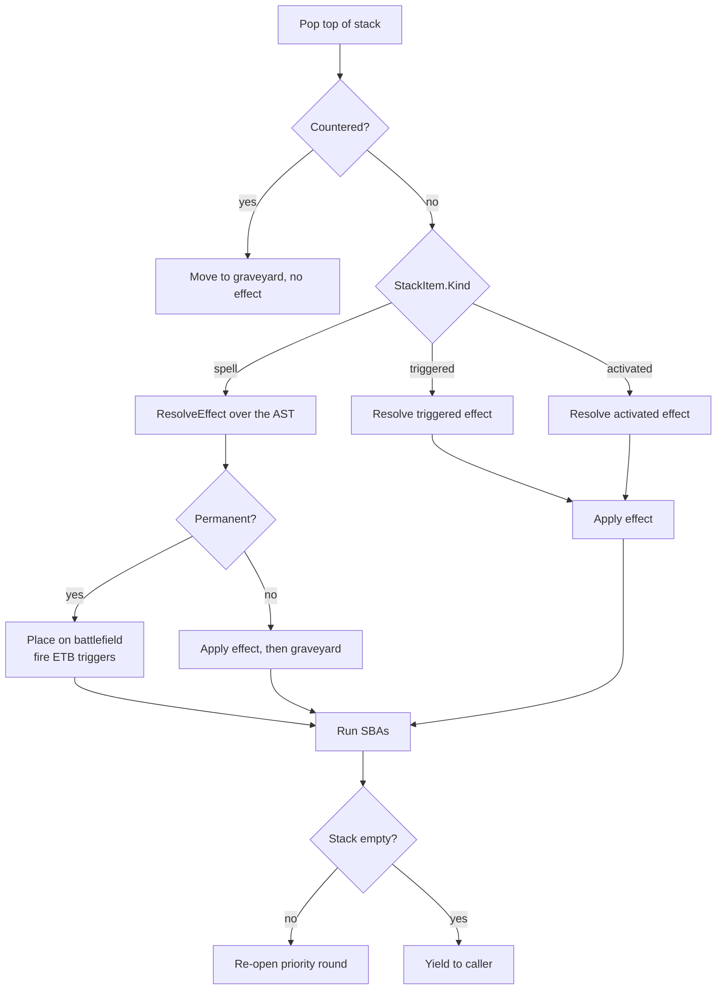
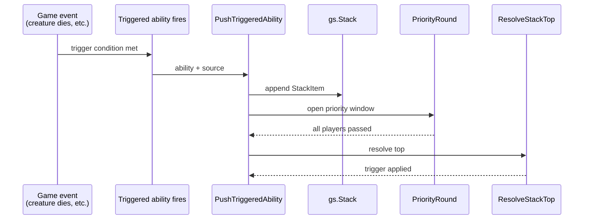
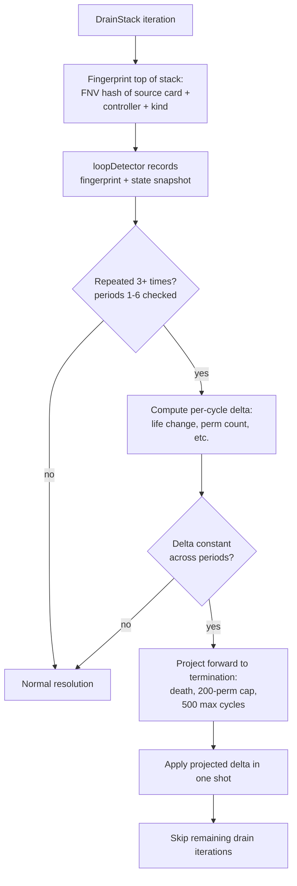

# Stack and Priority

> Source: `internal/gameengine/stack.go`, `triggers.go`, `loop_shortcut.go`
> CR refs: §117 (priority), §405 (stack), §601 (casting), §603 (triggers), §605 (mana abilities), §608 (resolution)

The stack is the LIFO data structure where spells and triggered abilities wait to resolve. Priority is the rule that says *whose turn it is to act* — every time the stack changes, every player gets a chance to respond before resolution proceeds. Together they're the heart of Magic's interaction system.

## Table of Contents

- [The Cast Pipeline (CR §601.2)](#the-cast-pipeline-cr-6012)
- [Priority Passes (CR §117)](#priority-passes-cr-117)
- [Resolution (CR §608)](#resolution-cr-608)
- [The SBA-Priority Coupling (CR §704.3)](#the-sba-priority-coupling-cr-7043)
- [Mana Abilities Exempt (CR §605.3a)](#mana-abilities-exempt-cr-6053a)
- [Triggered Abilities Going on the Stack (CR §603.3)](#triggered-abilities-going-on-the-stack-cr-6033)
- [APNAP for Simultaneous Triggers](#apnap-for-simultaneous-triggers)
- [Safety Caps](#safety-caps)
- [Loop Shortcut (CR §727)](#loop-shortcut-cr-727)
- [Worked Example: Bolt Plus Counter](#worked-example-bolt-plus-counter)
- [Related Docs](#related-docs)

## The Cast Pipeline (CR §601.2)

Casting a spell is a strict 7-step sequence. HexDek implements it in `CastSpell` (`stack.go:200+`). Per §601.2, in order:



Steps b through f are **reversible** — if any step fails (no legal target, can't pay cost), the cast is rewound and the card returns to its original zone. This is what makes Counterspell-with-no-targets a legal safe choice instead of a softlocked game state.

`PushStackItem` (`stack.go:116`) does three things:

1. Allocate a monotonic stack ID (via the `_stack_seq` flag counter)
2. Append to `gs.Stack`
3. Log a `stack_push` event for the [Stack Trace](Tool%20-%20Stack%20Trace.md) audit

## Priority Passes (CR §117)

Once a stack item is pushed, **every player must pass priority in succession** before the top of the stack can resolve (§117.4). The order is [APNAP](APNAP.md) — active player first, then non-active players in turn order, then back to the active player.



**The restart rule** is what gives Magic its interactive depth: any player passing causes the *next* player to get priority. Any player *acting* (pushing a new spell or ability) restarts the round at the active player.

`PriorityRound` implements this loop, calling `Hat.ChooseResponse` on each seat in APNAP order, until either:

1. All living seats pass in succession → top resolves
2. The loop hits its iteration cap (8 — defensive against bugs in policy code)

## Resolution (CR §608)

When all players have passed, the top of the stack resolves. `ResolveStackTop` pops `gs.Stack[len-1]` and dispatches based on item kind:



After every resolution, **state-based actions run** before priority reopens (CR §704.3). This is the SBA-priority coupling.

## The SBA-Priority Coupling (CR §704.3)

> *"Whenever a player would get priority, the game first performs all applicable state-based actions as a single event, then repeats this process until no state-based actions are performed."*

This is the engine's heartbeat. Every time priority is about to open, [State-Based Actions](State-Based%20Actions.md) run to a fixed point. Creatures with lethal damage die, players with 0 life lose, illegally-attached auras detach — all before any player can act.

In `DrainStack` (`stack.go:66`):

```go
for drainIter := 0; len(gs.Stack) > 0 && drainIter < maxStackDrainIterations; drainIter++ {
    ResolveStackTop(gs)
    StateBasedActions(gs)
    if len(gs.Stack) > 0 {
        PriorityRound(gs)
    }
}
StateBasedActions(gs)
```

The order is: resolve, run SBAs, then if anything else is on the stack, reopen priority. After the stack fully drains, run SBAs one more time to catch deaths from the last resolution.

## Mana Abilities Exempt (CR §605.3a)

> *"A mana ability resolves immediately. It doesn't go on the stack and can't be targeted, countered, or otherwise responded to."*

Tapping a Forest for {G} is a mana ability. So is sacrificing Lotus Petal. So is "{T}: Add {U}" on Sol Ring. These don't go on the stack — they apply instantly inside the cost-payment step of whatever called them.

`isManaAbilityEvent()` in `activation.go` gates the stack push. When this returns true, the ability resolves inline, mana hits the pool, and the engine continues with the spell's cost payment.

This is what makes the cast pipeline reversible — mana abilities that fire during cost payment don't strand on the stack if the cast is rewound.

## Triggered Abilities Going on the Stack (CR §603.3)

> *"The next time a player would receive priority, each ability that has triggered but hasn't yet been put on the stack is put on the stack."*

When a trigger fires (creature ETBs, life is gained, a spell is cast), the ability doesn't resolve immediately. It waits in a pending bucket until priority is about to open, then gets pushed onto the stack like any other ability. `PushTriggeredAbility` (`stack.go:155`) handles the push:



Multiple triggers firing from the same event group together and get pushed in [APNAP](APNAP.md) order; see [Trigger Dispatch](Trigger%20Dispatch.md) for the full ordering algorithm.

## APNAP for Simultaneous Triggers

When multiple triggers fire at the same moment (a board wipe causes 6 creatures to die, each with a death trigger), the engine groups by *controller*, sorts groups in APNAP order, and within each group lets the controller pick the order via `Hat.OrderTriggers`.

Counterintuitive consequence of LIFO: the **last group pushed resolves first**. So the *last* non-active player in APNAP order has their triggers resolve before the active player's. Active player "loses the speed race" on simultaneous triggers.

See [APNAP](APNAP.md) and [Trigger Dispatch](Trigger%20Dispatch.md) for the full mechanics.

## Safety Caps

Cascading triggers can spin out of control without bounds. Five caps protect against this:

| Cap | Value | What it bounds | Why |
|---|---|---|---|
| `maxStackDrainIterations` | 500 | Iterations of the resolve-SBA-priority loop in `DrainStack` | Storm + Cascade chains |
| `maxDrainRecursion` | 10 | Recursive depth of `DrainStack to CastSpell to DrainStack` | Trigger handlers that cast spells |
| `maxResolveDepth` | 50 | Inline `PushTriggeredAbility to PriorityRound to ResolveStackTop` recursion | Reanimate/sacrifice loops blowing up Go's call stack |
| Trigger guard depth | 8 per chain | `per_card/registry.go:fireTrigger` recursion | Per-card trigger storms |
| Trigger guard total | 2000 per game | Cumulative trigger fire count | Sliver Queen / Goblin Sharpshooter loops |

`maxResolveDepth` is the most surgical (memory: `project_hexdek_parser.md` v10d). The cycle was:

```
PushTriggeredAbility -> PriorityRound -> ResolveStackTop -> ResolveEffect -> zone-change
   -> PushTriggeredAbility -> ... (recurses through Go's call stack)
```

For a sufficiently long reanimate chain (Worldgorger Dragon + Animate Dead with auxiliary triggers), this could blow Go's default 1GB stack limit at ~2M frames. Fix: when recursion depth exceeds 50, the trigger stays on the stack for `DrainStack`'s **iterative** loop to drain. Same effect, no Go-stack exhaustion.

## Loop Shortcut (CR §727)

> *"If a loop contains a mandatory action, the game ends in a draw. Otherwise, the player taking those actions can choose to continue the loop, but they must do something different at some point or the game ends in a draw."*

Some legal Magic states genuinely loop forever — Worldgorger Dragon + Animate Dead with no outlet, or Kinnan token loops, or Ashling counter pumps. The engine has to detect these and either project the result forward or declare a draw.

`loop_shortcut.go` does fingerprint-based detection. For each iteration of `DrainStack`:



When the detector fires, instead of running the loop 1000 more times the engine computes "after this loop terminates, life is X, permanent count is Y, this player wins" and applies it directly. This eliminated the last 3 timeout cases observed in 50K-game tournament runs (Kinnan with 3399 tokens, Ashling with 4274 tokens).

## Worked Example: Bolt Plus Counter

Concrete cast-and-respond sequence:

1. **Active player (P1)** casts Lightning Bolt targeting P2.
   - §601.2a: Bolt moved to stack
   - §601.2c: target = P2 (chosen via `Hat.ChooseTarget`)
   - §601.2g: pays {R}
   - `PushStackItem(bolt)` → stack = `[bolt]`
   - `LogEvent("stack_push")` → [Stack Trace](Tool%20-%20Stack%20Trace.md) records it
2. **Priority round opens** (`PriorityRound`):
   - P1 (active) gets priority → passes (just cast it)
   - P2 (NAP 1) gets priority → has Counterspell, decides to counter
   - P2.Hat.ChooseResponse returns a Counterspell stack item
   - `PushStackItem(counter)` → stack = `[bolt, counter]`
   - **Priority round restarts at P1**
3. **New priority round**:
   - P1 → passes
   - P2 → passes
   - P3, P4 → pass
   - All passed → resolve top
4. **`ResolveStackTop`** pops `counter`:
   - Counterspell's effect: mark `bolt.Countered = true`
   - Counter goes to graveyard
   - SBAs run (no creatures, no changes)
   - Stack = `[bolt]`, reopen priority
5. **Priority round opens**:
   - All pass
   - Resolve top
6. **`ResolveStackTop`** pops `bolt`:
   - `bolt.Countered == true`, so effect is skipped
   - Bolt goes to graveyard
   - SBAs run
7. Stack empty, `DrainStack` returns to caller.

Total stack-trace entries: 4 pushes (bolt, counter, plus 2 internal allocations), 4 priority-pass groups, 2 resolves, multiple SBA checks. All visible in `GlobalStackTrace.Entries` if `Enable()` was called.

## Related Docs

- [State-Based Actions](State-Based%20Actions.md) — what runs between resolutions
- [Combat Phases](Combat%20Phases.md) — uses the stack pipeline for combat triggers
- [Trigger Dispatch](Trigger%20Dispatch.md) — how triggers reach `PushTriggeredAbility`
- [Replacement Effects](Replacement%20Effects.md) — applied before the stack push
- [APNAP](APNAP.md) — multiplayer ordering
- [Tool - Stack Trace](Tool%20-%20Stack%20Trace.md) — audit logger for CR compliance
- [Mana System](Mana%20System.md) — mana abilities exempt from stack
