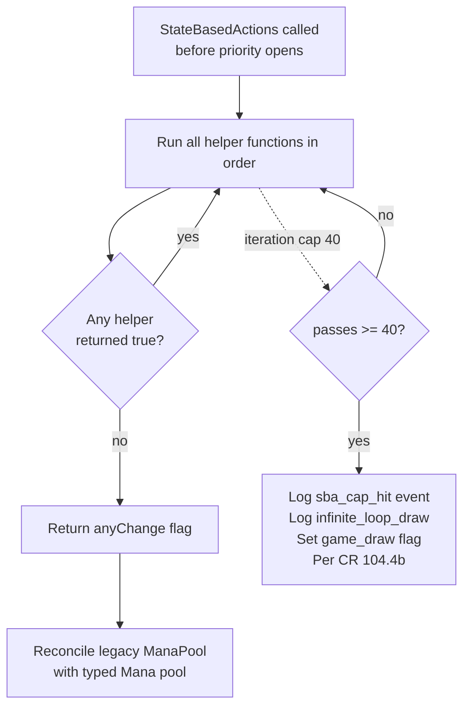

# State-Based Actions

> Source: `internal/gameengine/sba.go` (1462 lines)
> CR refs: §704

State-based actions (SBAs) are the rules cleanup pass. They check the game state for things that *should* be true automatically — creatures with lethal damage are dead, players with 0 life have lost, illegally attached auras detach. SBAs run before any player gets priority, and they keep running until nothing fires.

Per CR §704.3:

> *"Whenever a player would get priority, the game first performs all applicable state-based actions as a single event, then repeats this process until no state-based actions are performed."*

This page walks through every SBA HexDek implements, the loop semantics, and how SBAs interact with the rest of the engine.

## Table of Contents

- [Why SBAs Exist](#why-sbas-exist)
- [The Loop](#the-loop)
- [When SBAs Fire](#when-sbas-fire)
- [The 9-ish Player-Loss Checks](#the-9-ish-player-loss-checks)
- [Death Checks](#death-checks)
- [Duplicate Checks](#duplicate-checks)
- [Attachment Checks](#attachment-checks)
- [Counter Checks](#counter-checks)
- [Special Permanent Checks](#special-permanent-checks)
- [Commander Checks](#commander-checks)
- [Layer-Aware Toughness](#layer-aware-toughness)
- [Cascading SBA Example](#cascading-sba-example)
- [Loop Detection and Draws](#loop-detection-and-draws)
- [Related Docs](#related-docs)

## Why SBAs Exist

Without SBAs you'd have to manually check after every action: "did this damage kill anything? Did this life-loss put anyone at 0? Are there two legendaries on the field now?"

SBAs let the rules engine batch all those checks into a single mandatory pass. Players don't *have* to remember to check; the rules check automatically every time priority is about to open.

CR §704 lists ~25 individual SBAs grouped roughly into:

- Player loss conditions (life, library, poison)
- Token / copy zone existence
- Creature / planeswalker / battle death
- Legend rule, world rule
- Aura / equipment attachment legality
- +1/+1 / -1/-1 counter annihilation
- Saga final chapter, role replacement, dungeon completion
- Variant-specific (commander damage, planar dice)

Each is a small predicate over the game state with a small mutation if it triggers.

## The Loop



Source: `sba.go:30-220`. The driver:

```go
const maxPasses = 40
for passes < maxPasses {
    passes++
    changed := false
    if sba704_5a(gs) { changed = true }
    if sba704_5b(gs) { changed = true }
    // ... 20+ more helpers
    if !changed { break }
    anyChange = true
}
```

Each helper returns `true` iff it mutated state. The driver iterates until a complete pass produces no changes — that's the fixed point.

Per CR §704.3, all SBAs *would* happen "as a single event" — simultaneously. HexDek approximates this by running helpers sequentially within a pass and re-looping. The result is observably identical to simultaneous evaluation as long as no helper depends on another in the same pass (which CR §704 is structured to avoid).

## When SBAs Fire

Three primary call sites:

1. **`DrainStack`** (`stack.go`) — after every `ResolveStackTop`, before reopening priority.
2. **`PriorityRound`** (`stack.go`) — at the top of every priority window.
3. **Combat damage steps** (`combat.go`) — between FS and regular damage steps.

Plus a handful of opportunistic calls in special-purpose paths (companion legality check, mulligan finalization).

The rule is "whenever a player would get priority, SBAs run first" — so anywhere that could open a priority window calls `StateBasedActions` first.

## The 9-ish Player-Loss Checks

Source: `sba.go:225-330`.

### §704.5a — Life Total ≤ 0

Iterate seats. Any seat with `Life <= 0` and not protected by Angel's Grace / Phyrexian Unlife loses.

Fires `would_lose_game` replacement event before applying — Platinum Angel hooks here to cancel.

### §704.5b — Empty Library Draw

If a seat tried to draw from an empty library this turn, they lose. The "tried to draw" flag is set in the draw machinery; SBA reads it.

This is the Laboratory Maniac / Thassa's Oracle / Jace, Wielder of Mysteries trigger window — those cards register replacement effects for `would_lose_game` that turn the loss into a win.

### §704.5c — Poison Counters ≥ 10

Any seat with `Counters["poison"] >= 10` loses. Mostly relevant for infect decks.

## Death Checks

Source: `sba.go:419-578`.

### §704.5f — Toughness ≤ 0

For each creature on the battlefield, if its **layer-effective** toughness (not base) is ≤ 0, it dies (goes to graveyard).

This is the layer-aware check. A 1/1 creature with -1/-1 counter has effective toughness 0 — dies. A 2/2 with -3/-3 buff (Doom Blade with -X/-X effect) has effective toughness -1 — also dies.

### §704.5g — Lethal Damage

For each creature, if `Damage >= effective_toughness`, it dies. Damage doesn't directly equal "death"; it equals "marked damage which causes death via SBA."

This is also the deathtouch hook: a creature dealt any damage by a deathtouch source has its damage marked, and the SBA treats any damage from a deathtouch source as lethal.

### §704.5i — Planeswalker Loyalty ≤ 0

For each planeswalker on the battlefield, if `Counters["loyalty"] <= 0`, it goes to the graveyard.

Other death-class SBAs are stubs:

- **§704.5h** (deathtouch tracking, separate from §704.5g) — handled inline in combat damage assignment, not in SBA pass.
- **§704.5e** (copy of a spell on the stack) — stub; not exercised by current card pool.

## Duplicate Checks

### §704.5j — Legend Rule (CR §704.5j)

For each player, if they control 2+ legendary permanents with the same name, they choose one to keep and put the rest in their graveyards.

The "choose" delegates to the player whose permanents they are; HexDek chooses the most recently entered (timestamp-based) by default — a hat hook for explicit choice exists but isn't currently wired.

### §704.5k — World Rule (CR §704.5k)

If 2+ "world" permanents exist on the battlefield, all but the most recent go to the graveyard. Practically dead in modern Magic (no world cards printed in many years) but implemented for completeness.

## Attachment Checks

Source: `sba.go:714-840`.

### §704.5m — Aura Attached Illegally

If an aura is on the battlefield but not attached to anything legal (target died, target became illegal due to type change, etc.), it goes to its owner's graveyard.

### §704.5n — Equipment / Fortification Attached Illegally

Equipment can attach to a creature (legal) or be unattached (legal). If it's "attached to" something that isn't a creature anymore (transformation, type change), it falls off but stays on battlefield.

### §704.5p — Bestow Detach

When a bestow creature was attached as an aura, then its enchanted creature dies, the bestow card flips back to creature mode and stays on the battlefield. Implemented via Layer 4 in [Layer System](Layer%20System.md), with the SBA hook detecting the detachment trigger.

## Counter Checks

### §704.5q — +1/+1 / -1/-1 Annihilation (CR §704.5q)

If a permanent has both `+1/+1` and `-1/-1` counters, remove pairs of them — one of each — until at least one type is gone.

Source: `sba.go:840-895`. Iterate every permanent, if `Counters["+1/+1"] > 0 && Counters["-1/-1"] > 0`, subtract `min(p, m)` from each.

### §704.5r — "Can't Have More Than N" Counter Caps

Stubbed. The few cards that have this clause (Ajani Adversary's exile rule, certain planeswalker emblem effects) aren't currently in the active card pool.

## Special Permanent Checks

### §704.5s — Saga Final Chapter

If a saga has lore counters ≥ its final chapter number AND no chapter ability has triggered this priority window, sacrifice the saga.

### §704.5t — Dungeons (Adventures in the Forgotten Realms)

Stubbed. Dungeons require their own state machine which isn't currently built.

### §704.5u — Space Sculptor / Sector

Stubbed.

### §704.5v — Battles

Battles defeated (last counter removed) trigger the "transform" handler. Implemented at `sba.go:1020`.

### §704.5w — Battle Protectors

Stubbed.

### §704.5x — Siege Protector Reset

Stubbed.

### §704.5y — Roles

Roles attached to creatures can only be one Role per "type" per controller — extras get discarded. Implemented at `sba.go:1087`.

### §704.5z — Start Your Engines (Speed mechanic)

Stubbed.

## Commander Checks

### §704.6c — 21 Commander Damage

Iterate each seat's `CommanderDamage[srcID]` map. If any source has dealt ≥ 21 to the seat, the seat loses (regardless of life total).

This is the special commander-format loss condition. Memory note: implementation includes partner support (each partner is a separate source).

### §704.6d — Commander in Graveyard / Exile

This one is actually a *replacement effect*, not an SBA — it lets the commander's owner redirect to the command zone instead. Implemented in [Zone Changes](Zone%20Changes.md) `FireZoneChange`, gated by `Hat.ShouldRedirectCommanderZone`.

## Layer-Aware Toughness

A subtle but critical detail: the toughness check in §704.5f reads the **layer-resolved** toughness, not the base value on the card.

Example: Wrath of God-style "destroy all creatures" doesn't actually trigger §704.5f. Wrath uses `DestroyPermanent` directly. But a -3/-3 mass effect (Languish, Drown in Sorrow targeting big board) reduces effective toughness via [layer 7](Layer%20System.md) — and *that* triggers §704.5f.

The SBA pass calls `GetEffectiveCharacteristics(perm)` to get the layer-resolved toughness. Re-application of layers happens implicitly because the layer cache is invalidated whenever layer-relevant state changes.

## Cascading SBA Example

A common cascade: kill a creature with a death trigger that damages another creature.

**Setup:**

- Creature A: 2/2 with "When this dies, deal 2 damage to target creature."
- Creature B: 1/2

**Action:** P1 destroys Creature A.

**SBA pass 1:**

- §704.5g sees Creature A in graveyard already (destroyed), nothing to do here.
- Creature A's death trigger has fired, going on the stack.

**Stack resolves the death trigger:** 2 damage to Creature B.

**Drain calls SBA again:**

- §704.5g: Creature B has damage ≥ toughness → dies.

**SBA pass 1 of new call:** Creature B in graveyard. Death triggers? If B had any, they're now firing.

**Stack resolves B's death trigger** (if any), repeat.

This is what `DrainStack`'s outer loop is for — the back-and-forth between resolution, SBAs, and triggers cascades naturally.

## Loop Detection and Draws

If SBAs hit the 40-pass cap (`maxPasses` in `sba.go:36`), it indicates a mandatory loop that can't terminate. CR §104.4b says this is a draw:

> *"If the game somehow enters a 'loop' of mandatory actions, repeating a sequence of events with no way to break the loop, the game is a draw."*

When the cap fires, the engine logs:

```go
gs.LogEvent(Event{Kind: "sba_cap_hit", Details: ...})
gs.LogEvent(Event{Kind: "infinite_loop_draw", Details: ...})
gs.Flags["game_draw"] = 1
gs.Flags["ended"] = 1
```

Memory: in 50K production games, this cap was **never observed**. Its purpose is defense against malformed card interactions — a card that lies about its toughness or a layer system bug that pushes toughness to a weird value.

## Related Docs

- [Stack and Priority](Stack%20and%20Priority.md) — the SBA-priority coupling
- [Invariants Odin](Invariants%20Odin.md) — `SBACompleteness` invariant
- [Replacement Effects](Replacement%20Effects.md) — `would_die` / `would_be_put_into_graveyard` hooks
- [Layer System](Layer%20System.md) — toughness resolution
- [Combat Phases](Combat%20Phases.md) — damage assignment feeds §704.5g
- [Zone Changes](Zone%20Changes.md) — commander redirect §704.6d
